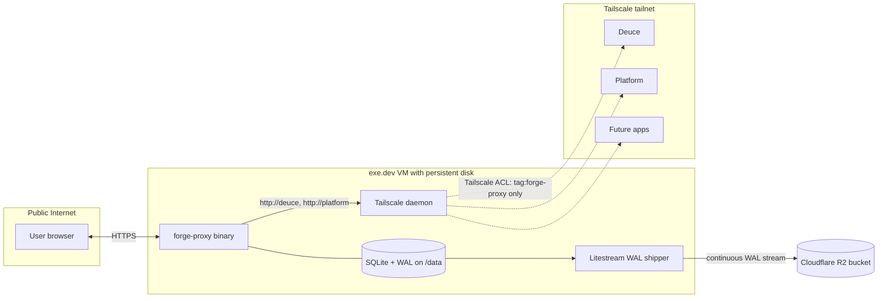

# forge-proxy

Forge Utah Foundation auth proxy. A single Go binary that sits in front of
every `*.forgeutah.tech` app, authenticates users via Slack OpenID Connect,
and forwards a small set of trusted `X-Forge-*` identity headers to the
upstream apps. Upstream apps validate a shared proxy secret and trust the
forwarded headers; direct browser access to the upstream origins is blocked
at the network layer (Tailscale ACLs).

The full design lives in
[`docs/plans/2026-05-20-001-feat-forge-auth-proxy-plan.md`](docs/plans/2026-05-20-001-feat-forge-auth-proxy-plan.md);
the originating requirements live in
[`docs/brainstorms/forge-auth-proxy-requirements.md`](docs/brainstorms/forge-auth-proxy-requirements.md).
This README is the operator-facing runbook — first deploy, env-var
reference, role admin, incident response.

---

## Architecture



The trust model has two layers:

1. **Network path.** Upstream apps are only reachable over the tailnet, and
   Tailscale ACLs allow only the `tag:forge-proxy` node to reach them.
2. **Application-layer secret.** Every outbound request from the proxy carries
   `X-Forge-Proxy-Secret`. Upstream apps reject any request that lacks it or
   has a wrong value. Either layer alone keeps the apps safe; both must
   fail before identity headers can be spoofed.

---

## Upstream-app contract

If you're building an app that lives behind forge-proxy, this is the
contract you implement. The proxy injects nine `X-Forge-*` headers on
every authenticated request. Your app validates the shared secret, then
treats the other headers as the authoritative identity of the caller —
no separate auth, no session cookies, no token exchange.

### Headers your app receives

| Header | Type | Example | Notes |
| --- | --- | --- | --- |
| `X-Forge-Proxy-Secret` | string | `9f3a…` (hex) | Validate this first; reject the request if missing or wrong. Compare in constant time. |
| `X-Forge-Contract-Version` | int | `1` | Bumped on a breaking change to this table. Apps may pin a major version. |
| `X-Forge-User-Id` | int | `42` | Stable integer primary key. Survives email and Slack workspace changes. Use this as the foreign key in your DB, not the email. |
| `X-Forge-Email` | string | `alice@example.com` | Slack-verified. Refreshed on every sign-in. |
| `X-Forge-Name` | string | `Alice` or `UTF-8''Al%C3%ADce` | Display name. Pure-ASCII passes through verbatim. Non-ASCII (emoji, accents) is RFC 8187 encoded as `UTF-8''<percent-encoded>`. Most apps can display either form as-is; if you need to decode, the standard "strip the `UTF-8''` prefix and percent-decode" pipeline works. |
| `X-Forge-Avatar` | URL | `https://avatars.slack-edge.com/…` | Slack profile image. Safe to render directly. |
| `X-Forge-Roles` | csv | `admin,founder` | Comma-separated. Empty string means no roles. Roles are user-defined — managed via `forge-proxy admin set-roles`. Treat as opaque tags and define your own authorization rules on top. The proxy may also refuse before your app is reached if its `UPSTREAMS` entry declares required roles (see [restricting an app by role](#restricting-an-app-by-role)) — that gate is additive, so keep enforcing your own rules regardless. |
| `X-Forge-Slack-User-Id` | string | `U0R7G…` | The Slack user ID. Useful if you call the Slack API on the user's behalf. |
| `X-Forge-Slack-Team-Id` | string | `T0R7G…` | The Slack workspace ID. The proxy already enforces a single configured workspace, but apps can double-check. |

### Validating in your app

Minimal middleware shape, in any language:

```text
secret := request.header("X-Forge-Proxy-Secret")
if secret == "" || !constantTimeEqual(secret, env.PROXY_SECRET):
    return 401  // or 403, or hang up — your call

user := {
    id:    int(request.header("X-Forge-User-Id")),
    email: request.header("X-Forge-Email"),
    name:  request.header("X-Forge-Name"),
    roles: request.header("X-Forge-Roles").split(","),
    // etc.
}
// Now proceed; user is authenticated.
```

Use a constant-time comparison (`hmac.Equal` in Go, `secrets.compare_digest` in Python, `crypto.timingSafeEqual` in Node) — a regular string `==` leaks the secret one byte at a time under timing attack.

### Why you don't have to defend against spoofed headers

Before injection, the proxy performs a three-layer strip on every inbound request:

1. Everything listed in the client's `Connection:` header (RFC hop-by-hop)
2. Everything listed in `X-Forwarded-Forge-Headers` (explicit denylist hook)
3. *Any* header whose canonical name starts with `X-Forge-` (catch-all)

So a client that sends `X-Forge-Roles: admin` from their browser has those bytes deleted before your app ever sees them. The nine values your app receives come from the proxy's authenticated session lookup, not from the client.

The Tailscale network layer means a client also can't bypass the proxy and hit your app directly with handcrafted headers — the upstream origin isn't reachable from the public internet. The `X-Forge-Proxy-Secret` check is belt-and-braces against a future ACL misconfiguration.

### Logging out

The proxy owns sessions. To sign a user out from your app's perspective, link or redirect to `https://auth.<base-domain>/` and have them click "Sign out" in the portal. There's no `/logout` for upstream apps to call — sessions are server-side and opaque to your app.

### Versioning

`X-Forge-Contract-Version` is `1` today. Future bumps stay additive unless this header changes — apps that want to pin can branch on it. The full contract is normative: apps that deviate break the trust model.

---

## First-time deploy

### 1. Slack app

1. Create a new Slack app in the `forgeutah.slack.com` workspace.
2. Enable **Sign in with Slack** with scopes `openid profile email`.
3. Set the redirect URI to `https://auth.forgeutah.tech/auth/callback`.
4. Record the **Client ID** and **Client Secret** for the env-var step below.

### 2. exe.dev VM

1. Provision a VM with a public IP and a persistent disk.
2. Mount the persistent disk at `/data`. The proxy writes `/data/forge.db`
   (the SQLite file) and Litestream reads it from the same path.
3. The container runs as uid 65532 (the distroless `nonroot` user); make
   `/data` writable by that uid (`chown 65532:65532 /data`).

### 3. Tailscale on the VM

```sh
curl -fsSL https://tailscale.com/install.sh | sh
```

Authenticate the VM as a tagged node using an auth key generated from a
Tailscale OAuth client (so the auth survives VM rebuilds):

```sh
tailscale up --authkey=tskey-client-... --advertise-tags=tag:forge-proxy
```

Update tailnet ACLs so only `tag:forge-proxy` can reach the upstream-app
nodes on their HTTP ports — every other tailnet member (laptops, admin
tooling) is explicitly denied. This is the network half of the trust model;
the proxy secret is the application half.

### 4. Install the binary

Install with the one-liner — the script detects OS + arch, fetches the
latest release tarball, verifies the SHA-256 against the published
`checksums.txt`, puts the binary at `/usr/local/bin/forge-proxy`, AND
drops `.env.example` at `/etc/forge-proxy.env` (mode `0600`, ready to
edit). Existing env files are never overwritten, so re-running the
script after editing is safe.

```sh
curl -fsSL https://raw.githubusercontent.com/forgeutah/forge-proxy/main/install.sh | sh
```

Pin a version, install user-locally, override the env-file path, or
skip the checksum verify by setting env vars before piping:

```sh
# Pin a version
curl -fsSL https://raw.githubusercontent.com/forgeutah/forge-proxy/main/install.sh | FORGE_PROXY_VERSION=v0.1.0 sh

# Install to ~/.local/bin + ~/.config/forge-proxy.env (no sudo)
curl -fsSL https://raw.githubusercontent.com/forgeutah/forge-proxy/main/install.sh | \
  FORGE_PROXY_INSTALL_DIR="$HOME/.local/bin" \
  FORGE_PROXY_ENV_FILE="$HOME/.config/forge-proxy.env" \
  sh
```

(If you'd rather not run a `curl | sh`, the [Releases page](https://github.com/forgeutah/forge-proxy/releases)
lists each platform's tarball and `checksums.txt` for manual install.)

### 5. Configure the environment

`/etc/forge-proxy.env` exists already (install.sh copied it from
`.env.example`). Edit in your secrets:

```sh
sudo $EDITOR /etc/forge-proxy.env
```

You'll need: the Slack client ID + secret from step 1, your workspace's
`SLACK_TEAM_ID`, the `UPSTREAMS` mapping for each Forge app, and a
freshly-generated `PROXY_SECRET`:

```sh
openssl rand -hex 32   # paste into /etc/forge-proxy.env
```

See the [environment variables](#environment-variables) section below
for the full reference.

The binary auto-discovers its env file from this search path (first
existing wins):

1. `$FORGE_PROXY_ENV_FILE` (explicit override)
2. `/etc/forge-proxy.env` (system-wide install, recommended)
3. `$XDG_CONFIG_HOME/forge-proxy.env`
4. `$HOME/.config/forge-proxy.env` (user-level)
5. `./forge-proxy.env` (CWD, development convenience)

`--env-file <path>` still works for explicit overrides; the auto
discovery only fires when the flag is absent.

### 6. Run the binary

**Run as a daemon under systemd (one command):**

```sh
sudo forge-proxy setup systemd
```

The `setup systemd` subcommand creates the `forge-proxy` user + group,
creates `/var/lib/forge-proxy/` with the right ownership and mode,
writes a systemd unit at `/etc/systemd/system/forge-proxy.service` with
the binary path resolved from the running executable, then runs
`systemctl daemon-reload && systemctl enable --now forge-proxy` and
prints the status. The unit applies the hardening directives
(`ProtectSystem=strict`, `NoNewPrivileges`, `PrivateTmp`, etc.).

Re-running `setup systemd` is idempotent — existing user/group/dir are
left in place; the unit file is overwritten (so don't hand-edit it,
edit `cmd/forge-proxy/setup.go` and re-run).

**Or run it directly** as a foreground process — testing, debugging, or
hosts without systemd:

```sh
# Auto-discovers /etc/forge-proxy.env per the search path above
forge-proxy

# One-off admin commands from the same env file
forge-proxy admin list-users
forge-proxy admin set-roles user@example.com admin,organizer
```

**Or run it as a detached daemon without systemd** (e.g. on BSD or
Alpine OpenRC, or when you just want `forge-proxy --daemon &`-style
backgrounding):

```sh
sudo forge-proxy --daemon
# forge-proxy: daemonized as pid 12345
#   log file: /var/log/forge-proxy.log
#   pid file: /var/run/forge-proxy.pid
# stop with: kill $(cat /var/run/forge-proxy.pid)
```

The `--daemon` flag re-execs the binary with `setsid`, redirects
stdout/stderr to a log file, writes a PID file, and returns. Override
paths with `--pid-file` and `--log-file`; defaults fall back to `/tmp`
if `/var/run` and `/var/log` aren't writable (so `--daemon` works for
non-root testing too). If a PID file already exists and the recorded
PID is alive, `--daemon` refuses to start — preventing accidental
double-launches.

Values already in the process environment win over the file (shell
beats file), so you can override individual keys for debugging without
editing `/etc/forge-proxy.env`:

```sh
LOG_LEVEL=debug forge-proxy admin list-users
```

**Manual systemd install** — if you'd rather see what `setup systemd`
does before running it, [`deploy/forge-proxy.service`](deploy/forge-proxy.service)
is the equivalent hand-installed unit; copy it to `/etc/systemd/system/`
after creating the user + dir yourself.

This is enough to run the proxy. The SQLite file at
`/var/lib/forge-proxy/forge.db` is the source of truth; the persistent
disk's own snapshot/backup story (whatever your host provides) is your
recovery boundary. If the disk fails and you have no off-host backup,
you lose every user record and active session — fresh sign-ins
re-provision users from Slack, and roles you'd manually granted are
gone.

If that's an acceptable risk for now, you're done. Skip to **7. Verify**
below. Add Litestream later (see
[off-host backup](#off-host-backup-optional-litestream--cloudflare-r2))
when the data-loss surface grows.

#### Alternative: Docker

If your host runs containers and you'd rather not manage a systemd unit,
pull the published image from
[GitHub Container Registry](https://github.com/forgeutah/forge-proxy/pkgs/container/forge-proxy)
and run it. The image is multi-arch (linux/amd64 + linux/arm64); docker
selects the right one automatically.

```sh
docker pull ghcr.io/forgeutah/forge-proxy:latest

docker run -d \
  --name forge-proxy \
  --restart=unless-stopped \
  -p 8080:8080 \
  -v /var/lib/forge-proxy:/data \
  --env-file /etc/forge-proxy.env \
  ghcr.io/forgeutah/forge-proxy:latest
```

Set `DB_PATH=/data/forge.db` in `/etc/forge-proxy.env` to match the
volume mount. Everything else is identical.

**Pinning to a specific version** (recommended for production — `latest`
moves with every merge to `main`):

```sh
docker pull ghcr.io/forgeutah/forge-proxy:v0.1.0   # exact release
docker pull ghcr.io/forgeutah/forge-proxy:v0       # rolling major
docker pull ghcr.io/forgeutah/forge-proxy:sha-abc1234   # exact commit
```

The [Releases page](https://github.com/forgeutah/forge-proxy/releases)
also publishes a `checksums.txt` for each tagged release; the image
digest in `docker pull` output is the equivalent integrity check for
the container path.

**Building locally** (if you need to customise the image or are working
air-gapped from GHCR):

```sh
docker build -t forge-proxy:local .
# substitute forge-proxy:local for ghcr.io/forgeutah/forge-proxy:latest above
```

**One-time package visibility** — the first push to GHCR creates the
package as **private** by default. To make it pullable without
authentication, the org owner needs to go to
**Packages → forge-proxy → Package settings → Change visibility →
Public** once. After that the workflow keeps pushing to the same
package and visibility stays public.

### 7. Verify

```sh
# Liveness — should print "ok"
curl https://auth.forgeutah.tech/healthz

# Readiness — should print "ready" once Slack's JWKS has been fetched
# (usually within a second or two of startup).
curl https://auth.forgeutah.tech/readyz
```

---

## Environment variables

| Name | Required | Description |
| --- | --- | --- |
| `LISTEN_ADDR` | optional | Defaults to `:8080`. |
| `BASE_DOMAIN` | yes | `forgeutah.tech`. The cookie domain is derived as `.forgeutah.tech`. |
| `AUTH_HOST` | yes | `auth.forgeutah.tech`. Must be a subdomain of `BASE_DOMAIN`. |
| `SLACK_CLIENT_ID` | yes | From the Slack app. |
| `SLACK_CLIENT_SECRET` | yes | From the Slack app. |
| `SLACK_TEAM_ID` | yes | The `T`-prefixed workspace ID (e.g. `T0R7GR`). |
| `DB_PATH` | yes | Path to the SQLite file (e.g. `/data/forge.db`). Parent directory must exist and be writable by the running user. |
| `UPSTREAMS` | yes | Semicolon-separated `host=url` pairs, each with an optional `\|role1,role2` allowlist. Example: `deuce.forgeutah.tech=http://deuce:8080\|ai-dev,admin;platform.forgeutah.tech=http://platform:8080`. An entry with a role list is reachable only by users holding at least one of those roles; an entry without one is reachable by any signed-in member. See [restricting an app by role](#restricting-an-app-by-role). |
| `PROXY_SECRET` | yes | At least 32 characters of random. Generate with `openssl rand -hex 32`. Same value must be configured on every upstream app. |
| `SESSION_LIFETIME` | optional | Absolute cap on session age. Defaults to `720h` (30 days). |
| `SESSION_IDLE_TIMEOUT` | optional | Sliding idle timeout. Defaults to `336h` (14 days). Must be ≤ `SESSION_LIFETIME`. |
| `DEFAULT_LANDING_URL` | optional | Where signed-in users land when they hit the auth host root without an explicit `return_to`. Defaults to `https://<AUTH_HOST>/`. |
| `LOG_LEVEL` | optional | One of `debug`, `info`, `warn`, `error`. Defaults to `info`. |
| `R2_ACCOUNT_ID`, `R2_BUCKET`, `R2_ACCESS_KEY_ID`, `R2_SECRET_ACCESS_KEY` | optional (Litestream backup only) | The write-only R2 credential. Consumed by the Litestream sidecar's `litestream.yml`, not by the proxy binary. Omit entirely if you're not running Litestream. See [off-host backup](#off-host-backup-optional-litestream--cloudflare-r2). |

---

## Adding a new upstream app

The full cutover sequence (with rollback) is documented in the plan's
[Migration & Cutover](docs/plans/2026-05-20-001-feat-forge-auth-proxy-plan.md#migration--cutover)
section. The operator-facing summary:

1. Confirm the new app implements the [Upstream-App Contract](#upstream-app-contract):
   reads `X-Forge-*` headers, rejects requests missing
   `X-Forge-Proxy-Secret`, and has the proxy secret configured in its own
   deployment.
2. Add the app's tailnet hostname to the tailnet, tagged so the
   `tag:forge-proxy` ACL grant covers it.
3. Append the app to the `UPSTREAMS` env var, separating entries with `;`
   (`;new-app.forgeutah.tech=http://new-app:8080`) and restart the proxy.
   To restrict it to certain roles, append `|role1,role2` — but read
   [restricting an app by role](#restricting-an-app-by-role) first, because
   the order of operations matters.
4. Smoke-test from a signed-in browser before the DNS swing: hit
   `new-app.forgeutah.tech` via the proxy and confirm headers arrive.
5. Lower the DNS TTL on `new-app.forgeutah.tech` to 60s, then swing it from
   the app's direct origin to the exe.dev VM.
6. Observe for 24 hours, then tighten the Tailscale ACL as the final step —
   block direct (non-proxy) access to the app's tailnet hostname.

Cut over one app at a time. Each cutover takes ~24-48 hours of observation
before ACL tightening.

---

## Restricting an app by role

By default every signed-in workspace member can reach every configured app,
and each app decides for itself what to do with `X-Forge-Roles`. Adding a
role list to an app's `UPSTREAMS` entry makes the proxy refuse first — a user
without a matching role gets a 403 page naming the roles they'd need, and the
app never sees the request.

This is defense in depth, not a replacement: apps still receive
`X-Forge-Roles` and should keep enforcing their own rules.

**Grant the roles before you add the list.** The proxy has no self-serve
access request yet, so anyone who does not already hold a listed role is
locked out until an admin grants it by hand:

```sh
# 1. Grant first — everyone who should keep access.
forge-proxy admin set-roles alice@example.com ai-dev
forge-proxy admin set-roles bob@example.com ai-dev

# 2. Then gate, and restart.
#    UPSTREAMS=deuce.forgeutah.tech=http://deuce:8080|ai-dev;...
```

Matching is "any one of" — a user holding any single listed role gets in.
Role names are compared exactly, and no name is special: `admin` grants
nothing unless the entry lists it.

To reopen an app, drop the `|role1,role2` suffix and restart.

**The gate is per inbound hostname, not per upstream.** If two entries point
at the same upstream URL, each needs its own role list — otherwise the
un-listed hostname is an open side door to the same app:

```sh
# WRONG — deuce-legacy reaches the same app with no gate
UPSTREAMS=deuce.forgeutah.tech=http://deuce:8080|ai-dev;deuce-legacy.forgeutah.tech=http://deuce:8080

# RIGHT — both hostnames carry the list
UPSTREAMS=deuce.forgeutah.tech=http://deuce:8080|ai-dev;deuce-legacy.forgeutah.tech=http://deuce:8080|ai-dev
```

### Migrating `UPSTREAMS` to the new format

Role lists made `,` ambiguous, so entries are now separated by `;`:

```sh
# Old
UPSTREAMS=deuce.forgeutah.tech=http://deuce:8080,platform.forgeutah.tech=http://platform:8080

# New — same behaviour, both apps still open to any signed-in member
UPSTREAMS=deuce.forgeutah.tech=http://deuce:8080;platform.forgeutah.tech=http://platform:8080
```

The proxy refuses to start on the old format rather than guessing, so **edit
the env file before restarting** — on a systemd host that is
`/etc/forge-proxy.env`, read via `EnvironmentFile`. Restarting first leaves
every app behind the proxy unreachable until the file is fixed.

Validation is all-or-nothing: one bad entry rejects the whole map, so a single
typo takes down every app, not just the one you edited. Check the edit before
you restart — any `admin` subcommand loads and validates config first, so it
doubles as a config linter:

```sh
set -a; . /etc/forge-proxy.env; set +a
forge-proxy admin list-users >/dev/null && echo "UPSTREAMS OK"
```

A grammar mistake prints the same error the proxy would fail to start with,
without touching the running service.

---

## Managing roles

Three approaches, in order of preference:

### 1. `list-users` to find the user

```sh
docker exec forge-proxy forge-proxy admin list-users --match clint
```

Prints a tab-separated table: `id  email  name  roles  last_login_at`.
Omit `--match` to list everyone (capped at 100 rows; if you need more, use
direct SQL).

### 2. `set-roles` to assign roles

```sh
docker exec forge-proxy forge-proxy admin set-roles clint@example.com admin,organizer
```

Roles are validated against `[A-Za-z0-9_-]+` (no commas, no spaces, no
other separators). To clear all roles, pass an empty string:

```sh
docker exec forge-proxy forge-proxy admin set-roles clint@example.com ""
```

### 3. Direct SQL fallback

```sh
docker exec forge-proxy /usr/local/bin/forge-proxy admin set-roles ...
# or, with the distroless image, a separate sqlite3 container:
docker run --rm -v /data:/data keinos/sqlite3 \
  sqlite3 /data/forge.db \
  "UPDATE users SET roles='admin,organizer' WHERE email='clint@example.com';"
```

The distroless image has no shell or `sqlite3` binary; the SQL fallback
runs from a sidecar. Role-name constraint (`[A-Za-z0-9_-]+` per role,
comma-separated overall) still applies — the proxy reads back the column
on every request and a corrupted value fails the request with HTTP 500.

---

## Off-boarding a user

**Slack workspace membership is verified only at sign-in.** When someone is
removed from the Slack workspace, their existing proxy sessions do NOT
auto-expire. Operator must run, as part of off-boarding:

```sh
docker exec forge-proxy forge-proxy admin force-logout user@example.com
```

If this step is skipped, the user retains access for up to 30 days (the
absolute session lifetime cap). The plan's
[Risks & Dependencies](docs/plans/2026-05-20-001-feat-forge-auth-proxy-plan.md#risks--dependencies)
section documents this as an explicit trade-off: hitting Slack on every
request would buy marginal benefit at this scale.

---

## Slack guest audit

Slack's OIDC payload does not distinguish guest accounts from full
workspace members. The workspace admin must audit the guest list
periodically and remove anyone who shouldn't have continued access (which
triggers the off-boarding step above).

A future bot-install upgrade (deferred — would add a `users.info` API
dependency) can filter guests automatically. Until then, this is a manual
responsibility.

---

## Rotating the proxy secret

The same `PROXY_SECRET` value must be configured on the proxy and on every
upstream app. Rotation is a coordinated redeploy:

1. Generate a new secret: `openssl rand -hex 32`.
2. Update the env var on every upstream app and redeploy them. (If the
   apps support a comma-separated `current,previous` list — recommended in
   the Upstream-App Contract — they can accept both values during the
   window, making the rotation staged rather than synchronous.)
3. Update `PROXY_SECRET` on the proxy and redeploy.
4. Once every app is redeployed, drop the old value from any app that
   accepts both.

This is acceptable at v1's two-app scale. If the upstream count grows past
5, revisit by either adding the dual-secret path on the proxy side as well
or moving to short-lived asymmetric signatures.

---

## Off-host backup (optional: Litestream + Cloudflare R2)

The default deploy has no off-host backup — your data lives wherever your
persistent disk lives. If you need point-in-time recovery, continuous
replication, or protection against disk failure, the standard answer is
[Litestream](https://litestream.io/) streaming the SQLite WAL to a
Cloudflare R2 bucket as a sidecar process.

Skip this section if you're fine with disk-level snapshots (or no backup
at all) for now.

### Set up the R2 bucket

1. Create a bucket (e.g. `forge-proxy-backups`).
2. Generate a **write-only** R2 credential for the proxy: `PutObject`
   only, no `GetObject` or `ListBucket`. This is what Litestream uses.
3. Generate a separate **read-only** credential for operator-initiated
   restore. Store it in a password manager — do NOT deploy it to the VM.
4. Enable bucket access logging and configure an alert on unexpected
   `GetObject` calls (the read-only credential is the only legitimate
   reader). Any other read triggers the
   [bucket-compromise incident response](#incident-response-backup-bucket-compromise)
   below.

### Run the Litestream sidecar

Set the R2 env vars in `/etc/forge-r2.env`
(`R2_ACCOUNT_ID`, `R2_BUCKET`, `R2_ACCESS_KEY_ID`, `R2_SECRET_ACCESS_KEY`).
The repo's `litestream.yml` consumes them via env-var substitution.

```sh
docker run -d \
  --name forge-litestream \
  --restart=unless-stopped \
  -v /data:/data \
  -v /etc/litestream.yml:/etc/litestream.yml:ro \
  --env-file /etc/forge-r2.env \
  litestream/litestream:latest \
  replicate -config /etc/litestream.yml
```

The sidecar shares the `/data` volume with the proxy container — that's
how it sees the SQLite file and its WAL.

### Restore

```sh
litestream restore -o /data/forge.db \
  s3://${R2_BUCKET}/forge.db
```

(With `LITESTREAM_ACCESS_KEY_ID` / `LITESTREAM_SECRET_ACCESS_KEY` set to
the **read-only** restore credential — never the proxy's write-only one.)

Verify the restored DB by row equivalence, NOT byte-identity (Litestream
replicates WAL frames; page layout may differ):

```sh
sqlite3 /data/forge.db 'SELECT COUNT(*) FROM users;'
sqlite3 /data/forge.db 'SELECT COUNT(*) FROM sessions;'
```

After a restore, every active session continues to work (their IDs are in
the restored sessions table). If the restore is part of recovering from a
bucket compromise, force-logout-all *before* serving traffic from the
restored DB.

---

## Force-logout

```sh
# Single user (off-boarding):
docker exec forge-proxy forge-proxy admin force-logout user@example.com

# Everyone (incident response):
docker exec forge-proxy forge-proxy admin force-logout-all
```

Both subcommands are idempotent — re-running on an already-empty target is
a no-op that prints a 0-row deletion.

---

## Incident response: backup-bucket compromise

*Applies only if you're running the optional Litestream + R2 backup. If
you have no off-host backup, skip this section — there's no bucket to
compromise.*

The R2 bucket contains the entire SQLite database, including the active
sessions table. **Any unauthorized read of the bucket grants temporary
impersonation of every active session.** Bucket access logging + the
unexpected-GetObject alert is the detection mechanism.

When the alert fires:

1. **Immediately** run `forge-proxy admin force-logout-all` to invalidate
   every session ID. This is the only response that revokes the
   impersonation window.
2. **Notify users.** The bucket also contains every user's email, Slack
   user ID, display name, and avatar URL — a privacy disclosure separate
   from session theft. The exact notification text and audience are the
   workspace admin's call; document the incident in the team's
   communication channel either way.
3. **Rotate the Litestream R2 credential.** The compromise vector may be
   the write-only credential being leaked into a credential dump; rotate
   it as a precaution.

---

## Disk-usage monitoring

The `sessions` table grows with active usage; the persistent disk is
finite. The hourly sweeper goroutine deletes expired session rows to bound
growth, but operator responsibility includes:

- Monitoring `/data` free space (any standard host metric works).
- Alerting when free space drops below ~20% (gives time to act before the
  disk fills).

Disk-full does NOT break inbound requests immediately: `Touch` failures
(disk-full or other write errors) are logged but the request continues to
serve. Once the disk is genuinely full, new sign-in writes (OIDC upsert,
session insert) start failing — that's the user-visible breaking point.

---

## HSTS preload submission

Once `auth.forgeutah.tech` (and the app subdomains) are stable, submit the
apex domain to <https://hstspreload.org/>. This hard-codes HTTPS-only in
browsers and removes the first-connection downgrade window. The proxy
already sends `Strict-Transport-Security` on every response — preload
submission is the next step that makes the header effective on the very
first visit.

This is a one-time operational step; track it in the deployment ticket.

---

## Cross-tab login note

A user who opens the login flow in two tabs sees the second tab succeed
and the first tab land on `?error=auth_failed`. This is a documented
consequence of the single-value pre-auth cookie (state + nonce + return_to
all pinned to one cookie), not a bug. Operators should expect occasional
"I got an `auth_failed` error" support questions; the resolution is "try
again in the same tab."

---

## Tailscale auth-key renewal

OAuth-client auth keys have a configurable expiry (default 90 days). The
VM's `tailscale up` reconnect will start failing once the key expires;
calendar-reminder the renewal at the 60-day mark.

A re-issued key carries the same `tag:forge-proxy` tag and slots in as a
drop-in replacement.

---

## Limitations and known issues

- **Single-VM blast radius.** The proxy is the front door for every
  `*.forgeutah.tech` app. A VM outage takes them all down simultaneously.
  HA is deferred; operator monitors `/healthz` externally.
- **Slack guests get baseline access.** OIDC can't distinguish them;
  periodic workspace audit is the gap-filler. (See
  [Slack guest audit](#slack-guest-audit).)
- **`@handle` field absent from forwarded headers.** Requires a Slack bot
  install — deferred. `X-Forge-Name` covers display labeling; deep-links
  use `X-Forge-Slack-User-Id`.
- **Babel-standalone CDN cold-load latency on the login page.** The login
  page transpiles JSX in the browser to keep the Go repo free of a JS
  toolchain. Cold loads include a one-time CDN fetch; subsequent loads
  are cached. Esbuild bundling is deferred.
