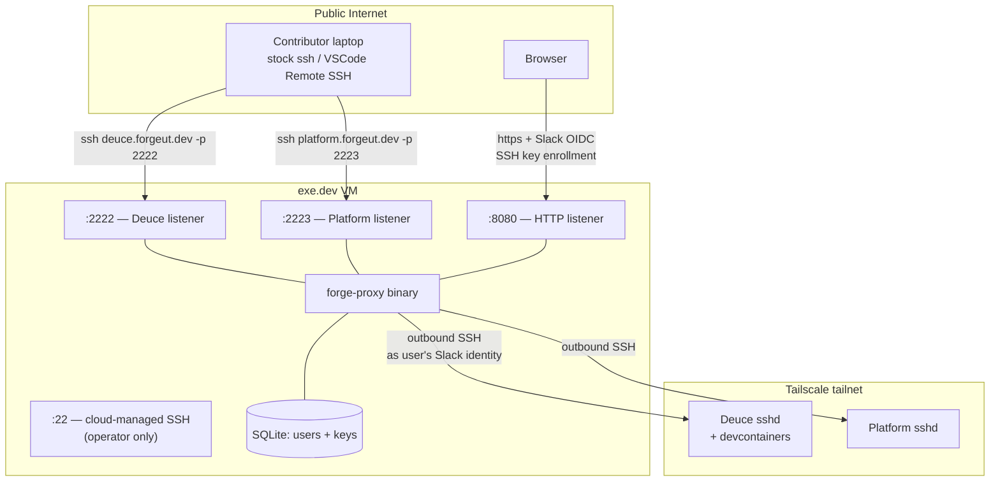

# Forge SSH Proxy

## Summary

A second listener inside the forge-proxy binary that accepts SSH connections on operator-configured ports — one port per upstream box — authenticates each connection via a public key registered to a Slack-identified user, role-checks against the port's allowlist, and forwards the session to the mapped upstream over the tailnet. Unknown keys trigger a TOFU enrollment flow that completes through the existing Slack OIDC sign-in.

---

## Problem Frame

Forge Utah is standing up a collaborative AI coding environment as one of the apps behind forge-proxy. The environment exposes per-user devcontainers, and contributors want to drive them through VSCode Remote SSH — the standard remote-development workflow. Today there is no SSH path: the proxy VM's port 22 is owned by the exe.dev cloud service for operator administration, the upstream app VMs sit behind Tailscale ACLs that block end-user dev machines, and Forge contributors will not install Tailscale on every laptop they own.

The HTTP side of forge-proxy already solved the right half of this problem for browser traffic: one place to enforce Slack identity, one role vocabulary, one set of tailnet ACLs gating the upstream apps. SSH needs the same chokepoint with the same identity vocabulary sitting in the same binary, so a Forge contributor's experience of "log in once with Slack, get the access your roles allow" extends to remote development.

Without it, the AI coding environment either has to ship its own auth — exactly what forge-proxy was built to prevent every app from doing — or remain unreachable from contributor laptops.

---

## Actors

- A1. **Forge Utah Slack member (SSH user)** — primary end user. Wants to SSH from their dev machine to a Forge upstream box (today: Deuce, hosting devcontainers) via stock `ssh` or VSCode Remote SSH.
- A2. **Forge Utah admin (operator)** — adds upstream SSH targets, allocates ports, revokes keys, force-logs-out users.
- A3. **Upstream Forge box** — a tailnet-resident VM that runs its own sshd and is the SSH terminus. Owns whatever happens after SSH lands, including per-user devcontainer routing.
- A4. **Slack workspace** — `forgeutah.slack.com`. The identity provider; same role as on the HTTP side.

---

## Key Flows

- F1. **First-time SSH (TOFU key enrollment)**
  - **Trigger:** A Slack member tries `ssh deuce.forgeut.dev -p 2222` from a machine whose public key is not yet registered.
  - **Actors:** A1, A4
  - **Steps:** SSH client offers its default public key(s) → proxy looks up each fingerprint → none match → proxy rejects publickey and offers keyboard-interactive, with the prompt body containing a one-time enrollment URL bound to the offered fingerprint → user opens URL in a browser → page is gated by the existing forge-proxy Slack OIDC flow → page shows the fingerprint being registered before sign-in → Slack sign-in completes registration → page tells user to retry SSH → next connection succeeds via standard publickey.
  - **Outcome:** The key is bound to the user record. Future connections from that machine succeed without re-enrollment.
  - **Covered by:** R3, R4, R5, R6, R7

- F2. **Returning SSH (role-checked forward)**
  - **Trigger:** A Slack member SSHes to an upstream port with a registered key.
  - **Actors:** A1, A3
  - **Steps:** SSH client offers key → proxy matches fingerprint → proxy verifies user is still a workspace member and has at least one role on the port's allowlist → proxy opens an outbound SSH session to the mapped upstream tailnet address, authenticating as the user's Slack identity → proxy forwards every channel and request between the two sessions.
  - **Outcome:** The user has an end-to-end SSH-capable session on the upstream. VSCode Remote SSH, SFTP, port forwarding all work normally.
  - **Covered by:** R8, R9, R10, R11

- F3. **Unauthorized — registered user without the required role**
  - **Trigger:** A user with a registered key SSHes to an upstream port whose allowlist they do not satisfy.
  - **Actors:** A1
  - **Steps:** Key matches → proxy resolves user roles → no intersection with the port's allowlist → proxy closes the connection with a server-side log entry and a brief client-visible disconnect message.
  - **Outcome:** No session opened. No upstream traffic. User is informed enough to ask an admin for the right role.
  - **Covered by:** R8, R9

- F4. **Off-boarding while a session is live**
  - **Trigger:** An admin needs to revoke a user whose VSCode Remote SSH session has been open for hours.
  - **Actors:** A2
  - **Steps:** Admin runs the SSH force-logout command → proxy looks up that user's live SSH sessions → proxy closes each session at both the client- and upstream-facing ends. To prevent future SSH access with the user's existing registered keys, admin additionally runs `remove-ssh-key` per fingerprint (or deletes the user record entirely).
  - **Outcome:** Active sessions terminate immediately. Future SSH attempts depend on the operator's follow-up actions — there is no automatic detection of off-boarded users. Mirrors the HTTP-side off-boarding model.
  - **Covered by:** R12, R14

---

## Requirements

**Listener and routing**
- R1. The proxy must expose a separate SSH listener for each configured upstream, on a port chosen by the operator. The cloud-managed SSH on port 22 of the proxy VM remains untouched.
- R2. Each listener must be mapped at configuration time to exactly one upstream tailnet address-and-port pair, plus an `allowed_roles` list. No routing decisions happen below that mapping — the listening port fully determines the upstream.

**Authentication**
- R3. SSH authentication must be by public key against keys registered to the proxy's existing user records. The same `users` table that backs the HTTP side carries the registered SSH keys.
- R4. When an SSH connection offers a public key whose fingerprint is unknown, the proxy must reject publickey and offer keyboard-interactive with a prompt body containing a one-time enrollment URL. The URL must be bound server-side to the offered fingerprint and must expire after a short window.
- R5. The enrollment page must be gated by the existing Slack OIDC sign-in flow. The page must display the fingerprint being registered prominently before the user signs in. A successful Slack sign-in must bind the offered fingerprint to the signed-in user's record.
- R6. A single user record may hold any number of registered SSH keys. Admins must be able to remove individual keys by fingerprint.
- R7. After enrollment completes, the next SSH connection offering that key must authenticate via standard publickey without re-entering the enrollment flow.

**Authorization**
- R8. After successful authentication and before opening any upstream connection, the proxy must verify the user is still a current Slack workspace member.
- R9. After the workspace check, the proxy must verify the user holds at least one role on the listening port's `allowed_roles` list. Failing either check closes the connection with a server-side log entry and a brief client-visible message; no outbound SSH connection is opened.

**Upstream session forwarding**
- R10. The proxy must open a fresh outbound SSH session to the mapped upstream and proxy every channel type and channel request between the two sessions — session, direct-tcpip, exec, pty, env, signal, subsystem (including SFTP), window-change. VSCode Remote SSH (including its server upload over the session channel) must work end-to-end through the proxy.
- R11. The proxy must authenticate to the upstream as the user's Slack identity (e.g., email or stable Slack user ID) — not as the username the SSH client typed and not as a shared service account. The upstream sees a stable per-user identity it can use to route to per-user resources such as a specific devcontainer.

**Long-running sessions**
- R12. The proxy must close active SSH sessions when their user is admin-force-logged-out. Force-logout is the operator-driven revocation mechanism — there is no automatic re-check loop.

**Operations**
- R14. Admin commands must exist for: removing a user's SSH key by fingerprint, listing a user's registered keys, and force-closing live SSH sessions for a user. The shape mirrors the existing `admin` subcommands on the HTTP side.
- R15. SSH connection events — auth success, auth failure, enrollment URL issued, enrollment completed, role denial, session opened, session closed, force-close — must be logged with the same structure and visibility as the existing HTTP request log.

---

## Acceptance Examples

- AE1. **Covers R3, R4, R5, R7.** Given a Slack workspace member who has not registered any SSH key yet, when they run `ssh deuce.forgeut.dev -p 2222` from a laptop with a stock OpenSSH client and a default `~/.ssh/id_ed25519`, then the proxy rejects publickey, presents a keyboard-interactive prompt containing an enrollment URL bound to the offered key's fingerprint, the user opens the URL, sees the fingerprint they're about to register, signs in with Slack, the binding is recorded, and a follow-up SSH attempt succeeds via standard publickey without re-enrolling.

- AE2. **Covers R8, R9.** Given a user with a registered key but no role on the port's `allowed_roles` list, when they SSH to that port, then the proxy completes publickey authentication, looks up roles, finds no intersection with the allowlist, closes the connection with a brief client-visible message and a role-denied log entry, and never opens an outbound SSH connection to the upstream.

- AE3. **Covers R10, R11.** Given a Forge contributor with the `ai-dev` role and a registered key, when they connect via VSCode Remote SSH to `deuce.forgeut.dev:2222`, then the proxy authenticates them, opens an outbound SSH session to the Deuce upstream presenting their Slack identity as the principal, forwards the session and SFTP subsystem channels through, VSCode uploads its server binary and connects to it, and the contributor uses the dev-containers extension to attach to their devcontainer — without forge-proxy ever modeling devcontainer identity.

- AE4. **Covers R12.** Given a contributor with an active VSCode Remote SSH session that has been open for six hours, when an admin runs `ssh-force-logout` for that contributor, then the proxy closes the live session at both the client- and upstream-facing ends within a small bounded window. If the admin also runs `remove-ssh-key` for that contributor's fingerprints, subsequent SSH attempts are denied at publickey authentication.

---

## Success Criteria

- A Slack workspace member with the required role can drive a VSCode Remote SSH session into a Deuce devcontainer using nothing more than a hostname, a port, and their default SSH key — no `~/.ssh/config` edits, no CLI tools to install, no extension setup beyond VSCode Remote SSH itself.
- Adding a new SSH-accessible upstream requires only allocating a port, opening it on the firewall, and adding a row to the proxy's SSH upstream config. The upstream's internals — multi-tenancy, container routing, anything past the SSH terminus — are not modeled in forge-proxy.
- Off-boarding a Slack-removed user closes their active SSH sessions within a bounded re-check window, without operator intervention beyond the existing force-logout pattern.
- A Forge admin can answer "who SSHed to which upstream when" by reading the proxy's existing log stream, with no separate audit tool.
- The SSH proxy does not change any contract the HTTP layer enforces with upstream apps. The two layers share the user table, role vocabulary, and admin shape but do not interfere with each other's request paths.

---

## Scope Boundaries

- The proxy is intentionally unaware of devcontainers. Per-devcontainer routing, lifecycle, ownership, and authorization all live on the upstream box.
- The proxy is not an SSH certificate authority for end users. Authentication is by registered public key; short-lived user-side certs are explicitly out for v1 because VSCode Remote SSH's persistent connection model is hostile to frequent renewal.
- No client-side configuration (`~/.ssh/config`, `ProxyJump`, `ProxyCommand`, custom wrappers, CLI tooling) is required or expected.
- No per-IP routing or per-upstream IPv6 address allocation. The port is the disambiguator.
- No Slack-DM-based interactive SSH approval flow. SSH auth is publickey only, with TOFU enrollment as the one-time onboarding path.
- No replacement of the cloud-managed SSH on port 22 of the proxy VM.
- No mediation of upstream-to-upstream or service-to-service SSH. Only human contributor sessions inbound from end-user dev machines.

---

## Key Decisions

- **Per-port routing over per-IP, per-username, or per-hostname.** SSH has no SNI equivalent — the hostname the user typed never reaches the server. Per-port keeps the disambiguator inside SSH's standard surface and avoids per-target IP allocation (cloud-provider-dependent) as well as a username-encoding convention. At Forge Utah's scale this is sufficient and cheap; operators allocate one port per upstream.
- **Session-forwarding bastion over raw-tunnel ProxyJump.** Because users connect with stock `ssh host -p port` and no client config, there is no `ProxyJump` to lean on. The proxy must terminate the user's SSH connection, authenticate it, and open a fresh outbound SSH session to the upstream. Larger implementation surface than raw TCP forwarding, but the only shape that satisfies the no-client-config constraint, and it yields a clean single chokepoint for audit and revocation.
- **Pre-registered keys over short-lived issued certs for user-side auth.** VSCode Remote SSH holds persistent connections; user-cert expiry would force frequent re-auth and disconnect long-running sessions. Registered keys with admin-side revocation match the workflow.
- **TOFU enrollment via keyboard-interactive prompt.** The unknown-key path resolves through Slack OIDC on the existing web portal, so SSH inherits the HTTP side's identity gate without inventing a parallel auth mechanism. The fingerprint shown on the enrollment page before Slack sign-in is the user's verification that they are enrolling the right key.
- **Slack sign-in is the enrollment confirmation — no second Yes/No click.** The fingerprint is rendered prominently above the Slack sign-in button so the user verifies before they sign in. A successful sign-in atomically registers the offered key. Chosen over an explicit post-sign-in Yes/No page because the additional click adds friction without changing the security boundary (Slack session compromise already implies enrollment compromise).
- **Identity substitution at the upstream hop.** The proxy presents the user's Slack identity to the upstream rather than passing through the SSH username the client typed. This gives upstreams a stable, spoofing-resistant identity to route per-user (e.g., to a specific devcontainer) without forge-proxy modeling the per-user resources itself.
- **Roles per port, not per user-per-target matrix.** Each listening port carries its own `allowed_roles` list, mirroring the HTTP side's role-tag approach. The proxy stays an identity broker; richer authz lives on the upstream.

---

## Dependencies / Assumptions

- The existing forge-proxy `users` table, role vocabulary, Slack OIDC flow, admin-subcommand shape, and tailnet ACL model are reused. SSH is an additive layer, not a parallel system. Planning confirmed the `users` table cleanly accepts a related `ssh_keys` table via the same `user_id INTEGER REFERENCES users(id) ON DELETE CASCADE` pattern the existing `sessions` table uses.
- Each upstream box exposing an SSH target accepts inbound SSH from the proxy and trusts a forge-proxy-issued user identity for downstream routing decisions. The plan adopts an internal SSH user CA — upstream sshd configures `TrustedUserCAKeys` with the proxy's CA pub, and the proxy mints a short-TTL cert per outbound connection with the user's Slack identity as the principal.
- The proxy VM can bind additional inbound TCP listener ports beyond 22 without conflict and the cloud's firewall permits inbound traffic on those ports. Cloud-managed SSH on port 22 is the only pre-claimed port.
- End-user dev machines have a recent OpenSSH client (or VSCode Remote SSH's equivalent) and at least one usable Ed25519 or RSA key pair. No bespoke client installation.
- Off-boarding is operator-driven, matching the HTTP layer's existing model. There is no automatic Slack-membership re-check during long-lived SSH sessions; revocation happens via `ssh-force-logout` and `remove-ssh-key`.

---

## Outstanding Questions

### Resolve Before Planning

- [Affects R5][User decision] **Enrollment confirmation strength.** Default proposed: fingerprint shown prominently on the enrollment page, Slack sign-in IS the confirmation, no extra confirm click. Alternative: after Slack sign-in, an explicit "Confirm registering key SHA256:abcd…" page with Yes/No. Decide before planning so the page flow can be drawn unambiguously.

### Resolved during planning

- **Upstream-auth mechanism (was Affects R10, R11).** Resolved to internal SSH user CA. Per-outbound-connection ephemeral cert (TTL ~2 min) with principal = user's Slack email; upstream sshd configured with `TrustedUserCAKeys` pointing at the proxy's CA pub. Pubkey-sync and shared-service-account alternatives rejected as worse fits for per-user identity carry-through.
- **SSH server library (was Affects R10).** Build directly on `golang.org/x/crypto/ssh`. Higher-level bastion wrappers (gliderlabs/ssh, charmbracelet/ssh) either narrow the channel surface or actively fight transparent session forwarding. ~200–300 LoC of channel/request pumping.
- **Session-tracking shape (was Affects R12).** In-memory `map[connID]*activeSession` as the source of truth for liveness and force-close. A DB-backed `ssh_sessions` table is added in parallel as an audit log (rows written on open and close), not as a coordination primitive.
- **Off-board revocation model (was Affects R12, R13).** Resolved to operator-driven only, matching HTTP parity. R13's periodic Slack re-check was dropped during planning to avoid a new Slack bot token + `users.info` API dependency. `ssh-force-logout` and `remove-ssh-key` are the two admin commands that effect revocation.
- **SSH upstream config shape (was Affects R2).** New env var `SSH_UPSTREAMS=2222=deuce.tailnet:22|ai-dev,2223=platform.tailnet:22|admin` parsed by a parallel of the existing `parseUpstreams`. Pipe-separator avoids collision with the `[A-Za-z0-9_-]+` role-name character set.
