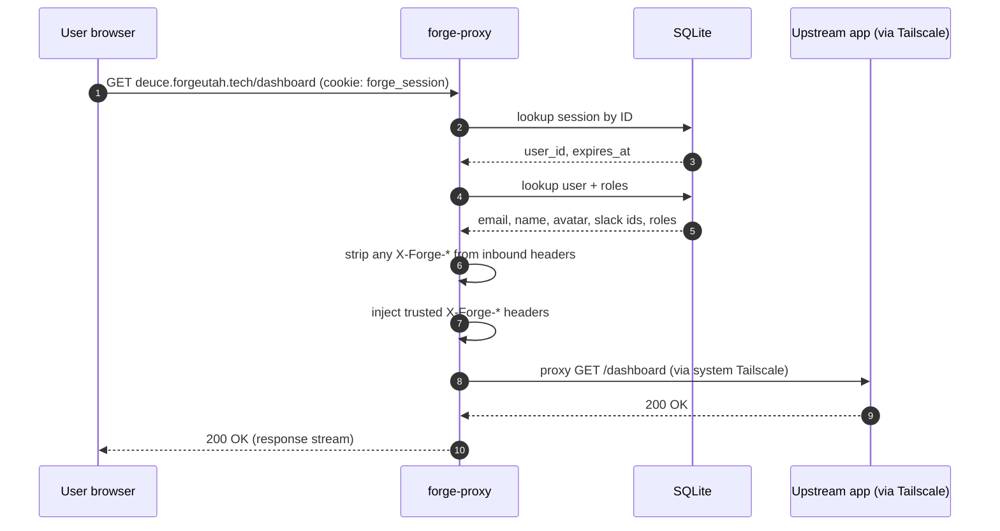
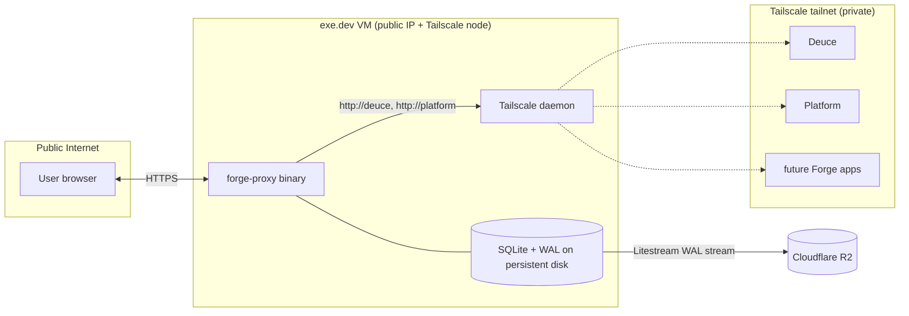

# feat: Forge Auth Proxy

## Summary

A single Go binary deployed publicly to an exe.dev VM (persistent disk + system Tailscale at the OS level) serves an embedded React login page (card variant), authenticates users via Slack OpenID Connect, and reverse-proxies to upstream Forge apps by ordinary hostname — the VM's Tailscale handles network routing, so the binary just dials private hosts and trusts the OS to deliver. SQLite via the pure-Go `modernc.org/sqlite` driver holds users and server-side sessions on the persistent disk, with Litestream replicating the WAL to object storage as backup.

---

## Problem Frame

Forge Utah Foundation runs a small portfolio of internal apps that are currently public and unauthenticated. Each new app would otherwise reinvent its own Slack-based auth. The work motivated by the origin requirements doc is to ship the single shared proxy that ends that duplication — and to do it with the lowest possible operational footprint for a nonprofit with no on-call rotation. See origin for the full problem framing: [docs/brainstorms/forge-auth-proxy-requirements.md](../brainstorms/forge-auth-proxy-requirements.md).

---

## Requirements

This plan satisfies the origin requirements doc. Plan-local R-IDs trace to origin R-IDs verbatim — no renumbering.

**Authentication and access**
- R1. Serve a branded login page on any `*.forgeutah.tech` host behind the proxy when the user is unauthenticated. (origin R1)
- R2. "Continue with Slack" is the only sign-in method exposed. (origin R2)
- R3. Sign-in requires active membership in the `forgeutah.slack.com` workspace; non-members see a distinct branded denial. (origin R3)
- R4. First successful sign-in auto-provisions a user record with stable identity (email, Slack user ID) and an empty roles list — no manual approval. (origin R4)

**Session and SSO**
- R5. Sessions are carried by a cookie scoped to `.forgeutah.tech` for silent SSO across subdomains. (origin R5)
- R6. Identity and role data forwarded to upstream apps reflects current DB state on each request, not a snapshot taken at sign-in. (origin R6)
- R7. A single sign-out invalidates the session across every app behind the proxy. (origin R7)
- R8. Sessions are revocable server-side without rotating any global signing key. (origin R8)

**Header contract to upstream apps**
- R9. Every forwarded request carries headers for: internal user ID, email, roles list, display name, avatar URL, Slack user ID, Slack team ID. (origin R9 — Slack handle deferred, see Key Technical Decisions)
- R10. Roles are a flat list; the proxy does not enforce role-based access. (origin R10)
- R11. Headers are plain values; trust is the network path (only the proxy can reach the apps, via Tailscale) **plus a defense-in-depth `X-Forge-Proxy-Secret`** that each upstream app validates and rejects on mismatch. Every forwarded request also carries `X-Forge-Contract-Version: 1` so future evolution stays additive. (origin R11 — plan-local strengthening; see Key Technical Decisions and Upstream-App Contract)

**Login page**
- R12. The login page is the existing React scaffold, narrowed to the card variant, embedded into the binary. (origin R12)
- R13. The login page renders signed-out, error, and unauthorized states. The connecting/success/already-signed-in states are not user-visible in production because the OAuth round-trip happens server-side. (origin R13 — see Key Technical Decisions for the state-rendering narrowing)

**Operations**
- R14. Users and sessions live in a single SQLite file on the exe.dev VM's persistent disk, with Litestream replicating the WAL to object storage. (origin R14)
- R15. Role management is direct DB edit only — no admin UI in v1. (origin R15)

**Origin actors:** A1 (Slack member), A2 (Forge admin), A3 (upstream app), A4 (Slack workspace)
**Origin flows:** F1 (first sign-in), F2 (silent SSO), F3 (unauthorized), F4 (sign-out), F5 (role change)
**Origin acceptance examples:** AE1 (covers R3, R13), AE2 (R4, R5), AE3 (R5, R6), AE4 (R6, R10), AE5 (R7), AE6 (R11)

---

## Scope Boundaries

Items carried from origin's Scope Boundaries unchanged:

- No admin UI for role management (direct DB only in v1).
- No Slack slash command for role management.
- No per-app role scoping; roles are a flat global list.
- No service-to-service auth — proxy is for human browser traffic only.
- No audit log beyond what session/user tables naturally record.
- No rate-limiting feature focus (basic guard on `/auth/login` only).
- No additional identity providers — Slack only.
- No JWT envelope on header payloads — plain headers, network-path trust.
- No mobile SDK or native-app sign-in flows.

Plan-local scope boundary:

- No Slack `@handle` (`X-Forge-Slack-Handle`) header in v1. Slack OIDC does not expose `@username`, and fetching it would require a bot install with `users:read`. Deferred — see Key Technical Decisions.

### Deferred to Follow-Up Work

- Esbuild bundle for the login page (current Babel-standalone CDN approach ships in v1).
- Bot install + `users.info` fetch to populate `X-Forge-Slack-Handle`.
- Admin UI / Slack slash command for role management.
- Multi-region or multi-machine HA (single VM is sufficient for v1).

---

## Context & Research

### Relevant Code and Patterns

- `auth-app.jsx`, `auth-core.jsx`, `auth-variants.jsx`, `tweaks-panel.jsx`, `styles/`, `assets/`, `index.html` — existing React scaffold to be narrowed and embedded.
- No Go patterns exist in the repo yet — this is greenfield Go.

### Institutional Learnings

- None — `docs/solutions/` does not exist in the repo.

### External References

- [Slack Sign in with Slack (OIDC)](https://docs.slack.dev/authentication/sign-in-with-slack/) — auth flow, scopes, endpoints, ID-token claims.
- [Slack openid.connect.token method](https://docs.slack.dev/reference/methods/openid.connect.token/) — token exchange response shape including `https://slack.com/team_id` claim.
- [pkg.go.dev: net/http/httputil ReverseProxy](https://pkg.go.dev/net/http/httputil#ReverseProxy) — `Rewrite` vs `Director`, `ProxyRequest.SetURL`, `SetXForwarded()`.
- [Go 1.22 routing enhancements](https://go.dev/blog/routing-enhancements) — method+path patterns in `net/http.ServeMux`.
- [modernc.org/sqlite](https://pkg.go.dev/modernc.org/sqlite) — pure-Go SQLite driver, DSN pragmas.
- [pressly/goose v3](https://pkg.go.dev/github.com/pressly/goose/v3) — embedded migrations via `embed.FS`.
- [golang.org/x/oauth2](https://pkg.go.dev/golang.org/x/oauth2) — OAuth client with custom Slack endpoint.
- [coreos/go-oidc/v3](https://pkg.go.dev/github.com/coreos/go-oidc/v3) — ID-token verification, JWKS rotation.
- [Litestream](https://litestream.io/) — continuous WAL replication for SQLite.
- [Ory: Hop-by-hop header vulnerability in Go](https://www.ory.sh/hop-by-hop-header-vulnerability-go-standard-library-reverse-proxy/) — why `Rewrite` is preferred over `Director` for trusted-header injection.
- [Outline OAuth state CVE GHSA-mjgw-5j7q-gv8v](https://github.com/outline/outline/security/advisories/GHSA-mjgw-5j7q-gv8v) — bind state to a cookie, not a server table.

---

## Key Technical Decisions

### Auth flow and identity

- **Sign in with Slack (OIDC), not `oauth.v2.access`.** Minimum-privilege flow (`openid profile email` scopes), no workspace install required. Workspace membership verified by the `https://slack.com/team_id` claim in the ID token — a non-member cannot complete OAuth against the configured team. (see Alternatives Considered)
- **Drop `X-Forge-Slack-Handle` from v1 headers.** Slack OIDC does not expose `@username` and there is no cheap way to populate it without a bot install. R9's intent is otherwise covered by `X-Forge-Name`. Upstream apps that need Slack mentions or deep-links should construct them from `X-Forge-Slack-User-Id` using the `slack://user?team=...&id=...` URI scheme.
- **Workspace membership is verified only at sign-in.** A Forge Slack member who is removed from the workspace after signing in keeps their session until it expires or is manually revoked. Operational mitigation: admin executes `DELETE FROM sessions WHERE user_id = ?` as part of off-boarding (documented in U10 runbook). Periodic Slack re-verification is explicitly deferred — adds Slack API dependency on the request hot path for marginal benefit at this scale.
- **Slack guest accounts are accepted as authenticated members.** OIDC `team_id` does not distinguish guests from full members. The workspace admin's guest list is effectively the access list. Documented in the README guest-management section; deferable to a future bot-install upgrade.
- **ID-token verification is explicit and tightly pinned via `coreos/go-oidc/v3`:** (1) `SupportedSigningAlgs = ["RS256"]` — algorithm pinned; no JWKS-advertised alternatives accepted (defense against algorithm-confusion); (2) issuer pinned to exact string `https://slack.com`; (3) audience pinned to the configured Slack client ID; (4) `iat` skew tolerance 2 min, `exp` strict; (5) `nonce` compared to pre-auth cookie via `subtle.ConstantTimeCompare`; (6) `team_id` claim (`https://slack.com/team_id`) parsed from raw claims map and `ConstantTimeCompare`d to configured value; (7) userinfo endpoint is NOT consulted — verified ID token is the sole identity source.

### CSRF, cookies, and redirects

- **OAuth CSRF via pre-auth cookie binding.** State + nonce + `returnTo` live in a short-lived (10 min) cookie at the auth host. Avoids the Outline-CVE-class account-linking attack.
- **Pre-auth cookie uses the `__Host-` prefix** (`__Host-forge_pre_auth`). The prefix forbids a `Domain` attribute, requires `Secure`, and requires `Path=/` — pinning the cookie to exactly `auth.forgeutah.tech` and blocking subdomain cookie-shadowing if any other `*.forgeutah.tech` host is ever compromised.
- **State values are single-use.** `/auth/callback` deletes the pre-auth cookie at the start of handling, regardless of whether downstream verification succeeds. A captured state value cannot be replayed even within its 10-minute lifetime. Rate limiting on `/auth/callback` is a secondary defense.
- **`returnTo` validation is strict.** Parsed with `net/url.Parse`, then asserted: `Scheme == "https"`; `User == nil` (no userinfo); `Host` is exactly `forgeutah.tech` or ends in `.forgeutah.tech` (leading dot required to exclude `notforgeutah.tech`); `Port()` empty or `"443"`; host is ASCII and does not begin with `xn--` (no IDN/punycode homographs); the validator returns the URL's reconstructed `String()`, not the raw input (defense against parser differentials). Any failure falls back to `https://auth.forgeutah.tech/`.
- **Session cookie: `HttpOnly`, `Secure`, `SameSite=Lax`, `Domain=.forgeutah.tech`.** `Strict` would break the OAuth callback's top-level navigation back from Slack; `Lax` is the correct default. Session IDs are minted exclusively server-side from `crypto/rand` (32 bytes, base64url); any pre-existing `forge_session` cookie is ignored on successful callback and a fresh ID is minted (defense against fixation).
- **Sessions are not bound to IP or User-Agent.** Forge members roam across networks and this would be a usability disaster for marginal security gain. Theft mitigated by `HttpOnly` + `Secure` + `SameSite=Lax` + 14-day idle / 30-day absolute caps + server-side revocation.
- **`/auth/logout` validates `Origin` header against the configured auth host.** Reject with 403 if missing or mismatched. `POST` + `SameSite=Lax` + `Origin` together cover CSRF without threading a per-session CSRF token through every upstream app.
- **Sign-out is per-device, not per-user.** Deleting the current session's row signs out only the browser holding that cookie. Force-sign-out-everywhere uses `DELETE FROM sessions WHERE user_id = ?` (U10 runbook). This is the intended trade-off — a phone or second laptop's session is independent.

### Sessions and persistence

- **Server-side opaque session ID, not signed cookies.** R8 (revocation) and R6 (live role lookup) both require server-side state per request. A signed cookie buys nothing once we're hitting the DB anyway.
- **Hand-rolled session store (~40 LOC), not `alexedwards/scs`.** SCS's SQLite adapter assumes CGO; using `modernc.org/sqlite` would require a custom adapter regardless. At ~40 lines of clear SQL, the dependency stops paying for itself. (see Alternatives Considered)
- **Sliding session expiration: 30-day absolute max, 14-day idle window.** `last_seen_at` updates only when the previous `last_seen_at` is older than **60 seconds** — bounds write pressure on the writer pool from chatty clients without weakening the sliding window meaningfully.
- **`Touch` failures (e.g., ENOSPC from disk-full) must not block the request.** Log the error, surface as a counter for ops alerting, serve the cached session value — the user keeps working until the session expires or an operator intervenes. Validation of the session itself remains read-only and continues to work.
- **`modernc.org/sqlite` (pure Go), not `mattn/go-sqlite3` (CGO).** Single static binary, trivial cross-compile. (see Alternatives Considered)
- **WAL mode, two-pool DB pattern.** Writer pool with `MaxOpenConns=1` and `_txlock=immediate` eliminates the SQLite write-deadlock footgun; reader pool allows concurrent reads. PRAGMAs: `journal_mode=WAL`, `synchronous=NORMAL`, `foreign_keys=ON`, `busy_timeout=5000`.
- **Migrations via `pressly/goose/v3` embedded in the binary.** Idempotent run on every startup.
- **JWKS fetch is lazy with timeout, not blocking on startup.** Verifier construction wraps Slack's JWKS endpoint with a 30s timeout and falls open with a warning log if Slack is unreachable at boot. The proxy hot path (existing sessions, header injection) keeps working; only new sign-ins degrade. `/healthz` reports OIDC status separately from overall health.
- **Internal user ID is a separate integer from the Slack user ID.** Upstream apps should key persistent records on `X-Forge-User-Id` (stable integer) rather than `X-Forge-Email` — email may change when a user updates their Slack profile, and we mirror that change on next sign-in per R6.
- **Role names are constrained to `[A-Za-z0-9_-]+`.** The store rejects writes containing `,`, whitespace, or other separators — prevents the silent two-roles-from-one-edit footgun that direct-DB management would otherwise allow. Constraint enforced in code, not just docs.

### Trust boundary and upstream contract

- **Defense-in-depth: shared `X-Forge-Proxy-Secret` header.** In addition to network-path trust (Tailscale-only reachability), every outbound request from the proxy carries `X-Forge-Proxy-Secret: <random>` from an env var. Upstream apps MUST validate this header and reject any request that lacks it or has a wrong value. Converts a Tailscale ACL misconfiguration from "full compromise" into "still needs the secret." Rotation is a coordinated proxy + apps redeploy — acceptable at v1's two-app scale.
- **Header strip is layered, not just prefix-based.** On outbound, the proxy: (a) iterates `pr.Out.Header` and `Del`-s every key whose canonical form begins with `X-Forge-` (case-insensitive); (b) strips any `Trailer` entry that names an `X-Forge-*` header; (c) calls `Del` immediately before each trusted `Set` (defense against duplicate-value coalescing where a single `Set` only writes the first index of a slice). The trust anchor is Go's HTTP/1.1 and HTTP/2 servers rejecting obs-fold and non-ASCII header names at parse time.
- **`net/http/httputil.ReverseProxy` with `Rewrite`, not `Director`.** Modern API; hop-by-hop headers and inbound `X-Forwarded-*` are stripped before our function runs. (see Alternatives Considered)
- **`X-Forge-Contract-Version: 1` is set on every outbound request from day one.** Lets future apps branch on contract version cheaply when v2 lands. Evolution rule: additive-only; deletions or semantic changes require a version bump.
- **Header value encoding for non-ASCII** (e.g., a Slack display name with emoji): values are UTF-8, with any non-ASCII bytes percent-encoded (RFC 8187 form). Roles list never contains non-ASCII because role names are constrained ASCII. Documented in the upstream-app contract.

### Login page and UI

- **Login-page rendering: query-param state, server owns transition state.** The OAuth round-trip is server-side; the React app renders only terminal states: `logged-out` (default), `error` (`?error=auth_failed`), and `unauthorized` (`?error=not_in_workspace`). `connecting`/`success` states from the scaffold are dropped from runtime. The error-state contract is defined in U6 and consumed by U7.
- **`GET auth.forgeutah.tech/` with a valid session cookie 302s to the default landing**, rather than rendering the logged-out state. Realizes origin R13's "already-signed-in" state as a redirect, not a rendered card — consistent with server-driven transitions everywhere else.
- **Login page distribution: keep Babel-standalone, no build step.** Architectural trade: in-browser transpile cost on every cold load against zero JS toolchain in this Go repo. Rejected adding an esbuild step to a Go-only repo. Revisit if first-load latency degrades materially or the scaffold grows past Babel-standalone's single-file limit.
- **The other two variants (terminal, split) and the tweaks panel are deleted, not retained-as-reference.** Avoids dead-code drift in the embedded asset tree.

### Networking and deployment

- **Go binary dials by hostname only; system Tailscale on the VM does routing.** No `tsnet` library in the binary. Tailscale is installed and authenticated on the exe.dev VM as part of provisioning.
- **Go 1.22+ stdlib `net/http.ServeMux`.** Method+path patterns are sufficient for the dozen routes this proxy needs. (see Alternatives Considered)

---

## Open Questions

### Resolved During Planning

- Session storage shape (origin Outstanding Questions): opaque session ID + server-side `sessions` table.
- Deployment target (origin Outstanding Questions): exe.dev VM with persistent disk + system Tailscale.
- Language/runtime (origin Outstanding Questions): Go 1.23+.
- Header naming convention (origin Outstanding Questions): `X-Forge-*` prefix.
- Slack OAuth workspace membership query (origin Outstanding Questions): OIDC ID-token `https://slack.com/team_id` claim — no follow-up Slack API call needed.
- Login variant (origin Outstanding Questions): Card.

### Deferred to Implementation

- Exact retry/backoff for the OIDC token-exchange HTTP call when Slack is briefly unavailable. Stdlib defaults likely sufficient; revisit if observed.
- Litestream tuning (sync interval, retention) — start with defaults, adjust after observing real WAL volume.
- Whether to compress the embedded React assets via the `embed.FS` build (gzip pre-compression) or leave to runtime middleware. Defaults are fine for v1.
- Whether sessions should be excluded from Litestream replication entirely (re-creatable on next sign-in; would reduce backup-compromise blast radius). Decision deferred — current default is to replicate them; if the team is more comfortable with the bucket-compromise risk being "user identity disclosure" instead of "user identity disclosure + active-session theft," split sessions into a separate non-replicated DB file in a follow-up.
- Confirm with Slack docs/empirical test that the `team=<TEAM_ID>` parameter on `/authorize` is a workspace hint vs. a hard constraint. The unauthorized-state copy and U6 server-side check assume hint-only; tighten language if Slack treats it as a constraint.
- Whether `forge-proxy admin` should also expose `list-sessions <email>` for visibility into multi-device sign-ins. Probably yes, but minor — add when first needed.
- Header encoding choice for non-ASCII display names: RFC 8187 percent-encoded value vs base64 (the upstream-app contract says RFC 8187; confirm during U8 impl that this round-trips cleanly through Go's `http.Header` and through common app-side HTTP frameworks).

---

## Output Structure

```
forge-proxy/
├── go.mod
├── go.sum
├── cmd/
│   └── forge-proxy/
│       └── main.go                  # entry point, wiring, graceful shutdown
├── internal/
│   ├── auth/
│   │   ├── oidc.go                  # Slack OIDC config, ID-token verification
│   │   ├── handlers.go              # /auth/login, /auth/callback, /auth/logout
│   │   ├── state.go                 # pre-auth cookie: state/nonce/returnTo
│   │   ├── returnto.go              # returnTo URL validator
│   │   └── *_test.go
│   ├── session/
│   │   ├── store.go                 # sessions table CRUD, sliding expiration
│   │   ├── cookie.go                # cookie helpers (scope, flags)
│   │   └── *_test.go
│   ├── user/
│   │   ├── store.go                 # users table CRUD, role read, auto-provision
│   │   └── *_test.go
│   ├── proxy/
│   │   ├── proxy.go                 # httputil.ReverseProxy + Rewrite
│   │   ├── headers.go               # X-Forge-* strip + inject
│   │   ├── hostmap.go               # upstream hostname routing
│   │   └── *_test.go
│   ├── db/
│   │   ├── sqlite.go                # open WAL, writer/reader pools
│   │   ├── migrations.go            # goose runner
│   │   └── migrations/
│   │       ├── 0001_create_users.sql
│   │       └── 0002_create_sessions.sql
│   ├── config/
│   │   └── config.go                # env loading, validation
│   ├── httplog/
│   │   └── middleware.go            # request ID, slog access logs
│   └── web/
│       ├── assets.go                # embed.FS for login page
│       └── assets/                  # narrowed React scaffold:
│           ├── index.html
│           ├── auth-app.jsx
│           ├── auth-core.jsx
│           ├── auth-variants.jsx    # card only
│           ├── styles/
│           │   ├── auth.css
│           │   └── tokens.css
│           └── images/
│               ├── forge-icon.svg
│               └── forge-logo.webp
├── litestream.yml                   # replication config
├── Dockerfile                       # build artifact for exe.dev
├── README.md                        # operator runbook
└── docs/
    ├── brainstorms/forge-auth-proxy-requirements.md
    └── plans/2026-05-20-001-feat-forge-auth-proxy-plan.md
```

The top-level `auth-*.jsx`, `index.html`, `styles/`, `assets/`, and `tweaks-panel.jsx` files are moved into `internal/web/assets/` during U7 and removed from the root.

---

## High-Level Technical Design

> *This illustrates the intended approach and is directional guidance for review, not implementation specification. The implementing agent should treat it as context, not code to reproduce.*

### Sign-in flow (F1, F2, F3)

```mermaid
sequenceDiagram
    autonumber
    participant U as User browser
    participant P as forge-proxy (exe.dev VM)
    participant S as Slack OIDC
    participant DB as SQLite

    U->>P: GET deuce.forgeutah.tech/something
    P->>P: no session cookie
    P-->>U: 302 → /auth/login?return_to=...
    U->>P: GET auth.forgeutah.tech/auth/login
    P->>P: generate state + nonce, write pre-auth cookie (10 min)
    P-->>U: 302 → slack.com/openid/connect/authorize?...&team=<TEAM_ID>
    U->>S: authorize
    S-->>U: 302 → /auth/callback?code=...&state=...
    U->>P: GET /auth/callback
    P->>P: verify state == pre-auth cookie
    P->>S: POST /api/openid.connect.token
    S-->>P: id_token + access_token
    P->>P: verify ID-token signature (JWKS), nonce, team_id claim
    alt team_id matches forgeutah workspace
        P->>DB: upsert user (Slack ID, email, name, avatar)
        P->>DB: insert session row
        P-->>U: Set-Cookie forge_session; 302 → return_to
    else not in workspace
        P-->>U: render unauthorized state (no session cookie)
    end
```

### Proxy request path (F2, R9, R10, R11)



### Trust boundary



---

## Implementation Units

### U1. Go module bootstrap and minimal HTTP server

**Goal:** A buildable Go 1.23 module with the project layout in place and a binary that serves a `/healthz` endpoint. Establishes the skeleton on which every other unit builds.

**Requirements:** Enables all of R1–R15 by providing the binary.

**Dependencies:** None.

**Files:**

- Create: `go.mod`
- Create: `cmd/forge-proxy/main.go`
- Create: `internal/` directory skeleton with package stubs (`auth/`, `session/`, `user/`, `proxy/`, `db/`, `config/`, `httplog/`, `web/`)
- Create: `.gitignore` (binary, `*.db`, `*.db-wal`, `*.db-shm`)
- Create: `Makefile` or `justfile` (optional convenience; can defer)
- Test: `cmd/forge-proxy/main_test.go`

**Approach:**

- `main.go` opens a listener on `LISTEN_ADDR` (default `:8080`), serves `GET /healthz` returning `200 ok`, and stops cleanly on SIGTERM (graceful shutdown comes in U10; for now, a basic `srv.Shutdown` is fine).
- Skeleton internal packages have only a one-line doc comment to make the layout visible; real code lands in later units.
- Module path: `github.com/forgeutah/forge-proxy` (or whatever the user's import path actually is — confirm during impl if unsure).

**Patterns to follow:** None local; standard Go layout convention (`cmd/` for entry points, `internal/` for non-exported packages).

**Test scenarios:**

- Happy path: `GET /healthz` returns 200 with body `ok`.
- Happy path: binary builds with `go build ./...` and runs without panicking.

**Verification:**

- `go build ./cmd/forge-proxy` succeeds.
- `curl localhost:8080/healthz` returns `ok`.
- `go test ./...` runs (no failures, no tests yet beyond healthz).

---

### U2. Configuration loading

**Goal:** Centralized env-driven config that is validated at startup and threaded into every package that needs it. Fail fast on missing or invalid values.

**Requirements:** R3 (team_id config), R5 (cookie domain), R9 (upstream host map), R14 (DB path).

**Dependencies:** U1.

**Files:**

- Create: `internal/config/config.go`
- Test: `internal/config/config_test.go`
- Modify: `cmd/forge-proxy/main.go` (load config at startup, pass into wiring)

**Approach:**

- `Config` struct with fields: `ListenAddr`, `BaseDomain` (e.g. `forgeutah.tech`), `AuthHost` (e.g. `auth.forgeutah.tech`), `CookieDomain` (`.forgeutah.tech`), `SlackClientID`, `SlackClientSecret`, `SlackTeamID`, `DBPath`, `UpstreamMap` (map of `host → URL`, parsed from a single env var like `UPSTREAMS=deuce.forgeutah.tech=http://deuce:8080,platform.forgeutah.tech=http://platform:8080`), `SessionLifetime` (default 30d), `SessionIdleTimeout` (default 14d), `LogLevel`.
- Validation: secrets non-empty, hosts well-formed URLs, team_id matches Slack's `T*` prefix shape, DB path is writable.
- No env file dependency at runtime; secrets are injected by exe.dev.

**Patterns to follow:** Stdlib only — `os.Getenv` + a small struct. No `viper`/`koanf` dependency for a config this small.

**Test scenarios:**

- Happy path: all required env vars set, struct populated correctly, validation passes.
- Edge case: `UPSTREAMS` empty → validation fails with a clear error naming the env var.
- Edge case: `UPSTREAMS=deuce.forgeutah.tech=not-a-url` → validation fails.
- Edge case: `SLACK_TEAM_ID=NotATeam` (no `T` prefix) → validation fails.
- Error path: missing `SLACK_CLIENT_SECRET` → startup error names the missing var.

**Verification:**

- Binary refuses to start with incomplete env.
- Loaded `Config` can be passed to every other package without import cycles.

---

### U3. SQLite layer and migrations

**Goal:** Open the database with the correct pragmas and pools, run embedded migrations idempotently at startup, and create the `users` and `sessions` tables. Provides a clean DB handle to U4 and U5.

**Requirements:** R4 (user provisioning storage), R5 (session storage), R14 (single SQLite file on persistent disk), R15 (direct-DB role admin).

**Dependencies:** U1, U2.

**Files:**

- Create: `internal/db/sqlite.go`
- Create: `internal/db/migrations.go`
- Create: `internal/db/migrations/0001_create_users.sql`
- Create: `internal/db/migrations/0002_create_sessions.sql`
- Test: `internal/db/sqlite_test.go`
- Modify: `cmd/forge-proxy/main.go` (open DB at startup, run migrations)
- Modify: `go.mod`/`go.sum` (add `modernc.org/sqlite`, `github.com/pressly/goose/v3`)

**Approach:**

- `Open(path)` returns a `*DB` wrapping two `*sql.DB` handles: a writer (`MaxOpenConns=1`) and a reader (`MaxOpenConns=runtime.NumCPU()` or 4, whichever is larger), both pointed at the same file in WAL mode.
- DSN pragmas: `journal_mode=WAL`, `synchronous=NORMAL`, `foreign_keys=ON`, `busy_timeout=5000`, `_txlock=immediate` on the writer DSN.
- `migrations.go` registers the embedded FS with goose, sets dialect to `"sqlite3"`, runs `goose.Up()` on the writer handle on startup.
- Schemas:
  - `users`: `id INTEGER PRIMARY KEY AUTOINCREMENT`, `slack_user_id TEXT NOT NULL UNIQUE`, `slack_team_id TEXT NOT NULL`, `email TEXT NOT NULL`, `name TEXT NOT NULL`, `avatar_url TEXT NOT NULL`, `roles TEXT NOT NULL DEFAULT ''` (comma-separated), `created_at INTEGER NOT NULL`, `last_login_at INTEGER NOT NULL`.
  - `sessions`: `id TEXT PRIMARY KEY`, `user_id INTEGER NOT NULL REFERENCES users(id) ON DELETE CASCADE`, `created_at INTEGER NOT NULL`, `last_seen_at INTEGER NOT NULL`, `expires_at INTEGER NOT NULL`, `user_agent TEXT`, `ip TEXT`; index on `expires_at`.

**Technical design:**

Two-pool pattern (directional):

```text
writeDB  ── sql.Open("sqlite", "file:forge.db?_pragma=journal_mode(WAL)&...&_txlock=immediate")
            SetMaxOpenConns(1)

readDB   ── sql.Open("sqlite", "file:forge.db?_pragma=journal_mode(WAL)&...&mode=ro")
            SetMaxOpenConns(max(4, NumCPU))
```

Migrations live under `internal/db/migrations/` and are loaded via `//go:embed migrations/*.sql`.

**Patterns to follow:** External research references (see Context section) on modernc.org/sqlite DSN and the writer/reader split pattern.

**Test scenarios:**

- Happy path: open a temp DB, run migrations, verify both tables exist with expected columns.
- Happy path: re-running migrations on an existing DB is a no-op (idempotent).
- Edge case: open with `path` pointing at a non-existent directory → error names the bad path.
- Integration: write a user via writeDB, read it via readDB — confirms WAL mode lets readers see committed writes without contention.
- Edge case: simulate concurrent inserts from 10 goroutines on writeDB → all succeed (no `SQLITE_BUSY`) because `MaxOpenConns=1` + `busy_timeout` serializes them.

**Verification:**

- Fresh binary starts, creates `forge.db`, applies migrations, both tables queryable.
- No `SQLITE_BUSY` errors under concurrent test load.

---

### U4. Session store and cookie helpers

**Goal:** Server-side session lifecycle (create, lookup, touch, revoke, sweep) and the cookie helpers that read/write the shared `.forgeutah.tech` cookie. The only place in the codebase that knows the cookie name and flags.

**Requirements:** R5 (cookie-carried sessions, shared subdomain scope), R6 (sessions are looked up on each request), R7 (sign-out revokes), R8 (server-side revocation). Realizes the session-data side of F4 (sign-out).

**Dependencies:** U3.

**Files:**

- Create: `internal/session/store.go`
- Create: `internal/session/cookie.go`
- Test: `internal/session/store_test.go`
- Test: `internal/session/cookie_test.go`

**Approach:**

- `Store` wraps the DB. Methods: `Create(userID) (*Session, error)`, `Get(id) (*Session, error)`, `Touch(id, now) error`, `Delete(id) error`, `DeleteAllForUser(userID) error`, `Sweep(now) (int, error)`.
- Session ID: 32 bytes from `crypto/rand`, `base64.RawURLEncoding`.
- Sliding expiration: `expires_at = min(now + idle_timeout, created_at + absolute_lifetime)` (no extension past absolute). Default values come from config (U2).
- **Touch throttling:** `Touch` only writes if `now - last_seen_at >= 60s`. Sub-60s updates are no-ops. Bounds write pressure from chatty clients while preserving the sliding window semantics.
- **Touch failure handling:** if the underlying write fails (disk full, brief WAL contention beyond `busy_timeout`), `Touch` returns the error but the caller (U8) does NOT block the request — it logs and continues. The session remains valid for the rest of its current window.
- Cookie helpers (`cookie.go`): `Set(w, sessionID, expires, domain)` and `Clear(w, domain)`. Flags: `HttpOnly=true`, `Secure=true`, `SameSite=Lax`, `Path="/"`, `Domain=.forgeutah.tech` (from config). Cookie name: `forge_session`.
- `Read(r) (sessionID, ok)` returns the session ID from the cookie, or `""`, `false` if missing.
- **Distinct sentinels:** `Get` returns one of three results — found, `ErrNotFound`, or `ErrExpired`. Callers MAY treat both error sentinels as "redirect to login" but the distinction is preserved for metrics/logging.

**Execution note:** Implement test-first. Sessions are the load-bearing primitive for R5/R6/R7/R8; getting the lifecycle wrong is a security bug.

**Patterns to follow:** Cookie shape from external research (Calhoun on securing Go cookies). Random ID generation from `crypto/rand`.

**Test scenarios:**

- Happy path: `Create` returns a 43-character base64url session ID with no padding, stored in DB.
- Happy path: `Get` returns the session if not expired, returns `ErrExpired` if past `expires_at`, returns `ErrNotFound` if the ID does not exist.
- Happy path: `Touch` after >60s slides `last_seen_at` and `expires_at` forward, but never past `created_at + absolute_lifetime`.
- Edge case: `Touch` called twice within 60s — second call is a silent no-op (no DB write).
- Edge case: `Touch` on an already-expired session is a no-op (session must be deleted or fail open to expired, never re-extended).
- Edge case: `Touch` returns the underlying DB error when the writer pool fails (simulated via a closed DB handle) — caller can decide to keep serving.
- Edge case: `Sweep` deletes all sessions where `expires_at < now`, returns the count.
- Error path: `Get` on a non-existent ID returns `ErrNotFound`, distinct from `ErrExpired`.
- **Covers AE5** (store-layer assertion; end-to-end sign-out in U6). `Delete(id)` removes the row; subsequent `Get` returns `ErrNotFound`.
- Integration: `Read` then `Set` round-trips correctly through `httptest.ResponseRecorder` and a stub `http.Request`.
- Edge case: cookie flags — `HttpOnly`, `Secure`, `SameSite=Lax`, `Domain` set from config, `Path=/` — verify against `http.Header.Get("Set-Cookie")` parsing.
- Edge case: `Clear` emits a cookie with `MaxAge=-1` so browsers delete it; same domain/path as set.

**Verification:**

- Sessions created via `Create` are retrievable via `Get` within the absolute lifetime, become `ErrNotFound` after `Delete`, and become `ErrExpired` past `expires_at`. `Sweep` returns the exact count of deleted rows.
- Cookie flags from `Set` match the contract: `HttpOnly`, `Secure`, `SameSite=Lax`, `Domain=.forgeutah.tech`, `Path=/`.
- The cookie name (`forge_session`) and domain are defined centrally in `internal/session/cookie.go` and used consistently throughout the proxy (U6 sets it on callback, U8 reads it on request).

---

### U5. User store and provisioning

**Goal:** Look up users by Slack ID, auto-provision on first sign-in, read/write roles. Pure data access — no auth logic.

**Requirements:** R4 (auto-provision), R6 (live role read). Realizes the data-layer side of F5 (role change) — fresh role read on every request.

**Dependencies:** U3.

**Files:**

- Create: `internal/user/store.go`
- Test: `internal/user/store_test.go`

**Approach:**

- `Store` wraps the DB. Methods: `UpsertFromOIDC(claims) (*User, error)`, `Get(id) (*User, error)`, `GetBySlackID(slackID) (*User, error)`, `Roles(id) ([]string, error)`, `SetRoles(id, roles []string) error`.
- `User` struct: `ID int64`, `SlackUserID`, `SlackTeamID`, `Email`, `Name`, `AvatarURL`, `Roles []string`.
- **Email update behavior:** on re-sign-in, `UpsertFromOIDC` updates `email`, `name`, `avatar_url`, `last_login_at` to reflect Slack's current values (matching R6's live-data promise). Upstream apps should key persistent records on `X-Forge-User-Id` (stable integer), not `X-Forge-Email` — documented in the upstream-app contract.
- Roles are stored as a single comma-separated TEXT column for simplicity. A separate `user_roles` table is over-engineering at this scale and complicates direct-DB role admin (R15).
- **Role-name validation:** `SetRoles` and any insert path rejects role names that don't match `[A-Za-z0-9_-]+`. Prevents the silent two-roles-from-one-edit footgun that would otherwise be possible via direct-DB editing (e.g., a role `area,manager` would parse as two roles). Validation runs on both the API path and at read time (defense in depth: a malformed value in the DB returns an error from `Roles`, not silently mis-parses).
- Edge: empty `roles` column → empty slice (not `[""]`); whitespace-only or comma-only → empty slice.

**Patterns to follow:** None local; standard `database/sql` idioms.

**Test scenarios:**

- Happy path: `UpsertFromOIDC` on a fresh DB creates the user; second call with same Slack ID updates email/name/avatar/last_login_at but does not touch roles.
- **Covers AE2** (data-layer assertion; end-to-end first-sign-in in U6). New OIDC sign-in for a user not in DB → row created with empty roles list.
- Happy path: `Roles` parses `"admin,organizer"` → `["admin", "organizer"]`.
- Edge case: `Roles` on empty string → empty slice.
- Edge case: `Roles` with whitespace `" admin , organizer "` → trimmed correctly to `["admin", "organizer"]`.
- Edge case: profile fields change in Slack (user renames themselves, changes email, updates avatar) → `UpsertFromOIDC` updates all profile fields, preserves `roles`.
- Edge case: writing a role containing `,` via `SetRoles` returns a validation error.
- Edge case: writing a role containing whitespace via `SetRoles` returns a validation error.
- Edge case: reading roles from a manually-corrupted DB row that contains `,,` or a trailing-space entry returns either a clean slice (empty entries dropped) or a validation error — pick one and test it.
- **Covers AE4** (data-layer assertion; end-to-end live-roles assertion in U8). Manually update the `roles` column on a row, then `GetBySlackID` reflects the new value (verifying R6's live-DB-read promise).
- Error path: `Get` for a non-existent ID returns the not-found sentinel.

**Verification:**

- A row in the `users` table can be reasoned about purely by reading it; nothing else stores user data.
- Role edits via raw SQL show up on the next request without re-auth (R15 contract).
- Malformed role values cannot be inserted via `SetRoles` and either fail or self-clean on read.

---

### U6. Slack OIDC sign-in flow

**Goal:** The auth round-trip — `/auth/login` initiates, `/auth/callback` completes, `/auth/logout` ends the session, and `GET /` 302s already-signed-in users. The trust-establishing core of the proxy.

**Requirements:** R1 (login page entry), R2 (Slack only), R3 (workspace check + branded unauthorized), R4 (auto-provision), R5 (set session cookie), R7 (logout invalidates), R13 (already-signed-in handled as a redirect). Realizes F1 (first sign-in), F3 (unauthorized branch), F4 (sign-out — handler side; cookie-domain clear closes the session on every subdomain at once).

**Dependencies:** U2, U4, U5.

**Files:**

- Create: `internal/auth/oidc.go`
- Create: `internal/auth/handlers.go`
- Create: `internal/auth/state.go`
- Create: `internal/auth/returnto.go`
- Test: `internal/auth/handlers_test.go`
- Test: `internal/auth/returnto_test.go`
- Modify: `go.mod`/`go.sum` (add `golang.org/x/oauth2`, `github.com/coreos/go-oidc/v3`)
- Modify: `cmd/forge-proxy/main.go` (register `/auth/login`, `/auth/callback`, `/auth/logout`, and the `GET /` already-signed-in check)

**Approach:**

`oidc.go` sets up the OAuth config (Slack endpoint URLs, scopes `openid profile email`, client ID/secret from config) and the OIDC verifier with explicit configuration per Key Technical Decisions: `SupportedSigningAlgs=["RS256"]`, issuer pinned to `https://slack.com`, audience pinned to the client ID, `iat` skew tolerance 2 min, `exp` strict. **JWKS fetch is lazy with a 30s timeout** — verifier construction does not block startup. If Slack's JWKS endpoint is unreachable at boot, the proxy serves existing sessions normally; only new sign-ins degrade until Slack recovers.

`state.go` manages the **`__Host-forge_pre_auth`** cookie (10 min `Max-Age`, `HttpOnly`, `Secure`, `Path=/`, no Domain — the `__Host-` prefix forbids one). Payload is `{state, nonce, return_to}`, each random value 32 bytes from `crypto/rand` base64url-encoded. On callback, the cookie is read and **immediately deleted** before any other work — state values are single-use even within their 10-minute lifetime.

`returnto.go` validates per the strict `returnTo` rules in Key Technical Decisions (scheme `https`, no userinfo, host exact `forgeutah.tech` or `.forgeutah.tech` suffix, no IDN/punycode, port empty or `443`, returns the reconstructed `String()`).

`handlers.go` wires up:

- **`GET /auth/login`** — read `return_to`, validate, generate `state`+`nonce`, set pre-auth cookie, redirect to `slack.com/openid/connect/authorize?...&team=<SLACK_TEAM_ID>`. (F1)
- **`GET /auth/callback`** — (1) read pre-auth cookie and immediately Set a deletion cookie in the response; (2) constant-time compare `state` query against the cookie; (3) exchange code via `oauth2.Config.Exchange`; (4) verify ID token (signature, issuer, audience, `iat`/`exp`, nonce, `team_id` claim — all per Key Technical Decisions); (5) on `team_id` mismatch, render `?error=not_in_workspace` and stop (F3); (6) call `user.UpsertFromOIDC`; (7) call `session.Create`; (8) set session cookie; (9) redirect to `return_to`. Order matters — token verification gates everything downstream.
- **`POST /auth/logout`** — validate `Origin` header against the configured auth host (reject 403 if missing or mismatched), call `session.Delete`, clear the session cookie, redirect to `/`. Because the session cookie is scoped to `.forgeutah.tech`, a single Set-Cookie clear ends the session on every subdomain simultaneously. (F4)
- **`GET auth.forgeutah.tech/`** with a valid session cookie — 302 to the default landing URL (configurable; defaults to `https://auth.forgeutah.tech/`). Without a session, serve the login page (U7). Realizes R13's already-signed-in state.

**Error/failure branches:** missing/expired pre-auth cookie, state mismatch, token exchange failure, signature failure, nonce mismatch → render `?error=auth_failed`; log server-side with the specific cause. Mid-OAuth abandonment is safe: the pre-auth cookie auto-expires in 10 min; restarting `/auth/login` overwrites it; no server-side state lingers.

**Multi-device note:** successful `/auth/callback` creates a fresh session row; the user's prior sessions on other devices remain intact (intended — multi-device support). Force-sign-out-everywhere is `DELETE FROM sessions WHERE user_id = ?` via the U10 runbook.

**Workspace `team` parameter caveat:** Slack's `team=<TEAM_ID>` on `/authorize` is a *hint* that pre-selects the workspace picker when the user is signed into multiple Slacks — not a hard constraint. Server-side `team_id` claim verification is the only authoritative check. The unauthorized-state copy on the login page must tell users "you may have signed in with the wrong Slack workspace; switch to `forgeutah.slack.com` and retry," not just "not in workspace."

**Error-state contract with U7** (defined here, consumed in U7):

| Query value | Render |
| --- | --- |
| (none) | logged-out card |
| `error=auth_failed` | generic failure state |
| `error=not_in_workspace` | unauthorized state with workspace-picker guidance |
| anything else | generic failure state |

**Execution note:** Implement test-first against a stubbed Slack OIDC server (`httptest.NewServer`). This is the highest-risk unit; test the unhappy paths before the happy path.

**Technical design:**

State cookie payload (directional shape):

```text
__Host-forge_pre_auth = base64( {
    state:     "<random-43>",
    nonce:     "<random-43>",
    return_to: "https://deuce.forgeutah.tech/dashboard",
})
Max-Age=600, HttpOnly, Secure, SameSite=Lax, Path=/
(no Domain — the __Host- prefix forbids it)
```

The cookie binds the state to *this* browser session, blocking the Outline-CVE-style cross-account attack. The `__Host-` prefix additionally prevents a compromised sibling subdomain from shadowing the cookie.

**Patterns to follow:** External research references on OIDC verification (`coreos/go-oidc/v3`), state-cookie binding (Outline CVE advisory), and `httptest`-based OAuth provider stubs.

**Test scenarios:**

- **Covers AE2, F1.** Happy path: brand-new Slack member completes the full flow → user row created with empty roles, session cookie set on `.forgeutah.tech`, redirected to original `return_to`.
- **Covers AE1, F3, R3, R13.** Sign-in by someone whose `team_id` claim doesn't match Forge → login page renders unauthorized state with the workspace-picker guidance, no session cookie issued, pre-auth cookie cleared.
- Error path: callback arrives with no pre-auth cookie (expired / cleared) → render error state, no session.
- Error path: callback `state` query param doesn't match pre-auth cookie state → render error state, no session.
- Error path: token exchange fails (Slack returns 5xx) → render error state, log the upstream error.
- Error path: ID-token signature invalid (signing key mismatch) → render error state, no session.
- Error path: ID-token signed with HS256 using the public key as the HMAC secret (algorithm confusion attack) → rejected by the `SupportedSigningAlgs` pin, no session.
- Error path: ID-token `nonce` doesn't match pre-auth cookie nonce → render error state.
- Error path: ID-token `iss` is `https://slack.com.evil.com` → rejected as not exact-issuer.
- Error path: ID-token `iat` is 10 minutes in the future → rejected (outside skew tolerance).
- Edge case: state value is captured from a network log and replayed at `/auth/callback` after the legitimate user completed it → rejected because the pre-auth cookie was deleted on first callback.
- Edge case: two concurrent `/auth/login` initiations from the same browser → second initiation overwrites the first's cookie; completing the first fails gracefully with the standard `auth_failed` error page (documented user-visible behavior, not a bug).
- Edge case: `return_to=https://evil.com/foo` → validator rejects, default landing used.
- Edge case: `return_to=//evil.com/foo` (protocol-relative attack) → rejected.
- Edge case: `return_to=https://attacker@deuce.forgeutah.tech/` (userinfo attack) → rejected.
- Edge case: `return_to=https://deuce.forgeutah.tech:1234/` (port confusion) → rejected.
- Edge case: `return_to=https://xn--forgeutah-...evil/foo` (IDN homograph) → rejected.
- Edge case: `return_to=https://forgeutah.tech.evil.com/foo` (suffix-match attack — host does not have the leading dot) → rejected.
- Edge case: `return_to` URL containing `\n`/`\r` (parser-differential attack) → either rejected by `url.Parse` or normalized via `u.String()` reconstruction; either way the redirect target is safe.
- Edge case: `return_to=https://deuce.forgeutah.tech/dashboard?x=1#y` → preserved verbatim through round-trip.
- Edge case: returning user (already in DB) → `UpsertFromOIDC` updates name/email/avatar, preserves roles, creates a new session row alongside any existing ones.
- **Covers AE5, F4.** `POST /auth/logout` with a valid session cookie and matching `Origin` header → session row deleted, cookie cleared, 302 to `/`.
- Edge case: `POST /auth/logout` with mismatched `Origin` header → 403, session NOT deleted.
- Edge case: `POST /auth/logout` with no cookie but valid `Origin` → still returns 302 to `/` (idempotent).
- Edge case: signed-in user visits `auth.forgeutah.tech/` → 302 to default landing, login page is NOT rendered.
- Edge case: signed-in user with an expired session visits `auth.forgeutah.tech/` → login page rendered (treats expired as no session).
- **Covers F4 — cross-subdomain logout.** After `/auth/logout`, requests to `deuce.forgeutah.tech` and `platform.forgeutah.tech` both 302 to login (silent SSO is broken across all apps by the single logout).
- Integration: full OIDC flow against `httptest.NewServer`-stubbed Slack, including ID-token signing with a test RSA key and JWKS served from the stub.

**Verification:**

- A new Slack member can complete the full sign-in round-trip against a real Slack dev workspace and land on the configured `return_to`.
- A non-member completes OIDC and sees the unauthorized state with no session issued.
- Replayed `state` values are rejected.
- All `return_to` attack shapes in test scenarios are rejected and fall back to the default landing.
- Logout from any device clears the session row and the shared cookie; other devices' sessions remain.

---

### U7. Login page assets

**Goal:** The existing React scaffold becomes the production login page, narrowed to the card variant and embedded in the binary. Served from `auth.forgeutah.tech/`.

**Requirements:** R1 (branded login page), R12 (card variant), R13 (renders signed-out/error/unauthorized states). Realizes the rendered side of F3 (unauthorized state on the login page).

**Dependencies:** U6 (for the `return_to` link contract on the sign-in button, and for the `?error=` query-string enum). The page work itself can proceed in parallel with U6's internals once the error-state contract is locked; end-to-end verification depends on the U6 handlers being wired.

**Files:**

- Create: `internal/web/assets.go`
- Create (move from repo root): `internal/web/assets/index.html`, `internal/web/assets/auth-app.jsx`, `internal/web/assets/auth-core.jsx`, `internal/web/assets/auth-variants.jsx`, `internal/web/assets/styles/auth.css`, `internal/web/assets/styles/tokens.css`, `internal/web/assets/images/forge-icon.svg`, `internal/web/assets/images/forge-logo.webp`
- Delete (from repo root): `auth-app.jsx`, `auth-core.jsx`, `auth-variants.jsx`, `tweaks-panel.jsx`, `index.html`, `styles/`, `assets/`
- Modify: `cmd/forge-proxy/main.go` (mount `GET /` at the auth host on the embedded FS)

**Approach:**

- `assets.go` declares `//go:embed all:assets` and exposes a `http.Handler` returning an `http.FileServerFS` rooted at the embedded sub-FS.
- Narrow `auth-variants.jsx` to the `VariantCard` export only; delete `VariantTerminal` and `VariantSplit` source.
- Delete `tweaks-panel.jsx` entirely (dev-only tool).
- Simplify `auth-app.jsx` to read state from a URL query param (`?error=auth_failed` → error state; `?error=not_in_workspace` → unauthorized; default → logged-out). Drop the runtime state machine for `connecting`/`success`/`logged-in` — those are not reachable in production because the server handles those transitions via redirects.
- The "Continue with Slack" button (within the card) is a plain `<a href="/auth/login?return_to=...">` rather than a JS click handler — works without JS and is server-driven.
- `index.html` is the entry point; references `auth.css`, `tokens.css`, and the JSX files via Babel-standalone (CDN, unchanged from current scaffold).
- The auth host (`auth.forgeutah.tech`) serves the login page at `/` and the auth endpoints at `/auth/*`. Other hosts (`*.forgeutah.tech`) go to the proxy (U8); when those see an unauthenticated request, they 302 to `https://auth.forgeutah.tech/auth/login?return_to=<original>`.

**Patterns to follow:** External research reference on `embed.FS` + `http.FileServerFS` (Go 1.22+).

**Test scenarios:**

- Happy path: `GET auth.forgeutah.tech/` returns the `index.html` content with content-type `text/html`.
- Happy path: `GET auth.forgeutah.tech/styles/auth.css` returns the CSS file with the right content-type.
- Happy path: the page renders the card variant when loaded without query params.
- Edge case: `GET /styles/../../etc/passwd` is rejected (FileServer's default behavior — verify it stays default).
- Edge case: `auth-variants.jsx` exports only `VariantCard`; references to `VariantTerminal` and `VariantSplit` have been removed from the codebase.
- Edge case: `tweaks-panel.jsx` is no longer present in the embedded FS (verify the `embed.FS` filenames at test time).
- Integration **(covers F3)**: end-to-end with U6 — `/auth/login?error=not_in_workspace` round-trip renders the unauthorized text with the workspace-picker guidance.

**Verification:**

- The repo root no longer has `auth-*.jsx`, `index.html`, `tweaks-panel.jsx`, `styles/`, `assets/`.
- The binary serves all assets from memory (no file-system access at request time).

---

### U8. Reverse proxy with header injection

**Goal:** The actual proxy — every request to a non-`/auth/*` path on a `*.forgeutah.tech` host is authenticated and forwarded to its upstream with `X-Forge-*` headers set. The hot path of the system.

**Requirements:** R5 (cookie-driven SSO), R6 (live data on each request), R9 (header contract), R10 (proxy doesn't enforce role decisions), R11 (network-path trust + defense-in-depth proxy secret). Realizes F2 (silent SSO — session lookup + header injection on every request) and the proxy side of F5 (role change reflected on next request).

**Dependencies:** U2 (upstream host map + proxy secret config), U4 (session lookup), U5 (user + roles lookup), U6 (login redirect URL — `auth.forgeutah.tech/auth/login`).

**Files:**

- Create: `internal/proxy/proxy.go`
- Create: `internal/proxy/headers.go`
- Create: `internal/proxy/hostmap.go`
- Test: `internal/proxy/proxy_test.go`
- Test: `internal/proxy/headers_test.go`
- Modify: `cmd/forge-proxy/main.go` (register catch-all proxy handler)

**Approach:**

`hostmap.go` resolves the inbound `Host` header to an upstream `*url.URL` from config. Unknown host → 404 with branded error (not 502 — 502 would imply the upstream exists but failed).

`proxy.go` builds the `httputil.ReverseProxy` with `Rewrite`. Request handling order per request (F2):

1. Read session cookie. If `ErrNotFound` / `ErrExpired` → 302 to `https://auth.forgeutah.tech/auth/login?return_to=<full inbound URL>`.
2. Treat `ErrNotFound` and `ErrExpired` identically for routing (both → redirect to login), but **log them as distinct events** so expired-rate can be tracked separately for capacity planning.
3. Look up user + roles from `internal/user` store (R6) — fresh on every request. If the user row referenced by a valid session no longer exists (admin-deleted; `ON DELETE CASCADE` should normally clean up but covers a race window) → treat as forced logout: clear cookie, 302 to login.
4. Call `session.Touch` (60s-throttled per U4). On `Touch` failure (e.g., disk full), log and continue — do NOT block the request. The session is still valid for the rest of its window.
5. Resolve upstream URL from host map. Unknown host → 404.
6. Build the `Rewrite` payload (see `headers.go`) and serve through `ReverseProxy`.

`headers.go` does strip + inject. On every outbound:

- **Strip layer 1** — iterate `pr.Out.Header` and `Del` every key whose canonical form has prefix `X-Forge-` (case-insensitive ASCII comparison; Go's `net/http` rejects obs-fold and non-ASCII header names at parse, which is the trust anchor for this loop).
- **Strip layer 2** — iterate any `Trailer` header entries and `Del` any whose value names an `X-Forge-*` header. Trailers are a smuggling vector since Go's `ReverseProxy` forwards them.
- **Strip layer 3** — immediately before each trusted `Set`, call `pr.Out.Header.Del` for that specific header name. Defense against duplicate-value coalescing where a single `Set` only writes the first index of a header slice.
- Call `pr.SetXForwarded()` for the standard `X-Forwarded-For`/`Host`/`Proto`. `X-Forwarded-For` from any inbound client is *discarded*, not appended — we don't trust user-supplied IPs.
- Set `pr.Out.Host` from the upstream URL.
- Inject the nine headers (seven identity headers + the defense-in-depth proxy secret + the contract version):

```text
X-Forge-Proxy-Secret    : <random secret from config — apps validate this>
X-Forge-Contract-Version: 1
X-Forge-User-Id         : user.ID (internal stable integer)
X-Forge-Email           : user.Email
X-Forge-Name            : user.Name           (RFC 8187 percent-encoded if non-ASCII)
X-Forge-Avatar          : user.AvatarURL
X-Forge-Roles           : comma-join(user.Roles)     (each role matches [A-Za-z0-9_-]+ by U5)
X-Forge-Slack-User-Id   : user.SlackUserID
X-Forge-Slack-Team-Id   : user.SlackTeamID
```

WebSocket / streaming upgrade requests pass through automatically (`httputil.ReverseProxy` handles `Connection: Upgrade` natively since Go 1.12). `Transport` configured with timeouts on the dialer (dial 5s, TLS handshake 5s, response header 30s, idle 90s) rather than a top-level `http.Client.Timeout` — the latter would kill streaming responses. `ErrorHandler` logs the upstream failure and returns a generic `502 Bad Gateway`.

**Execution note:** Implement test-first. R11 (trust model) is enforced entirely by U8's strip step and proxy-secret injection; missing either is a critical bug. Write the smuggling-defense tests first.

**Technical design:**

Header-injection skeleton (directional, not implementation):

```text
Rewrite(pr):
    pr.SetURL(upstream)
    pr.SetXForwarded()
    pr.Out.Host = upstream.Host

    # Layer 1: prefix strip
    for k in pr.Out.Header:
        if HasPrefix(canonicalize(k), "X-Forge-"):
            delete pr.Out.Header[k]

    # Layer 2: trailer strip
    for trailer in pr.Out.Header["Trailer"]:
        if HasPrefix(canonicalize(trailer), "X-Forge-"):
            pr.Out.Trailer.Del(trailer)

    # Layer 3: Del-before-Set on each trusted header
    for (name, value) in trusted_headers:
        pr.Out.Header.Del(name)
        pr.Out.Header.Set(name, value)
```

**Patterns to follow:** External research references on `Rewrite` over `Director` and `SetXForwarded()` (pkg.go.dev, Ory hop-by-hop write-up, Go issue #53002).

**Test scenarios:**

- **Covers AE3, F2.** Happy path: signed-in user requests `deuce.forgeutah.tech/foo` → proxy looks up session, looks up user, forwards to `http://deuce:8080/foo` with the nine `X-Forge-*` headers set (including `X-Forge-Proxy-Secret` and `X-Forge-Contract-Version: 1`). Stub upstream asserts headers, returns 200.
- Happy path: unauthenticated request → 302 to `auth.forgeutah.tech/auth/login?return_to=https://deuce.forgeutah.tech/foo` (URL-encoded).
- **Covers AE6, R11.** Smuggling defense — base case: inbound request with `X-Forge-Roles: admin` from the client → outbound `X-Forge-Roles` reflects the *user's actual* roles from DB, not the client-supplied value.
- Smuggling defense — case-folding: inbound `x-forge-roles`, `X-FORGE-ROLES`, `X-Forge-RoLeS` all get stripped before injection.
- Smuggling defense — related headers: inbound `X-Forge-Email: attacker@evil.com` → outbound `X-Forge-Email` is the session's user.
- Smuggling defense — proxy-secret attack: inbound `X-Forge-Proxy-Secret: anything` → outbound value matches config, not the client.
- Smuggling defense — trailer attack: inbound `Trailer: X-Forge-Roles` with a trailer-section `X-Forge-Roles: admin` → outbound trailer is empty and outbound header is the trusted value.
- Smuggling defense — duplicate-value attack: inbound `X-Forge-Roles` set twice (`["admin", "user"]` as a slice) → outbound has exactly one `X-Forge-Roles` and its value is the trusted one (verifies the Del-before-Set layer).
- **Covers AE4, F5, R6.** Roles updated in DB while session active → next request sees new roles in headers (no session re-issue needed).
- Edge case: request to a host not in the upstream map → 404 with branded error page (not a 502).
- Edge case: upstream returns 500 → proxy passes it through unchanged (does not turn it into 502).
- Edge case: upstream unreachable (connection refused) → `ErrorHandler` fires, browser sees 502.
- Edge case: session valid at request start, expires mid-request → current request completes; next request 302s to login.
- Edge case: valid session referencing a `user_id` that was deleted from the DB → cookie cleared, 302 to login.
- Edge case: writer-pool `Touch` write fails (simulated disk full) → request still succeeds; error is logged; counter for ops alerting increments.
- Integration: WebSocket upgrade through the proxy works end-to-end (stub upstream that echoes WS frames; cookie carried in the upgrade request; identity headers present on the initial HTTP request).
- Edge case: `X-Forwarded-For` from an inbound malicious client is *replaced*, not appended (we don't trust the user's claimed IP).
- Edge case: Slack display name with emoji (e.g. `"Clint 🔥"`) → `X-Forge-Name` is RFC 8187 percent-encoded so the value is ASCII-safe over the wire; upstream contract documents the encoding.

**Verification:**

- For every authenticated request, all nine outbound `X-Forge-*` headers reflect server-truth (session lookup → user lookup → DB roles).
- No path exists where a client can forge any `X-Forge-*` header value — confirmed by the prefix, trailer, case-folding, and duplicate-value test scenarios.
- A direct request to an upstream's origin (bypassing the proxy entirely) lacks the proxy secret and is rejected by the app — this is the upstream-side half of R11 and is verified by the upstream-app contract documentation in U10.

---

### U9. Observability and reliability

**Goal:** Structured logs, request IDs, graceful shutdown, basic abuse guard. The minimum needed to operate this in production without flying blind.

**Requirements:** Supports R7/R8 by logging session lifecycle; supports R3 by surfacing unauthorized attempts; supports R14 by clean shutdown that doesn't corrupt SQLite.

**Dependencies:** U1, U6, U8.

**Files:**

- Create: `internal/httplog/middleware.go`
- Create: `internal/session/sweeper.go`
- Test: `internal/httplog/middleware_test.go`
- Test: `internal/session/sweeper_test.go`
- Modify: `cmd/forge-proxy/main.go` (wire slog, middleware chain, signal handling, sweeper goroutine, `/readyz`)

**Approach:**

`slog` JSON handler initialized at startup with level from `LOG_LEVEL` env (default `info`). **The slog handler and request-ID middleware are wired into `cmd/forge-proxy/main.go`'s router chain from the very first handler onward** — even though this unit ships late in the sequence, the middleware itself is added to the chain as soon as any HTTP handler is registered (i.e., as soon as U1 lands). This keeps request-correlated logs available for all subsequent units' integration tests rather than being bolted on at the end.

- Request-ID middleware: read `X-Request-Id` if present, else generate; inject into request context and response header.
- Access-log middleware: at request end, emit one line with method, path, status, duration, user ID (if known), bytes-out, request ID.
- Graceful shutdown: `signal.NotifyContext(SIGTERM, SIGINT)`, on cancel call `srv.Shutdown(ctx)` with a 30s deadline, then `db.Close()` on both writer and reader pools (forcing a WAL checkpoint).
- **Session sweeper:** background goroutine started from `main.go` that calls `session.Store.Sweep(now)` every hour. Sweeper file: `internal/session/sweeper.go`. Shuts down cleanly when `Shutdown` context is cancelled.
- **Rate limits:** in-memory per-IP token buckets, reset on restart (acceptable for v1 single-VM). `/auth/login` at 30/IP/minute (click-spam + accidental abuse). `/auth/callback` at **5/IP/minute** — a legitimate user completes one callback at a time; 5 is generous. State single-use (U6) is the primary state-replay defense; rate limiting is secondary.
- **Health endpoints:** `/healthz` (liveness — process is up); `/readyz` (readiness — DB reachable, OIDC verifier ready). Slack JWKS unreachable degrades `/readyz` for new sign-ins but does not affect liveness.
- Redact: never log session IDs, never log Slack client secret, never log full Authorization headers, never log the proxy secret. Implement `LogValuer` on the session ID type and on the proxy-secret type so accidental `%v`'ing renders `"[REDACTED]"`.

**Patterns to follow:** External research references on `log/slog` HTTP service patterns and `LogValuer`-based redaction.

**Test scenarios:**

- Happy path: request without `X-Request-Id` gets one generated, returned in response, logged.
- Happy path: request with `X-Request-Id: my-id` is propagated unchanged.
- Happy path: access-log middleware logs status + duration + user ID for an authenticated request.
- Edge case: SIGTERM triggers shutdown; in-flight requests complete within 30s; sweeper goroutine exits; DB closes cleanly (no `*.db-wal` file lingering after a clean shutdown).
- Edge case: 31st `/auth/login` request from the same IP in a minute returns 429.
- Edge case: 6th `/auth/callback` request from the same IP in a minute returns 429.
- Edge case: rate limits are per-IP, not global — different IPs are unaffected by each other.
- Edge case: session ID accidentally interpolated into a log line renders as `[REDACTED]`.
- Edge case: proxy secret accidentally interpolated into a log line renders as `[REDACTED]`.
- Edge case: sweeper running every hour deletes expired sessions, increments a counter, does not delete live sessions.
- Edge case: `/readyz` returns 503 while DB is closed (post-shutdown) or while OIDC JWKS fetch has never succeeded.

**Verification:**

- Production logs are parseable JSON.
- After `kill -TERM`, the data directory contains only `forge.db` (no `*.db-wal`, no `*.db-shm`); `litestream snapshots` lists at least one snapshot since boot.
- Logs never contain raw session IDs or the proxy secret, even under intentional misuse in tests.

---

### U10. Deployment artifacts and operator runbook

**Goal:** Everything needed to deploy this to exe.dev: container/build artifact, Litestream config, Tailscale provisioning notes, and a runbook covering DNS, secrets, role admin, and disaster recovery.

**Requirements:** R14 (backup story), R15 (role admin docs).

**Dependencies:** U1–U9 — the binary must actually work first.

**Files:**

- Create: `Dockerfile` (or whatever exe.dev expects as a build artifact — to confirm in implementation)
- Create: `litestream.yml`
- Create: `README.md`
- Modify: `cmd/forge-proxy/main.go` (add `admin` subcommand dispatch)
- Modify: `.gitignore` (add `litestream.yml.local` for secrets, if used)

**Approach:**

**Dockerfile** — multi-stage Go build (`golang:1.23-alpine` builder, `alpine` runtime), final binary at `/usr/local/bin/forge-proxy`. CGO disabled (`modernc.org/sqlite` doesn't need it), `GOFLAGS=-trimpath`. Final image is small (~20MB).

**`litestream.yml`** — replicates `/data/forge.db` to a Cloudflare R2 (or B2) bucket; credentials from env. Default sync interval. Retention: 30 days of point-in-time recovery.

**Bucket access controls** — Litestream uses a write-only IAM credential (proxy can put objects, cannot list or get). A separate read-only credential exists only for operator-initiated restore. Bucket has access logging enabled and alerts on unexpected `GetObject` calls. Documented in README incident-response section: backup-bucket read access compromises every active session ID, so an unauthorized read triggers `DELETE FROM sessions` (force re-auth for all users) immediately.

**Tailscale on the VM** — provisioned outside the binary. README documents:

1. Install Tailscale on the exe.dev VM (`curl -fsSL https://tailscale.com/install.sh | sh`).
2. Authenticate as a tagged node (e.g. `tag:forge-proxy`) using an auth key generated from a Tailscale OAuth client — this enables automatic re-auth across VM rebuilds.
3. Tailscale ACLs are written so only the `tag:forge-proxy` node can reach the upstream-app nodes on their HTTP ports. Other tailnet members (developer laptops, admin tooling) are explicitly denied — this is the network half of R11's trust model. The shared proxy secret is the application half.

**`forge-proxy admin` CLI subcommand** — the binary dispatches on `os.Args[1]` so the same compiled binary serves traffic *or* runs admin operations. Subcommands:

- `forge-proxy admin list-users [--match <substring>]` — print `id email name roles last_login_at` columns. Useful for finding the integer ID before role edits.
- `forge-proxy admin set-roles <email> <comma-list>` — validate role names, then UPDATE the user row. Calls into `internal/user.SetRoles`, so the validation logic is shared with the request path.
- `forge-proxy admin force-logout <email>` — `DELETE FROM sessions WHERE user_id = (SELECT id FROM users WHERE email = ?)`. Used for off-boarding.
- `forge-proxy admin force-logout-all` — `DELETE FROM sessions`. Used after a suspected bucket compromise.

These subcommands avoid creating an admin UI (preserving the R15 boundary) while making role admin actually usable without hand-crafting SQL.

**DNS setup** documented:

- `auth.forgeutah.tech` → exe.dev VM public IP / hostname.
- Each app subdomain (`deuce.forgeutah.tech`, `platform.forgeutah.tech`, …) → same.

**README runbook sections:**

- First-time deploy (env vars, Slack app setup, Tailscale tag, R2 bucket).
- Adding a new upstream app (DNS + `UPSTREAMS` env var + Tailscale ACL update for the new tag).
- Managing roles (`forge-proxy admin list-users`, `set-roles`, and the raw-SQL fallback).
- **Off-boarding a user** (workspace removal does NOT auto-revoke sessions — operator must run `forge-proxy admin force-logout <email>` as the off-boarding step).
- **Slack guest audit** (periodic — guests retain proxy access; documented as the workspace admin's responsibility).
- Rotating the proxy secret (env var update on proxy + each upstream app + coordinated redeploy).
- Restoring from Litestream backup (`litestream restore -o forge.db r2://...`).
- Force-logout a single user, force-logout everyone, and the incident-response triggers for each.
- Disk-usage monitoring (sessions table grows; persistent disk is finite — operator responsibility).
- Cross-tab login note (a user opening login in two tabs sees the second tab succeed; the first tab's stale state may produce an `auth_failed` — documented user-visible behavior, not a bug).

**Patterns to follow:** External research references on Litestream + Fly/exe.dev-style VMs (the host changes but the pattern is identical).

**Test scenarios** *(scope: the `admin` CLI subcommands; deployment artifacts themselves are verified manually)*:
- Happy path: `forge-proxy admin list-users` against a fresh DB prints the header row only.
- Happy path: `forge-proxy admin list-users --match clint` prints only rows whose email or name contains `clint`.
- Happy path: `forge-proxy admin set-roles user@example.com admin,organizer` updates the row.
- Edge case: `set-roles` with a role containing `,` returns the same validation error the API path does (validation in `internal/user`).
- Edge case: `set-roles` for a non-existent email returns a clear error (not a silent no-op).
- Happy path: `force-logout` deletes only that user's sessions; other users' sessions remain.
- Edge case: `force-logout-all` deletes every row; subsequent traffic redirects every user to login.

**Verification:**

- A new operator can read the README and deploy this from scratch in under 30 minutes.
- Litestream restore produces a DB that is row-equivalent to production (same users, same active sessions, queryable as expected). Bit-level identity is not guaranteed — Litestream replicates WAL frames, not the canonical file, so page layout may differ.
- A simulated VM rebuild keeps Tailscale connectivity (re-auth via OAuth-client auth key).
- The `admin` subcommands exit non-zero on validation failures and zero on success — composable in shell pipelines.

---

## System-Wide Impact

- **Interaction graph:** the proxy is the new front door for every `*.forgeutah.tech` request. Every other Forge app shifts from "directly serve browser traffic" to "validate the proxy secret, then trust `X-Forge-*` headers." The downstream contract is specified in detail in the **Upstream-App Contract** section below; each app implements its half in its own repo.
- **Error propagation:** a Slack OIDC outage degrades new sign-ins but does not affect already-signed-in users — their session cookies validate against local SQLite. An upstream app outage produces a `502` from the proxy with a branded error; other apps remain reachable. **VM outage takes down every `*.forgeutah.tech` app simultaneously** — this is the explicit availability trade-off of a centralized proxy over per-app SDKs. v1 accepts this single-VM blast radius; HA is in `Deferred to Follow-Up Work`.
- **State lifecycle risks:** SQLite WAL on the persistent disk is the source of truth. A crash mid-write is safe (WAL recovers). A volume failure is the catastrophic case — Litestream replication is the answer (point-in-time recovery from R2). A *backup-bucket read compromise* is a separate risk class (every session ID becomes a sign-in token until rotated) — see Risks & Dependencies and U10's incident-response runbook.
- **API surface parity:** the nine `X-Forge-*` headers (seven identity headers + `X-Forge-Proxy-Secret` + `X-Forge-Contract-Version`) are a public contract with upstream apps. Evolution is additive-only; renames or semantic changes require a `X-Forge-Contract-Version` bump and a coordinated downstream rollout. Future `X-Forge-Slack-Handle` will land via this mechanism.
- **Integration coverage:** the smuggling-defense scenarios in U8 are integration-flavored (cross-layer between inbound parsing and outbound injection). Unit-test coverage is not enough for R11. The defense-in-depth proxy secret means the upstream apps also share R11's enforcement burden — verified by the upstream-app contract documentation, not by tests in this repo.
- **Migration & cutover** (see dedicated section below) — the apps are "live but unauthenticated" today; cutting them over is a sequenced operation with rollback semantics.
- **Unchanged invariants:** the React scaffold's `tokens.css`/`auth.css` visual design is preserved — no rebrand. The `forgeutah.tech` apex DNS continues to do whatever it does today (this plan only touches `auth.forgeutah.tech` and the app subdomains).

---

## Upstream-App Contract

This contract is what each upstream Forge app (Deuce, Platform, future apps) implements in its own repo. It is documented here once so the apps' implementations stay consistent. This section is *normative*: apps that deviate break the trust model.

**Required by each app:**

1. **Reject any request that lacks a valid `X-Forge-Proxy-Secret`** matching the configured value. Return `401 Unauthorized` (no body needed). This is the application-layer half of R11's trust model. The Tailscale ACL is the network half; both must hold.
2. **Trust the rest of the `X-Forge-*` headers** only after the proxy-secret check passes.
3. **Key persistent records on `X-Forge-User-Id`** (the stable internal integer), not on `X-Forge-Email`. Email may change on the user's next sign-in if they update Slack.
4. **Do not implement a separate sign-out endpoint.** App "Sign out" UI links to `POST https://auth.forgeutah.tech/auth/logout`. Local app-only logout would leave the shared session cookie intact and is wrong.
5. **Handle the absence of optional fields gracefully.** `X-Forge-Avatar` may be empty if the user has no Slack avatar. Treat empty as "no avatar."
6. **Branch on `X-Forge-Contract-Version` if the app cares about evolution.** v1 is the only version today; future versions stay additive unless this header bumps.

**Header reference (v1 release, contract version `1`):**

| Header | Required | Encoding | Notes |
| --- | --- | --- | --- |
| `X-Forge-Proxy-Secret` | yes | ASCII random | App rejects request if missing or wrong |
| `X-Forge-Contract-Version` | yes | `1` (literal) | Stable for v1; bumps on incompatible changes |
| `X-Forge-User-Id` | yes | integer as ASCII string | Stable primary key; safe to store |
| `X-Forge-Email` | yes | ASCII | May change on next sign-in if user updates Slack |
| `X-Forge-Name` | yes | RFC 8187 percent-encoded UTF-8 | Display only; may include emoji |
| `X-Forge-Avatar` | yes (may be empty) | ASCII URL | Empty = no avatar |
| `X-Forge-Roles` | yes (may be empty) | comma-separated, each role matches `[A-Za-z0-9_-]+` | Empty = no elevated roles; app interprets meanings |
| `X-Forge-Slack-User-Id` | yes | ASCII (e.g. `U0R7JM`) | For Slack deep-links via `slack://user?team=...&id=...` |
| `X-Forge-Slack-Team-Id` | yes | ASCII (e.g. `T0R7GR`) | Constant across requests for a given Forge deployment |

**Sign-out integration:** apps render "Sign out" as a form posting to `https://auth.forgeutah.tech/auth/logout`. Apps may include `<input type="hidden" name="return_to" value="...">` to control where the user lands after logout; the proxy validates `return_to` the same way it does on sign-in.

**Future header — `X-Forge-Slack-Handle`:** deferred to a follow-up (requires a Slack bot install). When it lands, the contract version bumps to `2` and apps that want the handle will read it on v2 traffic, defaulting to "use `X-Forge-Name`" on v1 traffic. Apps do not need to handle this today.

---

## Migration & Cutover

The apps are "live but currently unauthenticated" (origin doc). Cutover is a sequenced operation, not a flip, with rollback semantics.

**Per-app readiness gate** (each app, before cutover):

- Reads `X-Forge-*` headers per the Upstream-App Contract above.
- Rejects requests missing `X-Forge-Proxy-Secret`.
- Tested against a stubbed proxy that injects representative headers.
- Has the proxy-secret env var configured in its own deployment.

**Cutover sequence** (per app — Deuce first, then Platform):

1. Verify the app's readiness gate (above).
2. Add the app to the proxy's `UPSTREAMS` env var (`<app>.forgeutah.tech=http://<tailnet-name>:<port>`). Restart the proxy.
3. Smoke-test from a signed-in browser: hit `<app>.forgeutah.tech` via the proxy and confirm headers arrive correctly.
4. **Swing DNS** for `<app>.forgeutah.tech` from the app's direct origin to the exe.dev VM. TTL should be lowered to 60s before this step to enable quick rollback.
5. Observe access logs for 24 hours. Verify proxy is receiving traffic and the direct origin is not.
6. **Tighten Tailscale ACLs as the final step** — only the `tag:forge-proxy` node can now reach the app's tailnet hostname; everything else is denied. Until this step runs, the app's direct origin is still reachable for anyone with tailnet access, which is a temporary security window during cutover.

**Rollback** (if any step fails):

- DNS rollback: point `<app>.forgeutah.tech` back at the direct origin (60s TTL makes this fast).
- The proxy's `users` and `sessions` tables persist harmlessly through a rollback — no data loss. Some sessions are now orphaned but cause no problems; they expire naturally.
- Tailscale ACL changes (if already tightened) are reverted to restore direct-origin reachability.

**State that persists across rollback:** `users` table (harmless to keep — re-cutover finds them already provisioned). `sessions` table (some sessions are orphaned during rollback; they expire on schedule).

**Order matters:** cutover is one app at a time. Do not cut over Deuce and Platform on the same day. Each cutover takes ~24-48 hours of observation before tightening ACLs.

---

## Risks & Dependencies

| Risk | Mitigation |
| --- | --- |
| Header-smuggling attack lets a client forge identity | U8 strips all inbound `X-Forge-*` headers (case-insensitive, including trailers, with Del-before-Set on each trusted header) before injection. Defense-in-depth: upstream apps reject any request lacking `X-Forge-Proxy-Secret`. |
| **Tailscale ACL misconfiguration exposes upstream apps to direct, header-spoofed access** | Application-layer defense: every upstream rejects requests without the proxy secret. Operational: ACLs scoped to `tag:forge-proxy` only; documented in U10. Converts a single-layer failure into a two-layer-must-fail one. |
| OAuth account-linking via unbound state (Outline-CVE class) | State + nonce + return_to are stored in a `__Host-`-prefixed pre-auth cookie pinned to `auth.forgeutah.tech`. State is constant-time compared and single-use (cookie deleted on first callback). Nonce is verified inside the ID token. |
| Open redirect via `return_to` parameter | `returnto.go` validates parsed URL: scheme `https`, no userinfo, host exact `forgeutah.tech` or `.forgeutah.tech` suffix (leading dot), no IDN/punycode, port empty or 443, returns reconstructed URL string (parser-differential defense). Anything else falls back to default landing. |
| **OAuth algorithm confusion / unverified ID token** | ID-token verification pins `SupportedSigningAlgs=["RS256"]`, exact issuer, exact audience, `iat`/`exp` with 2-min skew, constant-time nonce and `team_id` compare. Userinfo endpoint is never consulted for identity decisions. |
| Sign-out CSRF (malicious page logs user out) | `POST /auth/logout` validates `Origin` header against the configured auth host; `SameSite=Lax` on the session cookie is secondary defense. Low-impact (annoyance, not compromise) so no per-session CSRF token is threaded through upstream apps. |
| **User off-boarded from Slack workspace retains proxy access** | Workspace membership checked only at sign-in. Operator runs `forge-proxy admin force-logout <email>` as part of off-boarding (U10 runbook). Absolute 30-day session cap is the last-resort backstop. Periodic Slack re-verification is deferred. |
| **Slack guest accounts retain workspace-equivalent access** | OIDC payload does not distinguish guests. Workspace admin must audit guest list periodically. Future bot-install upgrade (deferred) can call `users.info` to filter guests. Documented in U10's guest-audit runbook. |
| SQLite write contention causing `SQLITE_BUSY` | Writer pool pinned to `MaxOpenConns=1`, `busy_timeout=5000`, `_txlock=immediate`. Reader pool is concurrent over WAL. |
| Persistent disk failure on the exe.dev VM | Litestream continuous WAL replication to Cloudflare R2; documented restore path in U10. |
| **Persistent disk fills up (sessions table growth, log accumulation)** | `Touch` failures (disk-full or other write errors) are logged but do NOT block the request — session validation continues to work read-only. Disk-usage monitoring is documented as an operator responsibility in U10. Sweeper deletes expired sessions hourly to bound growth. |
| **Backup-bucket read-access compromise grants every active session** | Bucket uses write-only IAM credential for the proxy; a separate read-only credential exists only for operator restore. Bucket access logging enabled; alerts on unexpected `GetObject`. Incident response: `forge-proxy admin force-logout-all` rotates every session immediately. |
| Slack OIDC / JWKS outage blocks new sign-ins | Existing sessions continue to work (locally validated, no Slack call). Verifier construction is lazy with 30s timeout; binary starts even if Slack's JWKS is unreachable at boot. `/readyz` reports OIDC status separately from liveness. |
| **VM outage takes down every `*.forgeutah.tech` app** | Explicit availability trade-off of centralized proxy over per-app SDKs. Accepted in v1; HA deferred. Operator monitors `/healthz` externally. |
| Tailscale daemon on the VM dies | Proxy starts returning `502` for upstreams. Caught by health checks + access logs. Auto-restart via the VM's init system; OAuth-client tagged auth handles re-auth across VM rebuilds. |
| Session table grows unboundedly | Hourly sweeper goroutine (U9) deletes expired rows; absolute 30-day session cap bounds growth. |
| Sliding session lets an attacker keep a stolen cookie indefinitely | Absolute lifetime cap (30 days) means even an actively-used session forces re-auth eventually. Admin can force-logout via `forge-proxy admin force-logout`. Sessions are not bound to IP/UA — accepted trade-off for roaming users. |
| Slack `@handle` field missing from headers may confuse downstream app authors expecting R9's full set | Documented in Scope Boundaries, Upstream-App Contract, and U10 runbook. `X-Forge-Name` covers display labeling needs; deep-links use `X-Forge-Slack-User-Id`. |
| Cross-tab login race produces confusing `auth_failed` for the first tab | Documented as user-visible behavior, not a bug, in U10. The second tab succeeds; the first tab's stale state is the price of single-value pre-auth cookies. |
| Proxy secret leaked (e.g. logged by an upstream app) | Rotation is a coordinated proxy + every upstream redeploy. Acceptable at v1's two-app scale; revisit if upstream count grows past 5. U10 documents the rotation procedure. |

---

## Alternative Approaches Considered

- **Cloudflare Worker at the edge (the original exe.dev-model option from brainstorm).** Rejected because the user picked self-hosted SQLite + a stateful Go binary; the edge model would have required D1 and a different architecture.
- **Per-app SDK middleware instead of a traffic-bearing proxy.** Rejected because it doesn't match the user's framing ("all route through this proxy") and would require per-language SDKs as Forge Utah picks up apps in different stacks.
- **Postgres instead of SQLite.** Rejected because operational overhead (a database server) buys nothing at Forge Utah's scale.
- **`mattn/go-sqlite3` (CGO).** Rejected because CGO complicates cross-compilation and Docker image size, with no compensating perf benefit at this scale.
- **JWT in session cookies (stateless sessions).** Rejected because R8 (revocation) and R6 (live role read) both require server-side state per request; a signed cookie buys nothing once we're hitting the DB anyway.
- **`alexedwards/scs` session library.** Rejected because its SQLite adapter assumes CGO; a custom modernc adapter is roughly the same code as the hand-roll.
- **Full Slack OAuth v2 (`oauth.v2.access`) with `identity.*` scopes.** Rejected because OIDC is the minimum-privilege flow and supplies the `team_id` claim directly — no follow-up Slack API call needed.
- **`chi` or `echo` router.** Rejected because Go 1.22+'s `net/http.ServeMux` supports method+path patterns natively; the ~12 routes don't justify a dependency.
- **Cloudflare Workers + D1 (revisit).** Same rejection as above; this would be a viable v2 if operational story changes.

---

## Dependencies / Prerequisites

- A Slack app created in `forgeutah.slack.com` with Sign in with Slack enabled, scopes `openid profile email`, redirect URI `https://auth.forgeutah.tech/auth/callback`. Client ID + client secret available to inject into the deployment. Note: this supersedes origin's `users:read` / `users:read.email` scope list — OIDC provides the same identity data with no workspace install needed.
- An exe.dev VM provisioned with persistent disk and a public IP.
- DNS control over `forgeutah.tech` (specifically: ability to point `auth.forgeutah.tech`, `deuce.forgeutah.tech`, `platform.forgeutah.tech` at the VM).
- A Tailscale tailnet that includes the VM and each upstream app's host, with ACLs that allow the proxy node to reach app nodes on their HTTP ports.
- A Cloudflare R2 (or Backblaze B2) bucket for Litestream backups.
- Upstream apps (Deuce, Platform) modified to read the `X-Forge-*` headers — landed in their own repos, not in this plan.

---

## Documentation / Operational Notes

- README (U10) documents: first deploy, DNS, secrets, adding an upstream, role management, Litestream restore, force-logout, Tailscale install.
- A short note in each upstream app's repo will document the `X-Forge-*` header contract — that documentation lives downstream, not in this proxy's repo.
- After v1 ships, write a `docs/solutions/` entry on the OAuth state-cookie pattern so future agents pick up the Outline-CVE lesson.

---

## Sources & References

- **Origin document:** [docs/brainstorms/forge-auth-proxy-requirements.md](../brainstorms/forge-auth-proxy-requirements.md)
- External docs: see "External References" under Context & Research above.
