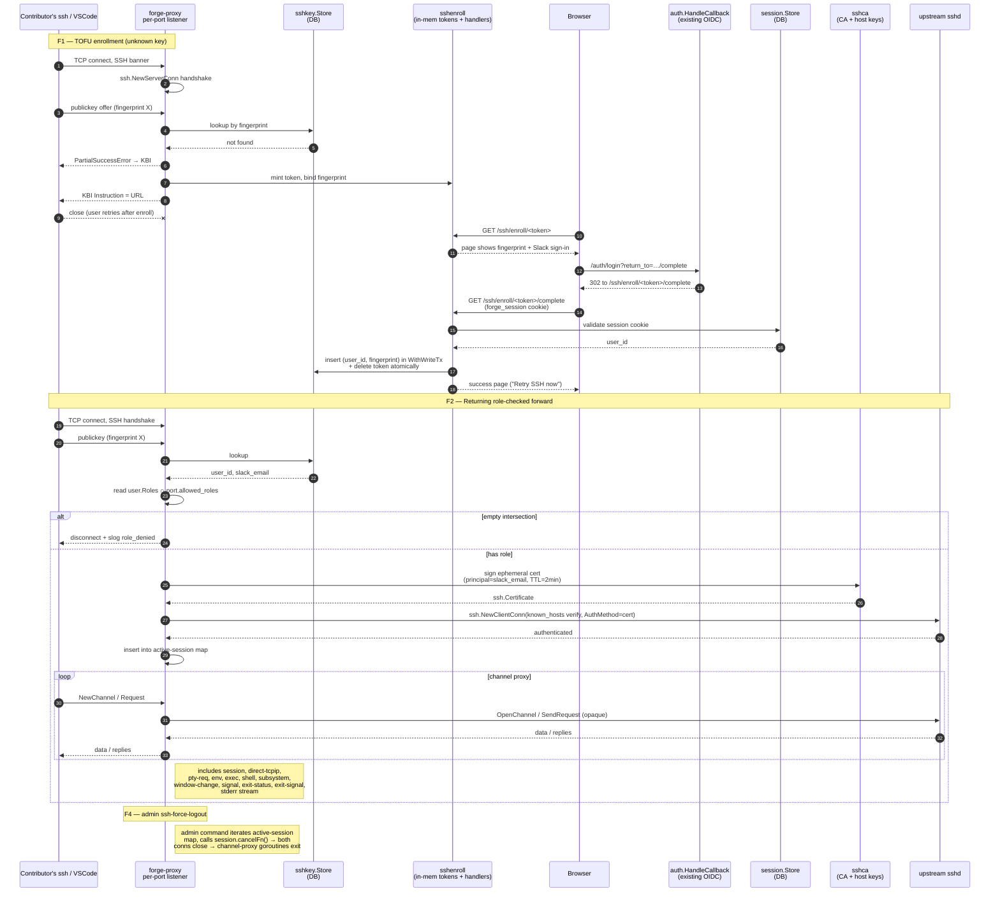

# feat: Add Authenticated SSH Proxy with Slack-OIDC TOFU Enrollment

## Summary

Adds a second listener subsystem to the existing `forge-proxy` Go binary that accepts SSH connections on operator-configured ports (one port per upstream box), authenticates each connection via a public key registered to a Slack-identified user, role-checks against the port's allowlist, and session-forwards to the mapped upstream tailnet box. Unknown keys trigger a TOFU enrollment flow that completes through the existing Slack OIDC flow. Built directly on `golang.org/x/crypto/ssh` with an internal SSH user CA handling proxy→upstream authentication.

---

## Problem Frame

Forge Utah's AI coding environment exposes per-user devcontainers that contributors want to drive through VSCode Remote SSH. The proxy VM's port 22 is owned by the exe.dev cloud service for operator administration, the upstream app VMs sit behind Tailscale ACLs that block end-user dev machines, and Forge contributors will not install Tailscale on every laptop. The HTTP side of forge-proxy already solved the right half of this problem for browser traffic; SSH needs the same chokepoint with the same identity vocabulary sitting in the same binary. See [origin requirements doc](../brainstorms/2026-05-22-forge-ssh-proxy-requirements.md) for the full problem framing.

---

## Requirements

- R1. Separate SSH listener per configured upstream on an operator-chosen port; cloud-managed SSH on port 22 untouched. *(see origin: R1)*
- R2. Each listener mapped at configuration time to one upstream tailnet address+port and an `allowed_roles` list. *(see origin: R2)*
- R3. Publickey authentication against keys stored against the existing `users` table. *(see origin: R3)*
- R4. Unknown-key → keyboard-interactive prompt carrying a one-time enrollment URL bound server-side to the offered fingerprint with a short TTL. *(see origin: R4)*
- R5. Enrollment page gated by existing Slack OIDC; fingerprint shown prominently before sign-in; successful sign-in binds fingerprint to the signed-in user atomically. No second confirm click. *(see origin: R5)*
- R6. Multiple registered keys per user; admin can remove individual keys by fingerprint. *(see origin: R6)*
- R7. Post-enrollment, subsequent connections with that key authenticate via standard publickey. *(see origin: R7)*
- R8. Workspace-membership and role checks happen after authn and before opening any upstream connection. *(see origin: R8, R9)*
- R9. Role check is per-listener-port — `allowed_roles` allowlist intersected with the user's roles. *(see origin: R9)*
- R10. Session-forwarding bastion: proxy terminates the inbound SSH session, opens fresh outbound SSH to the upstream, and proxies every channel type and channel request between the two. VSCode Remote SSH (including server upload over `session`) and SFTP work end-to-end. *(see origin: R10)*
- R11. Proxy authenticates to the upstream as the user's Slack identity (email) — not as the SSH username the client typed and not as a shared service account. *(see origin: R11)*
- R12. Operator-driven revocation: `ssh-force-logout <email>` closes active SSH sessions for a user; `remove-ssh-key <fingerprint>` prevents future authentications. No periodic Slack re-check. *(see origin: R12, post-planning revision)*
- *(Origin R13 — periodic Slack workspace re-check — was dropped during planning. See Key Technical Decisions and "Resolved During Planning". Plan R13 below maps to origin R14.)*
- R13. Admin commands `ssh-list-keys`, `ssh-remove-key`, `ssh-force-logout` mirror the existing `cmd/forge-proxy/admin.go` shape. *(see origin: R14)*
- R14. SSH events (auth success/fail, enrollment URL issued / completed, role denial, session opened/closed, force-close) logged via `slog` in JSON with the same field-naming convention as the HTTP request log. *(see origin: R15)*

**Origin actors:** A1 (Slack-member SSH user), A2 (Forge admin), A3 (upstream Forge box), A4 (Slack workspace)
**Origin flows:** F1 (TOFU enrollment), F2 (returning role-checked forward), F3 (unauthorized role), F4 (off-boarding mid-session)
**Origin acceptance examples:** AE1 (covers R3-R5, R7), AE2 (covers R8, R9), AE3 (covers R10, R11), AE4 (covers R12)

---

## Scope Boundaries

- No devcontainer awareness, lookup, or routing — Deuce owns devcontainer access entirely. *(see origin)*
- No SSH certificate authority for end users — client-side authn is by registered public key. *(see origin)*
- No client-side configuration required (`~/.ssh/config`, `ProxyJump`, `ProxyCommand`, custom wrappers).
- No periodic Slack-membership re-check during long-lived sessions. Revocation is operator-driven only (post-planning revision; HTTP parity).
- No `auth-agent-req@openssh.com` agent forwarding for v1 — explicitly rejected with a logged warning. Adds non-trivial channel-direction-inversion code with no current user need.
- No `tcpip-forward` / `forwarded-tcpip` reverse port forwarding for v1 — declined with a logged warning. VSCode Remote SSH does not require it for the devcontainer attach flow.
- No SFTP subsystem-level inspection, filtering, or audit. SFTP passes through opaquely via the `subsystem` channel; bastion does not import `github.com/pkg/sftp`.
- No `users.deactivated_at` column or `deactivate-user` admin command. Off-boarding remains the existing two-step (force-logout + remove keys / delete user).
- No `ssh_sessions` audit DB table for v1 — `slog` events satisfy R14's logging requirement; in-memory active-session map handles force-close.

### Deferred to Follow-Up Work

- **CI test workflow.** No GitHub Actions workflow runs `go test` today; this plan does not add one. Both the existing HTTP code and this SSH addition rely on author-run `go test ./...`. Adding a `test.yml` is its own focused PR.
- **`ce-compound` distillation.** After this lands, the "session-forwarding bastion in the same binary as an HTTP proxy" pattern is a strong candidate to seed `docs/solutions/` (which doesn't exist in the repo today). Separate PR.

---

## Context & Research

### Relevant Code and Patterns

- **HTTP listener startup, shutdown ordering, signal handling:** [cmd/forge-proxy/main.go](../../cmd/forge-proxy/main.go) `run()` (≈ line 262). New SSH listener subsystem wires in alongside `http.Server`. Shutdown order must be: `srv.Shutdown(ctx)` → `sshSrv.Shutdown(ctx)` → `sweeperStop()` → deferred `db.Close()`.
- **Config loader pattern:** [internal/config/config.go](../../internal/config/config.go) `Load()` + `parseUpstreams()` (line 146). New SSH config block parses `SSH_UPSTREAMS=port=upstream-host:port|role1,role2;...` via a sibling parser; required-vs-optional discipline accumulates into `errs []string`.
- **Admin subcommand pattern:** [cmd/forge-proxy/admin.go](../../cmd/forge-proxy/admin.go) `dispatchAdmin()` switch + `adminEnv`. New `ssh-list-keys`, `ssh-remove-key`, `ssh-force-logout` land next to existing `list-users`/`set-roles`/`force-logout`. `classifyBusy()` reused for SQLITE_BUSY messaging.
- **User store + writer pool discipline:** [internal/user/store.go](../../internal/user/store.go) — all writes through `db.WithWriteTx`, reads via `db.Reader`. SSH key store follows the same shape. `int64 user_id FK ON DELETE CASCADE` mirrors the sessions table.
- **Session sweeper as background-worker template:** [internal/session/sweeper.go](../../internal/session/sweeper.go) — `Run(ctx, interval)` loop, `LastSuccess()` for `/readyz`, `now func() time.Time` injection. We do NOT use this for SSH membership re-checks (dropped in planning), but the shape carries forward to the enrollment-token expiry sweeper if we end up DB-backing tokens.
- **Slack OIDC state + return_to:** [internal/auth/state.go](../../internal/auth/state.go), [internal/auth/returnto.go](../../internal/auth/returnto.go), [internal/auth/handlers.go](../../internal/auth/handlers.go). SSH enrollment integrates by redirecting to `/auth/login?return_to=<enrollment-complete-url>`; the existing `returnto.Validate` accepts same-base-domain URLs without modification. `randomToken()` (32 bytes from `crypto/rand`, base64url) is the token-generation pattern to mirror.
- **HTTP redaction newtypes for logging:** [internal/httplog/redact.go](../../internal/httplog/redact.go). New `httplog.SSHEnrollmentToken` newtype implements `slog.LogValuer` returning `[REDACTED]`. Fingerprints are not secret; key blobs are not logged.
- **Migration convention:** [internal/db/migrations/0001_create_users.sql](../../internal/db/migrations/0001_create_users.sql), [0002_create_sessions.sql](../../internal/db/migrations/0002_create_sessions.sql), embedded via [internal/db/migrations.go](../../internal/db/migrations.go). New `0003_create_ssh_keys.sql` follows the goose `+goose Up/Down/StatementBegin` shape.
- **Inline server-rendered HTML pattern:** [internal/proxy/proxy.go](../../internal/proxy/proxy.go) `writeUnknownHost` (line 253) shows the established no-templating, inline-HTML-with-escape style for one-off pages. The SSH enrollment page follows this — no addition to the React SPA at `internal/web/assets/`.
- **The existing forge-auth-proxy plan** at [docs/plans/2026-05-20-001-feat-forge-auth-proxy-plan.md](2026-05-20-001-feat-forge-auth-proxy-plan.md) is the structural template for this plan. The trust-model two-layer pattern (network-path + application-layer secret) maps directly: tailnet ACL + SSH CA on certs is the SSH-side analogue of tailnet ACL + `X-Forge-Proxy-Secret` on HTTP.

### Institutional Learnings

- `docs/solutions/` does not exist in the repo. The institutional knowledge surface for this work is the two existing brainstorm + plan pairs in `docs/brainstorms/` and `docs/plans/`. The SSH effort is a strong seed candidate for `docs/solutions/` after it lands (deferred to follow-up).
- The HTTP side intentionally chose defense-in-depth: tailnet ACL plus `X-Forge-Proxy-Secret`, not network-path-trust alone. This plan applies the same posture for SSH: tailnet ACL plus internal-CA-signed certs. *(carried from forge-auth-proxy plan's Key Technical Decisions)*
- The HTTP side rejected `viper`/`koanf`/`alexedwards/scs`/esbuild on a stdlib-bias rationale. This plan extends that posture — `golang.org/x/crypto/ssh` directly, no higher-level bastion wrapper. *(carried from forge-auth-proxy plan's dependency-rejection rationale)*

### External References

- [pkg.go.dev: golang.org/x/crypto/ssh](https://pkg.go.dev/golang.org/x/crypto/ssh) — server config, channel/request semantics, `CertChecker`, `Certificate.SignCert`, `NewCertSigner`.
- [CVE-2024-45337 + golang/go#70779](https://github.com/golang/go/issues/70779) — `PublicKeyCallback` is invoked for every offered key including ones the client doesn't prove possession of. Authorization decisions must read `ServerConn.Permissions` AFTER `NewServerConn` returns, not in the callback. Plan accommodates this in U6.
- [golang/go#29733](https://github.com/golang/go/issues/29733) — `exit-status` ordering race. Mitigation: serialize per-channel outbound events through a single ordered goroutine. Plan accommodates this in U7.
- [tg123/sshpiper](https://github.com/tg123/sshpiper) and [iamacarpet/ssh-bastion/forward.go](https://github.com/iamacarpet/ssh-bastion/blob/master/forward.go) — reference implementations of the four-goroutine channel proxy fan-out. ssh-bastion is the cleanest published example; sshpiper is more battle-tested but bundles its own crypto/ssh fork.
- [Smallstep step-ca docs (SSH user CA)](https://smallstep.com/docs/step-ca/) and [Teleport SSH cert configuration](https://goteleport.com/blog/how-to-configure-ssh-certificate-based-authentication/) — TTL norms, principal naming, `TrustedUserCAKeys` setup, dual-CA rotation pattern.
- [ContainerSSH OAuth2 backend docs](https://containerssh.io/v0.5/reference/auth-oauth2/) — reference for the keyboard-interactive ↔ OAuth2 bridge pattern.
- [microsoft/vscode-remote-release#6594](https://github.com/microsoft/vscode-remote-release/issues/6594) — historical VSCode Remote SSH + keyboard-interactive issue. Mitigated by recommending stock `ssh` for first-time enrollment, then VSCode for subsequent use. Documented in the operational notes.
- Mostly Copy & Paste's 2026 SSH guide + sshaudit.com hardening — current KEX/cipher allowlists: `sntrup761x25519-sha512@openssh.com`, `curve25519-sha256`; `chacha20-poly1305@openssh.com`, `aes256-gcm@openssh.com`; Ed25519 host key.

---

## Key Technical Decisions

- **Upstream auth: internal SSH user CA.** Per-outbound-connection ephemeral Ed25519 keypair + `ssh.Certificate{ CertType: UserCert, KeyId: slackEmail, ValidPrincipals: [slackEmail], ValidAfter: now-30s, ValidBefore: now+120s, Permissions.Extensions: {"permit-pty": ""} }` signed by a long-lived CA key the proxy holds. The cert is intentionally minimal — only `permit-pty` since the proxy declines `tcpip-forward` and agent forwarding (see Channel + request forwarding scope below); broader extensions would be standing over-privilege relative to what the proxy path actually exercises. Upstream sshd configures `TrustedUserCAKeys` pointing at the CA pub + `AuthorizedPrincipalsCommand` (or `AuthorizedPrincipalsFile`) to map principal → local user. Rejected alternatives: per-user pubkey sync (needs an upstream-side sync agent + reconciliation), shared service account (loses per-user identity at the upstream, violates R11). The cert TTL only needs to outlive the handshake; once authenticated the upstream sshd does not re-verify, so VSCode Remote SSH's day-long sessions are unaffected.
- **SSH library: `golang.org/x/crypto/ssh` directly.** Higher-level wrappers (`gliderlabs/ssh`, `charmbracelet/ssh`) are session-oriented and actively get in the way of transparent channel forwarding; `sshpiper` bundles a private crypto/ssh fork. The ~200–300 LoC of channel/request pumping is the lower-risk path versus depending on a third-party wrapper.
- **Routing: per-port, one TCP listener per upstream.** Decided in brainstorm. SSH has no SNI equivalent so DNS-resolved hostname is not visible to the server; per-port is the only disambiguator that requires zero client config and no IP allocation.
- **Authentication state machine: publickey with `ssh.PartialSuccessError` falling through to keyboard-interactive on unknown key.** This is the `x/crypto/ssh`-current idiom for "this auth method didn't authenticate, but you can advance to another method." The keyboard-interactive callback emits the enrollment URL in `Instruction` (zero `Questions`), then returns an error so the connection terminates and the user retries after enrollment. `BannerCallback` is not used because many clients don't render banners.
- **Authorization is read from `ServerConn.Permissions`, not from inside `PublicKeyCallback`.** CVE-2024-45337 / golang/go#70779: the callback may be invoked for keys the client cannot prove possession of. The callback stores `user_id` + `fingerprint` into `Permissions.Extensions`; the post-handshake handler reads from there. No external `map[connID]` keyed on `RemoteAddr` or similar.
- **Active session tracking is in-memory (single source of truth).** `sync.Mutex`-protected `map[connID]*activeSession{ userID, slackEmail, port, connectedAt, clientAddr, cancelFn, clientConn, upstreamClient }`. Force-logout iterates the map and calls `cancelFn`. No `ssh_sessions` DB table for v1; `slog` events are the audit trail.
- **Enrollment token store: in-memory.** `sync.Mutex`-protected `map[token]enrollment{ fingerprint, keyType, keyBlob, expiresAt }`. TTL 10 minutes. Single-use (delete on consume). Proxy restart during a pending enrollment is acceptable — the user re-runs `ssh` and gets a new URL. No `ssh_enrollments` DB table.
- **One new DB table: `ssh_keys`.** Schema: `id INTEGER PK AUTOINCREMENT`, `user_id INTEGER NOT NULL REFERENCES users(id) ON DELETE CASCADE`, `fingerprint TEXT NOT NULL UNIQUE`, `key_type TEXT NOT NULL`, `public_key BLOB NOT NULL`, `label TEXT`, `created_at INTEGER NOT NULL`, `last_used_at INTEGER`. Unique fingerprint prevents enrollment races from binding one key to two users. `ON DELETE CASCADE` so deleting a user via `users` cascades.
- **Fingerprint format: OpenSSH canonical `SHA256:base64nopad`.** Matches what `ssh-keygen -lf` and `ssh -G` produce. Stored verbatim. Compared with `subtle.ConstantTimeCompare`.
- **Enrollment URL integrates via existing OIDC `return_to`.** The enrollment URL serves `/ssh/enroll/<token>` (renders fingerprint + a sign-in button), which 302s to `/auth/login?return_to=<base>/ssh/enroll/<token>/complete`. After OIDC succeeds, the existing `auth.HandleCallback` redirects to the validated `return_to`, which lands on `/ssh/enroll/<token>/complete` — that handler reads the session cookie via `session.Read` + `Sessions.Get`, looks up the token + fingerprint, and atomically registers the key. The existing OIDC flow is untouched.
- **Host-key + KEX hardening (2026 baseline).** Per-port host key Ed25519 (one key reused across all SSH listeners). `KeyExchanges: ["sntrup761x25519-sha512@openssh.com", "curve25519-sha256", "curve25519-sha256@libssh.org"]`. `Ciphers: ["chacha20-poly1305@openssh.com", "aes256-gcm@openssh.com", "aes128-gcm@openssh.com"]`. `MACs: ["hmac-sha2-256-etm@openssh.com", "hmac-sha2-512-etm@openssh.com"]`. `PublicKeyAuthAlgorithms` allows Ed25519 + `rsa-sha2-{256,512}` + ECDSA P-256/384/521; `ssh-rsa` and `ssh-dss` rejected.
- **CA key + host key bootstrap.** Two file paths in config: `SSH_HOST_KEY_PATH` and `SSH_CA_KEY_PATH`. On startup: if file exists, load; if missing, generate (Ed25519), persist with mode `0600` owned by the running process user, log `slog.Info("ssh_key_generated", "path", ..., "type", "ed25519")`. Public halves of both are also written next to the private keys with `.pub` suffix for operator distribution to upstreams.
- **Upstream host-key verification: `knownhosts.New` on a persisted `ssh_known_hosts` file.** Operator populates this file at upstream-onboarding time (`ssh-keyscan upstream.tailnet > /etc/forge-proxy-known-hosts`). Plan does not adopt host-CA verification for v1 — that's a follow-up if upstream fleet grows past hand-rolled known-hosts. `ssh.InsecureIgnoreHostKey` is explicitly rejected; tailnet provides confidentiality but not server-identity assertion at the SSH layer.
- **Channel + request forwarding scope.** Forwarded verbatim: `session`, `direct-tcpip`. Inside `session`: `pty-req`, `env`, `shell`, `exec`, `subsystem` (including `sftp`), `window-change`, `signal`, `exit-status`, `exit-signal`. Declined with logged warning: `auth-agent-req@openssh.com`, global `tcpip-forward`/`cancel-tcpip-forward`. Channel `ExtraData` and request `Payload` byte slices are passed opaquely — never parsed and re-serialized.
- **Per-channel outbound event ordering.** A single goroutine per channel direction serializes byte-stream + request events to avoid the golang/go#29733 `exit-status` race. The four-goroutine fan-out (client→upstream stdio, upstream→client stdio, client→upstream stderr, upstream→client stderr) becomes effectively two-and-two with merged-into-one-ordered-write per direction. Stderr is forwarded separately (it's a distinct stream on session channels; missing this breaks `rsync`, `scp -v`).
- **`CloseWrite` propagation.** When the byte-stream copy from one side returns, `CloseWrite()` is called on the corresponding upstream/client channel before `Close()`. Otherwise commands that read to EOF (e.g., `cat`, `git push` over SSH) hang. Coordinated via `sync.WaitGroup` so the channel teardown waits for both directions to finish.

---

## Open Questions

### Resolved During Planning

- **Upstream-auth mechanism:** Internal SSH user CA (option a). See Key Technical Decisions.
- **SSH server library:** `golang.org/x/crypto/ssh` directly. See Key Technical Decisions.
- **Session-tracking shape:** In-memory map only; no DB audit table for v1.
- **Enrollment token store:** In-memory map with 10-minute TTL; no DB table.
- **Off-boarding revocation:** Operator-driven only (`ssh-force-logout` + `remove-ssh-key`), HTTP parity. R13's periodic Slack re-check dropped in planning.
- **SSH upstream config shape:** New env var `SSH_UPSTREAMS=port=host:port|role1,role2;...` parsed by a sibling of the existing `parseUpstreams`. Semicolon separates entries (avoids comma collision with role lists); pipe separates target from roles (avoids `=` collision with port assignment).
- **Host-key + KEX algorithms:** Ed25519 + sntrup761x25519/curve25519, chacha20/aes-gcm, hmac-sha2-etm. See Key Technical Decisions.
- **Upstream host-key verification:** Persisted `known_hosts` file for v1; host-CA deferred.

### Deferred to Implementation

- **Exact channel-forwarding goroutine topology** — pseudo-code in U7's technical design is directional; the implementer chooses between explicit `chan struct{}` coordination and `sync.WaitGroup`+`context.Context`. Either approach satisfies the ordering and cleanup contract.
- **Outbound dial timeout default** — likely `10 * time.Second`, but the implementer should pick based on what tailscale dial latencies actually look like in the deployment environment.
- **SSH listener `Accept` backoff on transient errors** — the standard `if ne, ok := err.(net.Error); ok && ne.Timeout() { ...sleep... }` shape from net/http's Server is the template; specific delays settle in implementation.
- **Whether `last_used_at` updates inline or via a separate write throttle** — `session.Touch` throttles to 60s on the HTTP side. Implementer applies the same throttle if profiling shows hot-path contention.

---

## High-Level Technical Design

> *This illustrates the intended approach and is directional guidance for review, not implementation specification. The implementing agent should treat it as context, not code to reproduce.*



---

## Output Structure

The SSH addition extends existing `internal/` packages and adds three new ones. New files only (no top-level layout change):

```
internal/
├── sshca/                       # NEW
│   ├── doc.go
│   ├── ca.go                    # load/generate CA + host keys
│   ├── ca_test.go
│   ├── sign.go                  # mint ephemeral user certs
│   └── sign_test.go
├── sshenroll/                   # NEW
│   ├── doc.go
│   ├── token.go                 # in-memory token store
│   ├── token_test.go
│   ├── handlers.go              # /ssh/enroll/* HTTP handlers
│   └── handlers_test.go
├── sshkey/                      # NEW
│   ├── doc.go
│   ├── store.go                 # CRUD against ssh_keys table
│   └── store_test.go
├── sshproxy/                    # NEW
│   ├── doc.go
│   ├── config.go                # SSH_UPSTREAMS parser, validated config
│   ├── config_test.go
│   ├── server.go                # listener, accept loop, auth callbacks
│   ├── server_test.go
│   ├── forward.go               # channel + request proxy loop
│   ├── forward_test.go
│   ├── sessions.go              # in-memory active-session map
│   └── sessions_test.go
├── db/migrations/
│   └── 0003_create_ssh_keys.sql # NEW
├── httplog/
│   └── redact.go                # MODIFY: add SSHEnrollmentToken newtype
├── config/
│   └── config.go                # MODIFY: SSH-related env vars
└── …
cmd/forge-proxy/
├── main.go                      # MODIFY: wire SSH subsystem + shutdown order
└── admin.go                     # MODIFY: ssh-list-keys, ssh-remove-key, ssh-force-logout
docs/
└── plans/
    └── 2026-05-23-001-feat-add-authenticated-ssh-proxy-plan.md
README.md                        # MODIFY: SSH operator runbook section
.env.example                     # MODIFY: SSH env var block
go.mod                           # MODIFY: add golang.org/x/crypto direct dep
go.sum                           # MODIFY: dependency lockfile updates
```

The per-unit `**Files:**` sections below are authoritative for what each unit creates or modifies.

---

## Implementation Units

### U1. Schema: `ssh_keys` table migration

**Goal:** Add the `ssh_keys` table that holds registered public keys associated with users.

**Requirements:** R3, R6

**Dependencies:** None

**Files:**
- Create: `internal/db/migrations/0003_create_ssh_keys.sql`
- Test: existing `internal/db` migration tests cover application; no new test file needed (a follow-up smoke test in U2 covers fingerprint UNIQUE).

**Approach:**
- Goose-formatted SQL with `-- +goose Up` and `-- +goose Down` sections.
- Columns: `id INTEGER PK AUTOINCREMENT`, `user_id INTEGER NOT NULL REFERENCES users(id) ON DELETE CASCADE`, `fingerprint TEXT NOT NULL UNIQUE`, `key_type TEXT NOT NULL`, `public_key BLOB NOT NULL`, `label TEXT`, `created_at INTEGER NOT NULL`, `last_used_at INTEGER`.
- Index `CREATE INDEX ssh_keys_user_id ON ssh_keys(user_id)` for the per-user listing query.

**Patterns to follow:**
- `internal/db/migrations/0002_create_sessions.sql` is the closest precedent (user_id FK + indexed lookup column).

**Test scenarios:**
- *Test expectation: none — pure schema; behavioral coverage lands in U2's store tests.*

**Verification:**
- `go test ./internal/db/...` passes (the migration applies cleanly on an empty DB and a DB already at version 0002).
- `sqlite3 forge.db .schema ssh_keys` shows the expected shape after `forge-proxy` starts.

---

### U2. `internal/sshkey` store

**Goal:** CRUD operations against `ssh_keys` with the same writer/reader-pool discipline as `internal/user` and `internal/session`.

**Requirements:** R3, R6, R7

**Dependencies:** U1

**Files:**
- Create: `internal/sshkey/doc.go`
- Create: `internal/sshkey/store.go`
- Create: `internal/sshkey/store_test.go`

**Approach:**
- **Prerequisite (run once before this unit):** `go get golang.org/x/crypto@latest && go mod tidy` to add the new direct dependency to `go.mod` / `go.sum`. All SSH units (U2 onward) assume the import is available.
- Public API: `New(db *db.DB) *Store`, `Add(ctx, userID int64, fingerprint string, keyType string, publicKey []byte, label string) (*Key, error)`, `Get(ctx, fingerprint string) (*Key, error)`, `ListByUser(ctx, userID int64) ([]*Key, error)`, `Remove(ctx, fingerprint string) error`, `TouchLastUsed(ctx, fingerprint string) error`.
- Sentinel: `ErrNotFound`, `ErrFingerprintTaken`.
- All writes through `s.db.WithWriteTx`. Reads via `s.db.Reader.QueryContext` / `QueryRowContext`.
- `now func() time.Time` injection for test clock.
- `TouchLastUsed` is invoked from the auth callback hot path; consider a 60s throttle (mirror `session.Touch`) if profiling shows contention. Default in v1: write on every successful auth.

**Patterns to follow:**
- `internal/user/store.go` for method shape, error wrapping, `now` injection, sentinel errors.
- `internal/session/store.go` for the `Touch`-style throttled-write pattern (if applied).

**Test scenarios:**
- Happy path: `Add` then `Get` returns the inserted row with `last_used_at` nil.
- Happy path: `Add` then `TouchLastUsed` then `Get` shows updated `last_used_at`.
- Happy path: `Add` for two distinct fingerprints under the same `user_id`; `ListByUser` returns both.
- Edge case: `Get` for unknown fingerprint returns `ErrNotFound`.
- Edge case: `Add` for an already-registered fingerprint returns `ErrFingerprintTaken` (UNIQUE constraint violated, wrapped).
- Edge case: `Remove` for unknown fingerprint returns nil error (idempotent, mirroring `session.Delete`).
- Integration: after `users.Delete(userID)`, all `ssh_keys` rows for that user are gone (CASCADE).

**Verification:**
- All test scenarios pass with `go test ./internal/sshkey/...`.

---

### U3. `internal/sshca` — CA + host key management and cert signing

**Goal:** Load or generate the proxy's SSH host key and CA key on startup; provide a function that mints short-TTL ephemeral user certs for outbound proxy→upstream connections.

**Requirements:** R10, R11

**Dependencies:** None

**Files:**
- Create: `internal/sshca/doc.go`
- Create: `internal/sshca/ca.go`
- Create: `internal/sshca/ca_test.go`
- Create: `internal/sshca/sign.go`
- Create: `internal/sshca/sign_test.go`

**Approach:**
- `ca.go`: `LoadOrGenerate(path string) (ssh.Signer, error)`. If file exists, read with `os.ReadFile` and `ssh.ParsePrivateKey`. If missing, generate an Ed25519 keypair via `ed25519.GenerateKey`, marshal as OpenSSH PEM via `ssh.MarshalPrivateKey`, write with `os.WriteFile` mode `0600`, write the public half (`ssh.MarshalAuthorizedKey`) to `<path>.pub`, log generation event.
- `sign.go`: `Mint(ctx context.Context, ca ssh.Signer, principal string, ttl time.Duration) (ssh.Signer, error)` — generates a fresh ephemeral Ed25519 keypair, builds an `ssh.Certificate{ Key: ephemPub, CertType: ssh.UserCert, KeyId: principal, ValidPrincipals: []string{principal}, ValidAfter: uint64(now()-30s), ValidBefore: uint64(now()+ttl), Permissions: { Extensions: {"permit-pty":""} } }`, calls `cert.SignCert(rand.Reader, ca)`, returns `ssh.NewCertSigner(cert, ephemSigner)`. Extensions intentionally exclude `permit-port-forwarding` and agent forwarding since the proxy forwarding scope declines both — keeping the cert minimal avoids standing over-privilege.
- Both functions take `now func() time.Time` via the struct or context for testability.
- File-mode enforcement: on load, `Stat` the file and warn (via slog) if mode is more permissive than `0600`.

**Execution note:** Test-first for `sign.go` — the validity-window math and ephemeral-key uniqueness are exactly the kind of correctness fence tests catch and dynamic testing misses.

**Patterns to follow:**
- `internal/auth/state.go` for `randomToken` / `crypto/rand` discipline.
- `internal/session/store.go` for `now` injection.

**Test scenarios:**
- Happy path: `LoadOrGenerate` on a missing path creates the file with mode `0600` and the `.pub` counterpart; subsequent call on the same path reads back the same key.
- Edge case: `LoadOrGenerate` on a path with mode `0644` logs a warning but still loads successfully.
- Error path: `LoadOrGenerate` on a path that exists but contains garbage returns a wrapped parse error.
- Happy path: `Mint(ctx, ca, "alice@example.com", 2*time.Minute)` returns a signer; the resulting cert validates against `ca.PublicKey()`, has principal `alice@example.com`, `ValidAfter` is 30s in the past, `ValidBefore` is `now + 2min`, `KeyId` is the principal, `CertType` is `UserCert`.
- Happy path: two `Mint` calls produce different ephemeral keypairs (no reuse).
- Edge case: `Mint` with `principal=""` returns an error (refuse to mint a cert with no identity).
- Edge case: `Mint` with `ttl=0` returns an error.

**Verification:**
- `go test ./internal/sshca/...` passes; tests exercise both the file-roundtrip and the cert-validation path.

---

### U4. Config: `SSH_UPSTREAMS`, `SSH_HOST_KEY_PATH`, `SSH_CA_KEY_PATH`, `SSH_KNOWN_HOSTS_PATH`

**Goal:** Extend `internal/config` to load and validate the SSH-specific env vars.

**Requirements:** R1, R2

**Dependencies:** None

**Files:**
- Modify: `internal/config/config.go`
- Modify: `internal/config/config_test.go`
- Modify: `.env.example`

**Approach:**
- Add to `Config`: `SSHUpstreams map[int]SSHUpstream` (key: listening port), `SSHHostKeyPath string`, `SSHCAKeyPath string`, `SSHKnownHostsPath string`, `SSHListenAddr string` (defaults to `0.0.0.0`, allowing operator to bind a specific NIC).
- `type SSHUpstream struct { Port int; Target *url.URL; AllowedRoles []string }` (Target uses `url.URL` with scheme `ssh://` for consistency with existing `UPSTREAMS`).
- New `parseSSHUpstreams(raw string) (map[int]SSHUpstream, error)` parses the form `port=host:port|role1,role2;port=host:port|role`. Semicolon entry separator (avoids comma in role list); pipe target-vs-roles separator (avoids `=` collision with port assignment). Validates: port is 1-65535 and unique, target is reachable host:port format, roles match the existing `roleNameRe = ^[A-Za-z0-9_-]+$` regex.
- Optional env vars (only required if `SSH_UPSTREAMS` is non-empty): `SSHHostKeyPath`, `SSHCAKeyPath`, `SSHKnownHostsPath`. If `SSH_UPSTREAMS` is empty, the SSH subsystem is disabled and these are not required — matches the "additive layer" principle.
- Validation accumulates into the existing `errs []string` from `Load()`.

**Patterns to follow:**
- `parseUpstreams` (line 146) for the multi-entry parser shape.
- `config_test.go` for the error-accumulation test pattern.

**Test scenarios:**
- Happy path: `SSH_UPSTREAMS=2222=deuce.tailnet:22|ai-dev;2223=platform.tailnet:22|admin,ops` parses to a 2-entry map with port 2222 → deuce target with `["ai-dev"]`, port 2223 → platform target with `["admin","ops"]`.
- Edge case: empty `SSH_UPSTREAMS` produces an empty map and no error; SSH-key path env vars are not required in this state.
- Edge case: `SSH_UPSTREAMS` set but `SSH_HOST_KEY_PATH` missing produces an `invalid configuration: SSH_HOST_KEY_PATH is required when SSH_UPSTREAMS is set` error.
- Error path: duplicate port (`2222=a:22|x;2222=b:22|y`) returns an error.
- Error path: port out of range (`70000=...`) returns an error.
- Error path: missing pipe (`2222=deuce.tailnet:22`) returns an error with a "role list missing" message.
- Error path: role name with `;` or `,` or `|` characters returns an error.
- Error path: missing port (`=deuce.tailnet:22|admin`) returns an error.
- Error path: missing target (`2222=|admin`) returns an error.

**Verification:**
- `go test ./internal/config/...` passes.
- `.env.example` documents `SSH_UPSTREAMS`, `SSH_HOST_KEY_PATH`, `SSH_CA_KEY_PATH`, `SSH_KNOWN_HOSTS_PATH`, `SSH_LISTEN_ADDR` with sample values.

---

### U5. `internal/sshenroll` — in-memory token store + HTTP handlers

**Goal:** Implement the TOFU enrollment URL flow — mint tokens bound to offered fingerprints, render the fingerprint-display page, and on Slack-OIDC success atomically bind the fingerprint to the signed-in user.

**Requirements:** R4, R5, R7

**Dependencies:** U2

**Files:**
- Create: `internal/sshenroll/doc.go`
- Create: `internal/sshenroll/token.go`
- Create: `internal/sshenroll/token_test.go`
- Create: `internal/sshenroll/handlers.go`
- Create: `internal/sshenroll/handlers_test.go`

**Approach:**
- `token.go`: `type Store struct { mu sync.Mutex; tokens map[string]Enrollment; now func() time.Time }`. `Enrollment{ Fingerprint, KeyType string; PublicKey []byte; ExpiresAt time.Time }`. Methods: `Mint(fingerprint, keyType string, publicKey []byte) (token string, err error)`, `Consume(token string) (Enrollment, error)` (deletes on read, returns `ErrNotFound` or `ErrExpired`), `Sweep()` (purges expired entries — called opportunistically inside `Mint` only; no background goroutine at v1's enrollment frequency).
- Token: `randomToken()` returning 32 bytes base64url no padding (same shape as `auth/state.go`'s helper).
- TTL: 10 minutes (configurable constant `DefaultTTL = 10 * time.Minute`).
- `handlers.go`:
  - `GET /ssh/enroll/<token>` — looks up token without consuming, renders inline HTML page (no React, no template engine — follow `proxy.writeUnknownHost` pattern) showing the fingerprint + a "Sign in with Slack to register" button that links to `/auth/login?return_to=https://<auth-host>/ssh/enroll/<token>/complete`. HTML-escapes the fingerprint via `html/template`'s `HTMLEscapeString`. If token is missing/expired, renders an inline error page (no info leak about whether the token ever existed). Includes `Cache-Control: no-store`.
  - `GET /ssh/enroll/<token>/complete` — reads `forge_session` cookie via `session.Read`, validates via `Sessions.Get`, fetches the user via `Users.Get`. Looks up + atomically consumes the enrollment token. Calls `sshkey.Add(ctx, user.ID, enrollment.Fingerprint, enrollment.KeyType, enrollment.PublicKey, label="enrolled from <user-agent-short>")`. Both store mutations happen inside a single `db.WithWriteTx` (`sshkey.Add` already does this; the token consume is in-memory, but the order is: consume token first, then write the key — if the DB write fails, the token is already gone and the user re-runs ssh to get a fresh URL). On success renders an inline "Key registered — retry SSH now" page. On `ErrFingerprintTaken`, look up the existing key's owner: if it matches the signed-in user, render the same success page (idempotent re-enrollment — common when a user retries the URL after a transient failure); if it belongs to a different user, render a "This key is registered to another user — contact an admin if this is unexpected" error page.
- Rate-limit `/ssh/enroll/*` via the existing `internal/httplog/ratelimit.go` per-IP token bucket — match the HTTP plan's `/auth/callback` policy (5 / IP / min).

**Execution note:** Test-first for `token.go` — single-use enforcement and TTL boundary cases are exactly the security-critical paths tests must pin down.

**Patterns to follow:**
- `internal/auth/state.go` (`randomToken`, base64url, mu+map pattern).
- `internal/proxy/proxy.go` `writeUnknownHost` (inline-HTML, no templating).
- `internal/auth/handlers.go` for the cookie-read + `Sessions.Get` + `Users.Get` chain.
- `internal/httplog/ratelimit.go` for the per-IP token bucket wiring.

**Test scenarios:**
- Happy path: `Mint` returns a unique token; `Consume(token)` returns the enrollment and removes it from the store; second `Consume(token)` returns `ErrNotFound`.
- Edge case: `Consume` after TTL returns `ErrExpired` even if the entry hasn't been swept yet.
- Edge case: `Sweep` removes only expired entries; non-expired remain.
- Edge case: two concurrent `Mint`s never return the same token (uses 32 random bytes — collision probability is negligible; the test asserts uniqueness across 10,000 mints).
- Happy path: `GET /ssh/enroll/<valid-token>` returns 200 with the fingerprint visible in the response body (escaped via the helper to defend against fingerprint-injection if a key parser ever produces unusual bytes).
- Edge case: `GET /ssh/enroll/<unknown-token>` returns a 404-shaped inline error page without revealing whether the token ever existed.
- Edge case: `GET /ssh/enroll/<valid-token>/complete` without a valid `forge_session` cookie returns a 401-ish "please sign in" page (or redirects through `/auth/login` with `return_to`).
- Integration (Covers AE1): full enrollment flow — mint token via direct `Store.Mint`, call `GET /complete` with a valid session cookie, assert `sshkey.Get(fingerprint)` returns the bound key with the expected `user_id`, assert the token is now consumed.
- Error path: enrollment-complete with a token whose fingerprint is already registered to another user returns the friendly error page and does NOT bind the key.
- Rate limit: 6 requests within 60 seconds from the same IP returns 429 on the 6th.

**Verification:**
- `go test ./internal/sshenroll/...` passes.
- Manual: hit `/ssh/enroll/foo` in a browser (logged in via the existing flow) and see the fingerprint-display page render correctly.

---

### U6. `internal/sshproxy/server.go` — SSH listener, accept loop, auth callbacks, role check

**Goal:** The SSH server core. Per-port listener; `ssh.NewServerConn` handshake with `PublicKeyCallback` that looks up the registered key and stores `user_id`+`fingerprint` in `Permissions.Extensions`; falls through to `KeyboardInteractiveCallback` for unknown keys, which mints an enrollment token + emits the URL; post-handshake role check against the port's `allowed_roles`.

**Requirements:** R3, R4, R5, R8, R9

**Dependencies:** U2, U3, U4, U5

**Files:**
- Create: `internal/sshproxy/doc.go`
- Create: `internal/sshproxy/server.go`
- Create: `internal/sshproxy/server_test.go`

**Approach:**
- Public surface: `type Server struct { ... }`, `New(cfg SSHConfig, users *user.Store, keys *sshkey.Store, enroll *sshenroll.Store, ca ssh.Signer, knownHosts ssh.HostKeyCallback) *Server`, `Run(ctx context.Context) error` (binds all per-port listeners, runs accept loop per listener), `Shutdown(ctx context.Context) error`.
- One `net.Listener` per upstream port. Each listener runs its own accept loop in a goroutine, owned by a `sync.WaitGroup` for shutdown coordination.
- For each accepted connection: spawn a handler goroutine that calls `ssh.NewServerConn(conn, sshServerConfig(...))`, then dispatches to `forward.go`'s handler (U7).
- `ssh.ServerConfig`:
  - `PublicKeyCallback`: compute `ssh.FingerprintSHA256(offered)`. Look up in `keys.Get(ctx, fp)`. If found, store `user_id` (string-stringified) + `fingerprint` in `Permissions.Extensions`. If not found, return `&ssh.PartialSuccessError{Next: ssh.ServerAuthCallbacks{KeyboardInteractiveCallback: enrollChallengeFor(fp, offered.Type(), offered.Marshal())}}`.
  - `KeyboardInteractiveCallback` (returned from `PartialSuccessError.Next`): closure capturing offered key info. On invocation, `enroll.Mint(...)`, build the URL `https://<auth-host>/ssh/enroll/<token>`, send a single zero-question challenge with the URL in `Instruction`, ignore any answers, return an error (`errors.New("enrollment required — visit the URL printed above")`).
  - `BannerCallback`: returns a static "forge-proxy SSH bastion — auth required" banner. Not load-bearing (informational).
  - Host key: `AddHostKey(hostSigner)` once (single host key shared across all ports — operator distributes one fingerprint).
  - `Config{ KeyExchanges, Ciphers, MACs, PublicKeyAuthAlgorithms }` as specified in Key Technical Decisions.
- After `NewServerConn` returns successfully, read `serverConn.Permissions.Extensions["user_id"]` + `["fingerprint"]`. Look up user via `users.Get`. Read `user.Roles`. Compute intersection with `port.AllowedRoles`. If empty, `serverConn.Close()` and log `slog.Warn("ssh_role_denied", ...)`. If non-empty, hand off to U7's forwarder along with `slack_email` for the outbound principal.
- **Critical (per CVE-2024-45337):** authorization is read from `Permissions` AFTER `NewServerConn`, never inside `PublicKeyCallback`. The callback may be invoked for keys the client cannot prove possession of; only the post-handshake `Permissions.Extensions` reflects the key actually used.
- Each handler goroutine takes a `context.Context` derived from the server's root context; cancellation propagates through to the forwarder.

**Execution note:** Test-first for the auth callback state machine — the CVE-2024-45337 trap and the publickey→KBI fallthrough are both correctness fences best caught by tests.

**Technical design:**

```text
// auth callback skeleton — directional, not literal
publicKeyCB(meta, key):
    fp := ssh.FingerprintSHA256(key)
    rec, err := keys.Get(ctx, fp)
    if err == ErrNotFound:
        // do NOT authorize. Hand back a PartialSuccess that advances to KBI.
        return nil, &ssh.PartialSuccessError{
            Next: ssh.ServerAuthCallbacks{
                KeyboardInteractiveCallback: enrollChallengeFor(fp, key.Type(), key.Marshal()),
            },
        }
    if err != nil:
        return nil, err   // DB error → 500-ish, log it
    perms := &ssh.Permissions{Extensions: {"user_id": str(rec.UserID), "fingerprint": fp}}
    return perms, nil

enrollChallengeFor(fp, keyType, keyBlob):
    return func(meta, challenge):
        token, _ := enroll.Mint(fp, keyType, keyBlob)
        url := https://<auth-host>/ssh/enroll/<token>
        _, _ = challenge(meta.User(), "Unknown SSH key " + fp + "\nEnroll: " + url + "\n", nil, nil)
        return nil, errors.New("enrollment required")

postHandshake(serverConn, port):
    userID := parseInt(serverConn.Permissions.Extensions["user_id"])
    user := users.Get(ctx, userID)
    if intersection(user.Roles, port.AllowedRoles) is empty:
        serverConn.Close(); slog.Warn(ssh_role_denied); return
    forward.Handle(ctx, serverConn, user, port)
```

**Patterns to follow:**
- `cmd/forge-proxy/main.go`'s `http.Server` goroutine + `sync.WaitGroup` pattern.
- `internal/auth/handlers.go` for the post-OIDC user-fetch chain.

**Test scenarios:**
- Happy path: a stock `golang.org/x/crypto/ssh` client connecting with a pre-registered key authenticates successfully; the resulting `*ssh.ServerConn.Permissions.Extensions` carries the expected `user_id` and `fingerprint`.
- Happy path (Covers AE1, first half): a stock client connecting with an unregistered key receives a keyboard-interactive prompt whose instruction contains a URL matching `https://<host>/ssh/enroll/<32-base64url-chars>`; the enrollment token store now contains a single entry bound to the client's fingerprint.
- Error path: a stock client connecting with no key (no `PublicKeysCallback` configured) is rejected at the publickey step and falls through to KBI (since publickey was offered as a method); test asserts the connection is closed cleanly with a non-success terminal state.
- Edge case: a client offering two keys — first unknown, second known — authenticates as the second key. `Permissions.Extensions["fingerprint"]` matches the second key's fingerprint (not the first). This is the CVE-2024-45337 case; the test exists to fence it permanently.
- Edge case (Covers AE2): a client with a registered key authenticates successfully, but the user's role intersection with the listener-port's `allowed_roles` is empty; the connection is closed without opening any upstream connection, and `slog` emits `ssh_role_denied` with `user_id`, `fingerprint`, `port`.
- Error path: DB lookup returns a non-`ErrNotFound` error; `PublicKeyCallback` returns the error wrapped, the connection is rejected, and a `slog.Error("ssh_key_lookup_failed", ...)` is emitted.
- Integration: `Shutdown(ctx)` with the context having a 5-second deadline closes all listeners + in-flight `NewServerConn` handshakes, returns within deadline.

**Verification:**
- `go test ./internal/sshproxy/...` (server_test.go) passes against a real `golang.org/x/crypto/ssh` client speaking to an in-process listener bound to a random localhost port.
- All test scenarios above pass.

---

### U7. `internal/sshproxy/forward.go` — channel + request session forwarding

**Goal:** Implement the bidirectional channel and request proxy that lets VSCode Remote SSH, stock `ssh`, `sftp`, and `scp` flow end-to-end between client and upstream.

**Requirements:** R10, R11

**Dependencies:** U3, U6

**Files:**
- Create: `internal/sshproxy/forward.go`
- Create: `internal/sshproxy/forward_test.go`

**Approach:**
- Public entry: `Handle(ctx context.Context, serverConn *ssh.ServerConn, chans <-chan ssh.NewChannel, reqs <-chan *ssh.Request, slackEmail string, target *url.URL, ca ssh.Signer, knownHosts ssh.HostKeyCallback) error`.
- Step 1: Mint an ephemeral signed cert via `sshca.Mint(ctx, ca, slackEmail, 2*time.Minute)`. Build an `ssh.ClientConfig{ User: slackEmail, Auth: []ssh.AuthMethod{ ssh.PublicKeys(certSigner) }, HostKeyCallback: knownHosts, Config: <same KEX/ciphers as server> }`.
- Step 2: Dial the upstream — `net.Dial("tcp", target.Host)` with a 10-second timeout, then `ssh.NewClientConn(rawConn, target.Host, clientCfg)`. On failure, close the inbound `serverConn` with a brief banner ("upstream unreachable") and log `slog.Warn("ssh_upstream_dial_failed", ...)`.
- Step 3: Drain four streams concurrently:
  - **Incoming `chans` (server side):** for each `ssh.NewChannel`, call `upstreamConn.OpenChannel(nc.ChannelType(), nc.ExtraData())`. On `*ssh.OpenChannelError`, propagate via `nc.Reject(err.Reason, err.Message)`. On success, `clientChan, clientReqs, _ := nc.Accept()`, then spawn channel-proxy goroutines (below).
  - **Upstream `upstreamChans` (client side):** for each `ssh.NewChannel` from the upstream (typically `forwarded-tcpip`), for v1 we `nc.Reject(ssh.Prohibited, "reverse port forwarding not supported in v1")` and log. *Out-of-scope per the brainstorm; revisit when a user need surfaces.*
  - **Incoming global `reqs`:** for each non-channel-scoped `*ssh.Request` from the client (`tcpip-forward`, `cancel-tcpip-forward`, `keepalive@openssh.com`), for v1: reply `(false, nil)` to `tcpip-forward`/`cancel-tcpip-forward` and log; reply `(true, nil)` to `keepalive@openssh.com`.
  - **Upstream global `upstreamReqs`:** symmetric — reply `(false, nil)` to anything we don't recognize, log unknown types at debug level.
- For each accepted channel pair (clientChan ↔ upstreamChan), run the four-goroutine fan-out:
  - **Goroutine A (client→upstream, ordered):** ranges over `clientReqs`; for each, `upstreamChan.SendRequest(req.Type, req.WantReply, req.Payload)`, replies to the client if `WantReply`. Filter: if `req.Type == "auth-agent-req@openssh.com"`, reply `(false, nil)` and `slog.Warn("ssh_agent_forwarding_declined", ...)`.
  - **Goroutine B (upstream→client, ordered):** symmetric.
  - **Goroutine C (client→upstream byte stream):** `io.Copy(upstreamChan, clientChan)`; on return, `upstreamChan.CloseWrite()`.
  - **Goroutine D (upstream→client byte stream):** `io.Copy(clientChan, upstreamChan)`; on return, `clientChan.CloseWrite()`.
  - **Goroutines E + F (stderr streams):** symmetric `io.Copy(upstreamChan.Stderr(), clientChan.Stderr())` and reverse.
  - Coordinate with a per-channel `sync.WaitGroup`; when stream copies return AND request loops drain, `clientChan.Close()` + `upstreamChan.Close()`.
- All `io.Copy`s respect context cancellation via a wrapping `ctxReader` that selects on `<-ctx.Done()`; on cancellation both sides' `Close()` is called and the copies unblock.
- The bidirectional request loops on `serverConn.SendRequest` + `upstreamConn.SendRequest` are needed for global requests *between* the two ends; this is handled by the four channels (chans + reqs each side) feeding into worker goroutines that bridge them, not by direct passthrough on `ssh.Channel.SendRequest`.
- The `serverConn.Wait()` + `upstreamConn.Wait()` calls block in a single `select`: whichever returns first triggers `Close()` on the other; this is the connection-teardown trigger.

**Execution note:** Test-first for the channel-and-request fan-out — golang/go#29733 (exit-status ordering race) and forgetting to forward stderr are exactly the silent-correctness bugs tests catch and dynamic testing misses.

**Technical design:**

```text
// channel proxy fan-out — directional, not literal
proxyChannel(ctx, clientChan, clientReqs, upChan, upReqs):
    var wg sync.WaitGroup
    wg.Add(6)

    // request forwarding (ordered — single goroutine each direction)
    go func() { defer wg.Done()
        for r := range clientReqs:
            if r.Type == "auth-agent-req@openssh.com":
                slog.Warn(ssh_agent_forwarding_declined)
                if r.WantReply: r.Reply(false, nil)
                continue
            ok, _ := upChan.SendRequest(r.Type, r.WantReply, r.Payload)
            if r.WantReply: r.Reply(ok, nil)
    }()
    go func() { defer wg.Done()
        for r := range upReqs:
            ok, _ := clientChan.SendRequest(r.Type, r.WantReply, r.Payload)
            if r.WantReply: r.Reply(ok, nil)
    }()

    // data streams + stderr
    go copyAndCloseWrite(wg, upChan, clientChan)
    go copyAndCloseWrite(wg, clientChan, upChan)
    go io.Copy(upChan.Stderr(), clientChan.Stderr()); wg.Done()
    go io.Copy(clientChan.Stderr(), upChan.Stderr()); wg.Done()

    wg.Wait()
    clientChan.Close(); upChan.Close()
```

**Patterns to follow:**
- iamacarpet/ssh-bastion `forward.go` for the channel proxy fan-out shape.
- `internal/proxy/proxy.go` for the "wrap an underlying library + add forge-specific behavior" pattern.

**Test scenarios:**
- Happy path (Covers AE3): start a stock `golang.org/x/crypto/ssh` client and a stock `golang.org/x/crypto/ssh` server bound to localhost, with the forwarder in between. The client `Session.Run("echo hello")` returns "hello\n" on stdout with exit code 0.
- Happy path: from the same harness, run a session that exits with code 7; `Session.Run` returns a `*ssh.ExitError` with `Waitmsg.ExitStatus() == 7`. *(This fences the exit-status ordering race.)*
- Happy path: a `pty-req` channel request with terminal modes is forwarded byte-for-byte; the upstream's view of `pty-req` matches the client's request bytes exactly.
- Happy path: a `window-change` request mid-session is forwarded; the upstream observes the new dimensions.
- Happy path: stderr written by the upstream `Session.Stderr()` is observed by the client's `Session.Stderr` pipe.
- Happy path: `direct-tcpip` channel — client opens a local port forward `-L 1234:somehost:80`; the forwarder relays the channel; the upstream's `direct-tcpip` handler observes the same `ExtraData` payload.
- Happy path: `subsystem sftp` — client runs `sftp -F /dev/null -P <bastion-port> user@bastion` after enrolling its key, lists a directory on the upstream. (Uses `pkg/sftp` only as the client-side test harness; the bastion does not import it.)
- Error path: upstream dial fails (no listener at target); forwarder closes the inbound connection cleanly and logs `ssh_upstream_dial_failed`.
- Error path: upstream host key verification fails (known_hosts mismatch); forwarder closes the inbound connection and logs `ssh_upstream_host_key_mismatch`.
- Edge case: client sends `auth-agent-req@openssh.com` on a session channel; forwarder replies `(false, nil)`, logs `ssh_agent_forwarding_declined`, the channel otherwise continues.
- Edge case: client issues global `tcpip-forward`; forwarder replies `(false, nil)`, logs `ssh_reverse_forward_declined`.
- Edge case: client sends a session with `exec true`, then `Ctrl-C`. The client's signal request (`SIGINT`) is forwarded to the upstream; the upstream's `exit-signal` is forwarded back. The client observes a non-nil error from `Session.Wait()` with signal info.
- Integration: context cancellation. With a session in progress, cancel the context; both client- and upstream-facing connections close within 100ms.

**Verification:**
- `go test ./internal/sshproxy/...` (forward_test.go) passes against in-process stock client + stock upstream.
- The full test matrix above exercises every channel type and request listed in the Channel + request forwarding scope decision.

---

### U8. `internal/sshproxy/sessions.go` — in-memory active session map + graceful shutdown integration

**Goal:** Track every live SSH session so admin force-logout can close them, and integrate into the binary-level shutdown ordering.

**Requirements:** R12

**Dependencies:** U6, U7

**Files:**
- Create: `internal/sshproxy/sessions.go`
- Create: `internal/sshproxy/sessions_test.go`

**Approach:**
- `type SessionMap struct { mu sync.Mutex; sessions map[uint64]*activeSession; nextID uint64 }`. `activeSession{ ID uint64; UserID int64; SlackEmail string; Port int; ConnectedAt time.Time; ClientAddr string; cancelFn context.CancelFunc; close func() error }`.
- Methods: `Add(...) (id uint64, cleanup func())` — assigns ID, registers, returns a cleanup that removes on call. `ForceCloseByUser(userID int64) int` — iterates, calls `cancelFn`, returns count closed. `ForceCloseByEmail(email string) int` — same, looking up by email. `List() []SessionInfo` — read-only snapshot for admin queries (matches existing `list-users` shape, returning a tab-separable struct).
- Forwarder (U7) calls `Add` after authn + role check; uses the returned `cleanup` in a defer.
- `cancelFn` is a `context.CancelFunc` from a `ctx, cancel := context.WithCancel(serverCtx)` created per session. Calling it cancels every goroutine in the session — request loops, byte-stream copies, both `ssh.Conn`s.
- `Server.Shutdown(ctx)` calls `s.sessions.ForceCloseAll()` then waits on `s.wg.Wait()`; respects the supplied `ctx` deadline. Plan default deadline: 5 seconds (VSCode Remote SSH sessions cannot drain gracefully — force-close is the honest model). On deadline exceeded, returns an error so `main.go` can log the partial shutdown but continues to `db.Close()`.
- `main.go` shutdown order (modified in U10): `srv.Shutdown(httpShutdownCtx)` → `sshSrv.Shutdown(sshShutdownCtx)` → `sweeperStop(); sweeperWG.Wait()` → deferred `db.Close()`.

**Patterns to follow:**
- `internal/session/sweeper.go` for the `sync.Mutex` + `now` injection pattern (but here we don't need `now` — no timestamps drive behavior).

**Test scenarios:**
- Happy path: `Add` returns a unique increasing ID; `List` returns the snapshot; the returned `cleanup` removes the session.
- Happy path: `ForceCloseByUser(userID)` calls `cancelFn` on each matching session; the returned count matches.
- Edge case: `ForceCloseByUser(unknown)` returns 0 without error.
- Edge case: two sessions for the same user — `ForceCloseByUser` closes both.
- Edge case: `Add` and `cleanup` from concurrent goroutines do not race (`-race` clean).
- Integration (Covers AE4): a real SSH session held open against a test listener — admin calls `ForceCloseByEmail` — within 1 second the client's `Session.Wait` returns with a transport-closed error.

**Verification:**
- `go test -race ./internal/sshproxy/...` passes; sessions_test.go covers each scenario.

---

### U9. Admin subcommands: `ssh-list-keys`, `ssh-remove-key`, `ssh-force-logout`

**Goal:** Add the three SSH admin commands to `cmd/forge-proxy/admin.go`, mirroring existing dispatch + flag + output conventions.

**Requirements:** R6, R12, R13

**Dependencies:** U2, U8

**Files:**
- Modify: `cmd/forge-proxy/admin.go`
- Modify: `cmd/forge-proxy/admin_test.go`

**Approach:**
- Extend `adminEnv` to carry `*sshkey.Store` and a getter for the running `*sshproxy.SessionMap` (or nil if the SSH subsystem is disabled — admin commands then refuse with "SSH subsystem not enabled").
- Three new dispatch cases in `dispatchAdmin`:
  - `ssh-list-keys <email>` — looks up user by email; if not found, errors out; otherwise prints tab-separated `id\tfingerprint\tkey_type\tlabel\tcreated_at\tlast_used_at`.
  - `ssh-remove-key <fingerprint>` — looks up key; if not found, prints "no key with that fingerprint" and exits 0 (idempotent, mirroring `delete-session`); otherwise removes via `sshkey.Remove` and prints "removed".
  - `ssh-force-logout <email>` — looks up user by email; calls `sshkey.GetSessionMap().ForceCloseByEmail(email)`; prints the count closed. If `GetSessionMap()` returns nil, prints "SSH subsystem not running; cannot force-close. Run from the server process." and exits non-zero.
- For `ssh-force-logout` specifically: this only works when invoked inside the running server process, because the active-session map is in-memory. Run from a separate process (e.g., `docker exec`) the count is always 0 — `--help` and the error message must call this out clearly. Operators can either invoke the admin command via a server-process IPC (deferred) or, for v1, restart the proxy to force-close all sessions and document that as the operator workflow.
- All errors run through `classifyBusy()` for SQLITE_BUSY messaging consistency.
- Each subcommand uses `flag.NewFlagSet("ssh-…", flag.ContinueOnError)` with `fs.SetOutput(env.stdout)`.

**Patterns to follow:**
- `cmd/forge-proxy/admin.go` `adminListUsers`, `adminSetRoles`, `adminForceLogout` — mirror these structurally.
- The tab-separated output format with header line is the established norm.

**Test scenarios:**
- Happy path: `ssh-list-keys alice@example.com` after adding two keys via `sshkey.Add` prints two rows with the expected fingerprints.
- Edge case: `ssh-list-keys nobody@example.com` errors with "user not found" and exits non-zero.
- Edge case: `ssh-list-keys alice@example.com` for a user with no registered keys prints just the header and exits 0.
- Happy path: `ssh-remove-key SHA256:abc…` removes the row; a subsequent `ssh-list-keys` for the owning user does not show it.
- Edge case: `ssh-remove-key SHA256:nonexistent` prints "no key with that fingerprint" and exits 0 (idempotent).
- Happy path (Covers AE4): `ssh-force-logout` against the in-process session map (using a test seam that provides a non-nil `SessionMap`) closes the expected sessions and prints the count.
- Edge case: `ssh-force-logout` invoked when the SSH subsystem is not running (out-of-process) prints the explanatory error and exits non-zero.
- Edge case: SQLITE_BUSY during `ssh-remove-key` produces the friendly retry message via `classifyBusy()`.

**Verification:**
- `go test ./cmd/forge-proxy/...` (admin_test.go additions) passes.
- `forge-proxy admin -h` (or equivalent) lists the three new subcommands in usage output.

---

### U10. Wire SSH subsystem into `main.go`, document operator runbook

**Goal:** Bind everything together. SSH listeners start with the HTTP server; shutdown order is correct; the new web routes are mounted; the new env vars are documented; README has an SSH section.

**Requirements:** R1, R2, R10, R11, R12, R13, R14

**Dependencies:** U1–U9

**Files:**
- Modify: `cmd/forge-proxy/main.go`
- Modify: `cmd/forge-proxy/main_test.go`
- Modify: `cmd/forge-proxy/admin.go` (`adminEnv` plumbing for `ssh-force-logout`'s in-process session map access)
- Modify: `.env.example`
- Modify: `README.md`

**Approach:**
- In `main.go` `run()`:
  - After existing store construction, if `cfg.SSHUpstreams` is non-empty:
    - Load host key and CA key via `sshca.LoadOrGenerate(cfg.SSHHostKeyPath)` + `sshca.LoadOrGenerate(cfg.SSHCAKeyPath)`.
    - Load `known_hosts` via `knownhosts.New(cfg.SSHKnownHostsPath)` to get the `HostKeyCallback`.
    - Construct `enroll := sshenroll.NewStore()`, `sshSrv := sshproxy.New(cfg.SSHUpstreams, users, keys, enroll, caKey, hostKey, knownHostsCallback)`.
    - Mount enrollment handlers on the existing `authMux`: `authMux.Handle("GET /ssh/enroll/", enrollH.Mount(...))`. Tests confirm the routes appear on `/auth/me`-shaped probe.
    - Start the SSH server in a goroutine: `sshWG.Go(func() { _ = sshSrv.Run(serverCtx) })`.
  - Shutdown block (lines ~396-407 today): insert `_ = sshSrv.Shutdown(sshShutdownCtx)` between `srv.Shutdown(...)` and `sweeperStop()`. The SSH shutdown context has its own 5-second deadline; document via a comment.
- `admin.go` extension: `adminEnv` gains a function-typed field `sessionMapForCurrentProcess func() *sshproxy.SessionMap` that returns the live map when set (i.e., in the running server process) and nil otherwise. Tests inject a non-nil getter; the server `run()` path injects the real one before dispatching admin paths.
- `.env.example`: add a commented-out block:
  ```
  # === SSH proxy (optional — leave empty to disable) ===
  # SSH_UPSTREAMS=2222=deuce.tailnet:22|ai-dev;2223=platform.tailnet:22|admin,ops
  # SSH_HOST_KEY_PATH=/data/ssh/host_ed25519_key
  # SSH_CA_KEY_PATH=/data/ssh/ca_ed25519_key
  # SSH_KNOWN_HOSTS_PATH=/data/ssh/known_hosts
  # SSH_LISTEN_ADDR=0.0.0.0
  ```
- `README.md` additions:
  - New section "SSH proxy" with operator-facing setup: how to allocate ports + open firewall, how to set `SSH_UPSTREAMS`, where the auto-generated CA pub is published, how to populate `known_hosts` from each upstream, how to configure each upstream sshd with `TrustedUserCAKeys` + `AuthorizedPrincipalsCommand` (a one-line shell snippet that resolves principal → local user).
  - New subsection "First-time enrollment" — instruct users to run `ssh deuce.forgeut.dev -p 2222` from stock `ssh` once, follow the URL, sign in with Slack, then use VSCode Remote SSH afterward (workaround for the VSCode + keyboard-interactive history).
  - New subsection "VSCode Remote SSH verification run-book" — a numbered checklist the operator follows on first deploy to confirm the full path works (open a real devcontainer, list a directory, run an SFTP put, observe slog events).
  - New subsection "Off-boarding a user" extended for SSH: run `ssh-force-logout`, then `ssh-remove-key` per fingerprint listed by `ssh-list-keys`.
  - New subsection "SSH key rotation": how to rotate the CA key (generate new, distribute pub to all upstreams' `TrustedUserCAKeys` lines as a second trusted CA, swap `SSH_CA_KEY_PATH` on the proxy and restart, remove the old CA from upstreams once confirmed). Mirror the existing `PROXY_SECRET` rotation runbook tone.

**Patterns to follow:**
- `cmd/forge-proxy/main.go`'s existing goroutine + waitgroup + signal handler pattern.
- README's existing "Adding a new upstream app" section as the structural template for "Adding a new SSH upstream".

**Test scenarios:**
- Integration: with `SSH_UPSTREAMS` set in a test env file, the binary starts, accepts SSH connections on the configured ports, and the HTTP listener also works. Verified by spawning the binary in a subprocess and probing both ports.
- Integration: SIGTERM sent to the binary closes the HTTP listener, then the SSH listeners (and any active SSH sessions), then the sweeper, then the DB — verified by `slog` output ordering.
- Edge case: with `SSH_UPSTREAMS` empty, the binary starts and no SSH listeners are bound; admin `ssh-list-keys` still functions (the store works regardless of whether the listeners are running); `ssh-force-logout` prints the "subsystem not running" message.
- Test expectation: end-to-end VSCode Remote SSH is verified manually per the README run-book — no automated test, intentionally.

**Verification:**
- `go test ./...` passes from the repo root.
- `go vet ./...` clean.
- Manual: full enrollment + VSCode Remote SSH flow against a real upstream (per the new README run-book) succeeds.

---

## System-Wide Impact

- **Interaction graph:** New `internal/sshproxy/Server.Run` goroutines (one accept loop per upstream port, plus per-connection handler goroutines). New `internal/sshenroll` handlers mounted on the existing auth mux. Existing `internal/session` and `internal/auth` flows unchanged. The existing HTTP request hot path is untouched.
- **Error propagation:** SSH-side errors slog at `Warn` for expected denials (unknown key, role denial, dial failure, host-key mismatch) and `Error` for infra failures (DB lookup error, malformed cert, file IO). No SSH errors propagate to the HTTP-side hot path. SSH errors that occur after a session is open are also logged; the connection is closed but the proxy process continues.
- **State lifecycle risks:** The active-session map is in-memory only — proxy restart drops all live SSH sessions. This is the same model as HTTP today (in-memory request handlers) and consistent with the documented graceful-shutdown behavior. The enrollment token map is also in-memory; restart drops pending enrollments — user re-runs `ssh` to get a new URL.
- **API surface parity:** The HTTP `X-Forge-*` header contract is unchanged. Upstream HTTP apps see no difference. New SSH-side principal carried on outbound SSH certs (`KeyId` = Slack email) is a new contract with upstream sshd, documented in the new README section.
- **Integration coverage:** Cross-layer scenarios that mocks alone won't prove: full enrollment flow (U5's integration test using a real session cookie + real `sshkey.Store`); end-to-end channel forwarding (U7's tests using real `golang.org/x/crypto/ssh` client + server in-process); shutdown ordering (U10's subprocess test asserting slog order).
- **Unchanged invariants:** The HTTP request pipeline (`internal/proxy` reverse-proxy hot path, `X-Forge-*` header strip + inject, Slack OIDC flow, session cookie semantics) is invariant. The `users` table schema is invariant — we add `ssh_keys` as a related table, not as a column. The admin command shape for HTTP-side operations (`list-users`, `set-roles`, `force-logout`) is invariant. Tailscale ACL trust model on the HTTP side is unchanged; SSH adds an analogous-but-parallel layer (CA cert) on top of the same tailnet network path.

---

## Risks & Dependencies

| Risk | Mitigation |
|------|------------|
| Session-forwarding correctness bugs (channel deadlocks, missed exit-status, dropped stderr) — these are the highest-likelihood, highest-blast-radius issues. | Test-first on U7 (per execution note). Test matrix covers every channel/request type explicitly. The four documented landmines (golang/go#29733, #6675, #6223, #35025) are addressed in Key Technical Decisions and per-unit approach. iamacarpet/ssh-bastion's `forward.go` is the reference pattern. |
| CVE-2024-45337-class authorization bypass (deciding in `PublicKeyCallback` instead of post-handshake `Permissions`). | Key Technical Decision explicitly fences this. U6's test scenario for "client offers unknown-key-then-known-key, must authenticate as the known key" is the permanent regression fence. |
| CA private key compromise on the proxy VM. | Key file mode enforced at `0600`. Stored under `/data/ssh/` (same persistent disk as the SQLite file, same backup story). Key rotation runbook documented in README. Cert TTL of 2 minutes limits the blast radius if a single ephemeral signed cert leaks. |
| Operator misconfigures `TrustedUserCAKeys` on an upstream, opening it to any cert the CA can issue. | Documented in README: the upstream's `AuthorizedPrincipalsCommand` (or static `AuthorizedPrincipalsFile`) must restrict which principals can log in as which local users. The CA only attests identity; per-user routing on the upstream is still required. |
| VSCode Remote SSH + keyboard-interactive UX regression on first-time enrollment. | README explicitly tells users to enroll from stock `ssh` first, then use VSCode afterward. The clear separation avoids the worst-case "VSCode hangs silently during enrollment." |
| Slack OIDC outage prevents new enrollments. | Existing risk on the HTTP side; not net-new for SSH. Operator workaround: rotate the existing user's roles manually until enrollment is needed, or wait. No mitigation beyond existing HTTP-side patterns. |
| Force-logout only works in-process; admins running `docker exec forge-proxy ssh-force-logout` see "0 sessions closed" silently. | The admin command explicitly detects the out-of-process case and prints a clear error message. README documents the operator workflow: either invoke from inside the running container's PID 1 (rare), or restart the proxy to drop all sessions (documented as the off-boarding fallback). |
| Long-running SSH connections (hours+) accumulate in memory. | Each active session is ≲ 1KB of struct overhead + the underlying TCP/SSH connection buffers. Even hundreds of concurrent sessions consume megabytes, not gigabytes. No mitigation needed for v1; revisit if `forge-proxy` ever runs at scale that wasn't anticipated. |
| Listener-port firewall misconfiguration silently exposes a listener without auth (but auth is in-band, so this is "exposure of the bastion's auth handshake, not the upstream"). | Each listener performs the same `ssh.NewServerConn` + role-check chain; there's no "unauthenticated" listener mode. README documents the firewall configuration step. |
| `pty-req` payload contains opaque terminal modes; if the bastion ever needs to parse it, that's a forward-compat hazard. | Plan explicitly does NOT parse channel `ExtraData` or request `Payload` bytes — opaque passthrough only. Documented in Key Technical Decisions. |

---

## Alternative Approaches Considered

- **Pubkey sync to upstream `authorized_keys` (option b from brainstorm).** Rejected: requires an upstream-side sync agent (or admin API), introduces a reconciliation problem (what if the agent is down when a key is removed?), and doesn't give the upstream a stable per-user identity for routing — every connection looks the same authentication-wise. The internal CA approach gives every benefit pubkey-sync would give plus per-user identity, with less moving infrastructure.
- **Shared service account per upstream (option c from brainstorm).** Rejected: violates R11 (upstream sees no per-user identity); breaks the AI-coding-env use case where the upstream must know which user is connecting to route to their devcontainer.
- **Username-encoded routing (Option C from brainstorm dialogue).** Rejected during brainstorm in favor of per-port. The per-port choice is reaffirmed here — no decision change at the plan level.
- **Higher-level SSH library (`gliderlabs/ssh`, `charmbracelet/ssh`).** Rejected: `gliderlabs/ssh` is session-oriented (`ssh.Handle(func(s Session) {...})`), which is the wrong abstraction for transparent channel-forwarding; using its lower-level `ChannelHandlers` map still requires implementing the request fan-out manually, so the library doesn't pay for itself. `charmbracelet/ssh` is a fork of gliderlabs with no published bastion features. `tg123/sshpiper` bundles its own crypto/ssh fork — taking it as a library imports more than we want.
- **Single shared SSH listener with username-based routing as a fallback.** Considered for forward compatibility but rejected: it would require maintaining two routing models (port-based and username-based), doubling the test surface. Per-port is sufficient and unambiguous.
- **Persistent enrollment tokens (DB-backed `ssh_enrollments` table).** Considered. Rejected for v1: in-memory map is simpler, sufficient for the 10-minute TTL window, and proxy-restart-during-enrollment is a recoverable user inconvenience (re-run `ssh`), not a data-loss event. The HTTP side's `__Host-forge_pre_auth` cookie is also single-use and process-restart-vulnerable in the same way.
- **DB-backed `ssh_sessions` audit table.** Considered. Deferred: `slog` events at session-open and session-close satisfy R14's audit requirement with the same JSON structure as the HTTP request log. A DB table buys queryable history but adds write pressure to the writer-pool, and the brainstorm explicitly does not require it. Easy to add later if an audit-trail requirement materializes.
- **Phased delivery across multiple PRs.** Considered (and surfaced as a scoping call-out). Rejected in favor of a single cohesive plan: the units are tightly coupled (the listener doesn't work without auth, auth doesn't work without keys, the keys store needs the migration), and the repo is small enough that a single ~10-unit feature PR is reviewable. The plan itself is structured so an implementer can land units sequentially as discrete commits if useful — `ce-work` will choose the commit granularity at execution time.
- **`users.deactivated_at` column with a single `deactivate-user` command** for off-boarding. Rejected as scope creep — brainstorm didn't request, HTTP side doesn't have it, off-boarding remains the existing two-step (force-logout + remove keys). The HTTP side's revocation model is the explicit precedent.

---

## Operational / Rollout Notes

**Initial deployment:**
1. On first start with `SSH_UPSTREAMS` set, the proxy auto-generates `SSH_HOST_KEY_PATH` and `SSH_CA_KEY_PATH` if missing. Operator publishes the CA's `.pub` file content into each upstream's `/etc/ssh/forge-proxy-ca.pub` and adds `TrustedUserCAKeys /etc/ssh/forge-proxy-ca.pub` to that upstream's `sshd_config`, plus an `AuthorizedPrincipalsCommand` mapping principal → local user.
2. Operator populates `SSH_KNOWN_HOSTS_PATH` by running `ssh-keyscan <upstream-host>` for each upstream and concatenating into the file.
3. Operator opens firewall rules for each configured listener port (`SSH_UPSTREAMS` keys).
4. Restart the proxy. Verify `/readyz` still returns "ready". Verify SSH listeners are bound via `ss -tln`.

**Per-upstream sshd configuration (operator runbook):**

```
TrustedUserCAKeys /etc/ssh/forge-proxy-ca.pub
AuthorizedPrincipalsCommand /etc/ssh/principal-map %u %t %k
AuthorizedPrincipalsCommandUser root
```

`principal-map` is a small operator-provided shell script that maps `%u` (target Unix user) + cert principal (Slack email) to allowed/denied. Sample provided in the README.

**First-time enrollment workflow (operator tells users):**
1. From a terminal, run `ssh deuce.forgeut.dev -p 2222` (substitute your target).
2. SSH client prompts with an enrollment URL. Open it in a browser.
3. Sign in with Slack. The page shows the fingerprint about to be registered; verify it matches `ssh-keygen -lf ~/.ssh/id_ed25519.pub` from your terminal.
4. After sign-in completes, the page says "Key registered." Retry the SSH command from step 1.
5. Once the basic SSH path works, configure VSCode Remote SSH to point at the same `host:port` with the same default identity file.

**VSCode Remote SSH verification run-book (one-time, on first deploy):**
1. After the steps above, in VSCode: `> Remote-SSH: Connect to Host…` → enter `deuce.forgeut.dev`, then the port `2222` when prompted.
2. Wait for the VSCode server to download and start. Expect success in ~30 seconds on a fast tailnet hop.
3. From the integrated terminal, run `ls -la ~`. Verify a directory listing renders.
4. Open the VSCode Dev Containers extension's `> Dev Containers: Attach to Running Container…` if the upstream is the AI coding env, and confirm container access works.
5. Run `code --remote ssh-remote+deuce.forgeut.dev:2222 ~/somefile` from a local terminal to verify the SFTP/file-open path works (this exercises the `subsystem sftp` channel).
6. In the proxy's slog output, verify `ssh_auth_success`, `ssh_session_opened`, and (on disconnect) `ssh_session_closed` events appear with matching connection IDs.

**Off-boarding a user:**
1. Remove the user from the `forgeutah.slack.com` workspace (external).
2. `forge-proxy admin force-logout user@example.com` — closes HTTP sessions.
3. `forge-proxy admin ssh-force-logout user@example.com` — closes live SSH sessions (run from inside the running server process, e.g., via a sidecar admin shell, or restart the proxy to drop all sessions). Document the chosen workflow in `/etc/forge-proxy/runbook.md`.
4. `forge-proxy admin ssh-list-keys user@example.com` — note the fingerprints.
5. `forge-proxy admin ssh-remove-key SHA256:…` for each fingerprint — prevents future SSH attempts using their existing keys.

**SSH CA rotation:**
1. Generate the new CA: `ssh-keygen -t ed25519 -f /tmp/new-ca` (or let the proxy auto-generate by pointing `SSH_CA_KEY_PATH` at a new path on the next restart).
2. Distribute the new public half to each upstream's `TrustedUserCAKeys` file as a *second* trusted CA. Upstream sshd allows certs signed by either CA during the rotation window.
3. Swap `SSH_CA_KEY_PATH` to the new path on the proxy and restart. Verify slog shows certs being minted from the new CA.
4. Once verified, remove the old CA from upstream `TrustedUserCAKeys` files.

**Monitoring:**
- The existing `/healthz` and `/readyz` endpoints remain unchanged. SSH listener health is not yet exposed — add `ssh_listener_bound` info events at startup so operators can grep for them.
- Track `ssh_auth_failure` and `ssh_role_denied` rates in whatever log-aggregation surface the operator uses today.

---

## Documentation Plan

- `README.md`: new "SSH proxy" section with all of the above (operator runbook + user enrollment workflow + VSCode verification + off-boarding + rotation). Existing sections unchanged.
- `.env.example`: new commented-out block documenting the SSH env vars.
- Per-package `doc.go` in `internal/sshca/`, `internal/sshenroll/`, `internal/sshkey/`, `internal/sshproxy/` — one-paragraph purpose statements following the existing repo convention.
- This plan file is the canonical design-decision record; updates flow back here if a follow-up changes a Key Technical Decision.
- After landing, candidate for `ce-compound` distillation into `docs/solutions/patterns/session-forwarding-bastion-in-go.md` (the "session-forwarding bastion sharing a binary with an HTTP proxy" pattern is non-obvious and worth seeding the empty `docs/solutions/` tree).

---

## Sources & References

- **Origin document:** [docs/brainstorms/2026-05-22-forge-ssh-proxy-requirements.md](../brainstorms/2026-05-22-forge-ssh-proxy-requirements.md)
- **Companion plan (HTTP layer):** [docs/plans/2026-05-20-001-feat-forge-auth-proxy-plan.md](2026-05-20-001-feat-forge-auth-proxy-plan.md) — trust model, admin shape, sweeper, shutdown ordering, schema conventions, redaction precedent.
- **Reference implementations to read:**
  - [iamacarpet/ssh-bastion `forward.go`](https://github.com/iamacarpet/ssh-bastion/blob/master/forward.go) — channel/request proxy loop pattern.
  - [tg123/sshpiper](https://github.com/tg123/sshpiper) — battle-tested session-forwarding bastion (its crypto/ssh fork is informative even if we don't import).
  - [openpubkey/opkssh](https://github.com/openpubkey/opkssh) — alternative model (OIDC-to-cert at client) for context; not adopted.
- **Authoritative API docs:** [golang.org/x/crypto/ssh](https://pkg.go.dev/golang.org/x/crypto/ssh).
- **Known crypto/ssh issues to internalize:** golang/go [#29733 (exit-status race)](https://github.com/golang/go/issues/29733), [#6675 (window size)](https://github.com/golang/go/issues/6675), [#6223 (agent forwarding)](https://github.com/golang/go/issues/6223), [#35025 (subsystem)](https://github.com/golang/go/issues/35025), [#70779 (CVE-2024-45337)](https://github.com/golang/go/issues/70779).
- **SSH CA architecture references:** [Smallstep step-ca SSH docs](https://smallstep.com/docs/step-ca/), [Teleport SSH cert configuration](https://goteleport.com/blog/how-to-configure-ssh-certificate-based-authentication/), [Meta Engineering 2016 "Scalable and secure access with SSH"](https://engineering.fb.com/2016/09/12/security/scalable-and-secure-access-with-ssh/).
- **TOFU keyboard-interactive bridge precedent:** [ContainerSSH OAuth2 backend](https://containerssh.io/v0.5/reference/auth-oauth2/).
- **VSCode Remote SSH constraint:** [microsoft/vscode-remote-release#6594](https://github.com/microsoft/vscode-remote-release/issues/6594).
- **2026 SSH hardening guidance:** [sshaudit.com hardening guides](https://www.sshaudit.com/hardening_guides.html).
