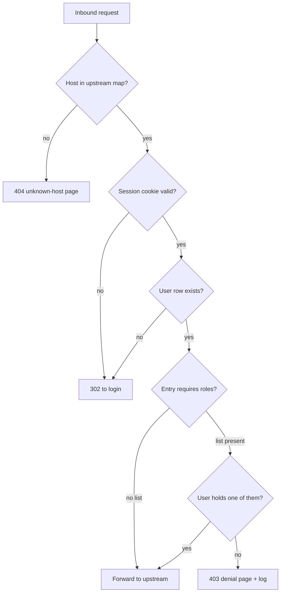

# Upstream Required Roles - Plan

## Goal Capsule

- **Objective:** Let each HTTP upstream declare the roles a user must hold, enforced at the proxy before any request reaches the app, with a denial page that names what's missing.
- **Product authority:** This plan owns the proxy-side gate and the denial surface. The Slack request/approve workflow that will hang off that surface is a separate, later work unit and is not active scope.
- **Authority order:** Requirements (R-IDs) win on product behavior. Key Technical Decisions (KTD-IDs) win on implementation mechanism within their cited requirements. Implementation Units override neither.
- **Execution profile:** Four units in dependency order, landing as one change. The config grammar break means partial delivery leaves the repo unbootable, so U1 through U4 ship together.
- **Stop conditions:** Stop and surface if the role check cannot be placed before the upstream connection opens without restructuring the request pipeline, or if migrating the existing config fixtures reveals a consumer of the upstream map outside `internal/config`, `internal/proxy`, and `internal/auth`.
- **Open blockers:** None.

---

## Product Contract

### Summary

Add an optional required-roles list to each HTTP upstream entry, enforced by the proxy after session validation and before the upstream connection opens. Users without a matching role get a proxy-served page naming the app, the roles it needs, and their current identity — the surface a later Slack request/approve flow will attach to.

### Problem Frame

Today the HTTP proxy authenticates a Slack-workspace member and forwards to any configured upstream. It emits `X-Forge-Roles` and the Upstream-App Contract in `README.md` makes authorization each app's own job. Roles exist on the user record and are enforced nowhere in `internal/proxy` except as a header value.

That leaves two costs. Every signed-in member reaches every app's front door, so an app with weak or missing internal checks is exposed to the whole workspace. And because the gate lives inside each app, there is no single place to notice that someone was turned away — which is exactly the moment a self-serve access request would be worth offering.

The SSH listener already solved the enforcement half of this: `SSH_UPSTREAMS` carries an `allowed_roles` list per port and refuses before dialing the upstream. The HTTP side has no equivalent.

### Key Decisions

- KTD1. **Operator declares required roles in proxy config, not the upstream app.** Apps self-declaring their own gate would not be an independent layer — a misconfigured app could open itself up. *(session-settled: user-directed — chosen over an app-served manifest and a DB-backed admin CLI: config keeps one authorship model across both listeners.)* Governs R8.
- KTD2. **Extend `UPSTREAMS` in place rather than adding a second variable.** One grammar shared with `SSH_UPSTREAMS`, paid for with a one-time config migration on every deployment. *(session-settled: user-directed — chosen over a separate `UPSTREAM_ROLES` variable: config symmetry with the SSH listener was worth the migration.)* Governs R8, R9.
- KTD3. **Absent role list means reachable by any authenticated member, and is the only way to express that.** Existing entries keep working untouched and apps are opted in one at a time. *(session-settled: user-directed — chosen over deny-by-default: avoids a coordinated lockout across every app at rollout; and over an explicit `|*` open marker: one spelling per meaning.)* Governs R3.
- KTD4. **The proxy gate is defense in depth, not a replacement for app-side checks.** Apps keep reading `X-Forge-Roles` and enforcing their own rules. Governs R7.
- KTD5. **The denial page is a designed surface, not a bare status code.** It carries the app identity and the roles required so a request-access action can be added later without reshaping the gate. Governs R11, R13.
- KTD6. **Gating is whole-host and has no privileged role.** Matches the SSH listener's per-port granularity; `admin` is an ordinary role name that must appear in a list to grant anything. Governs R5, R6.

<!-- ce-section: work-relationships -->
### How This Work Fits Together

This plan owns the proxy-side role gate and its denial surface. The breakdown below is the current understanding of the surrounding work, not a committed roadmap.

- **Slack request/approve workflow** — a "Request access" action on the denial page that notifies an operator in Slack, who approves and grants the role.
  - Depends on this plan for the gate, the denial surface, and the role-requirement configuration it would read to describe what is being requested.
  - Still to decide: whether requests are persisted with state (dedupe, audit) or fired as fire-and-forget notifications, and whether approval grants roles additively.
- **Role management moving into a Slack app** — replacing `forge-proxy admin set-roles` as the primary way roles are assigned.
  - Enables the approval step above; can proceed independently of this plan.
- **SSH listener role gating** — already shipped as `SSH_UPSTREAMS` `allowed_roles`.
  - Shares the config grammar and the role vocabulary with this plan. Can proceed independently; no change to it here.

### Actors

- A1. Signed-in Slack-workspace member reaching a gated app, with or without the required role.
- A2. Forge operator, who edits proxy config and assigns roles.
- A3. Upstream app behind the proxy, which continues to enforce its own authorization.

### Requirements

**Gating behavior**

- R1. Each HTTP upstream entry may carry a list of required roles; when present, the proxy denies the request before forwarding unless the signed-in user holds a matching role.
- R2. A user matches when the intersection of their roles and the entry's required-roles list is non-empty — any one of the listed roles is sufficient.
- R3. An entry with no required-roles list is reachable by any authenticated member, matching today's behavior; there is no separate marker for expressing that an entry is deliberately open.
- R4. The role check runs after session validation and before the upstream connection is opened; on denial no part of the request reaches the upstream.
- R5. Requirements apply to the whole host; there are no per-path rules.
- R6. No role name grants an implicit bypass, including `admin`.
- R7. Upstream apps continue to receive `X-Forge-Roles` unchanged and remain responsible for their own authorization.

**Configuration and migration**

- R8. Required roles are declared in `UPSTREAMS` using the grammar already used by `SSH_UPSTREAMS`: `;` separates entries, `|` separates the target from the role list, `,` separates role names.
- R9. Startup rejects an `UPSTREAMS` value still in the legacy comma-separated entry form, with an error naming both the old and new formats.
- R10. Role names in `UPSTREAMS` are validated against the same character set the user store and `SSH_UPSTREAMS` accept.

**Denial experience**

- R11. Denial renders a proxy-served page naming the app, the roles it requires, the signed-in identity, that identity's current roles, and where to ask for access.
- R12. The denial page is visually and semantically distinct from the existing unknown-host page, so an operator can tell a missing route from a missing role.
- R13. Each denial is logged with the fields needed to see who was turned away from what: user, host, roles required, roles held.

### Key Flows

- F1. Gated access granted
  - **Trigger:** A1 requests a host whose entry carries a required-roles list.
  - **Steps:** Proxy validates the session, loads the user, finds a non-empty intersection with the entry's list, opens the upstream connection and forwards with `X-Forge-Roles` intact.
  - **Outcome:** A3 receives the request and applies its own checks.
  - **Covered by:** R1, R2, R4, R7
- F2. Gated access denied
  - **Trigger:** Same as F1, but the intersection is empty.
  - **Steps:** Proxy stops before opening any upstream connection, renders the denial page, logs the denial.
  - **Outcome:** A1 sees which roles the app needs and who to ask; A3 never sees the request.
  - **Covered by:** R1, R2, R4, R11, R12, R13
- F3. Operator enables gating on a live app
  - **Trigger:** A2 decides an existing open app should require a role.
  - **Steps:** A2 grants the role to the members who should keep access, then adds the role list to that app's `UPSTREAMS` entry and restarts.
  - **Outcome:** Members who were granted the role keep working; everyone else lands on the denial page.
  - **Covered by:** R3, R8
  - **Note:** The grant-then-gate order matters. Reversing it locks out every member until they are granted individually, and until the Slack request flow ships there is no self-serve way back in.

### Acceptance Examples

- AE1. Ungated app is unchanged.
  - **Covers R3, R7.**
  - **Given** an `UPSTREAMS` entry with no role list, **when** any authenticated member requests that host, **then** the request is forwarded exactly as it is today, `X-Forge-Roles` included.
- AE2. Denial happens before the upstream is contacted.
  - **Covers R1, R2, R4, R11.**
  - **Given** an entry requiring `ai-dev,admin` and a member holding neither, **when** they request that host, **then** no connection to the upstream is attempted and the response is the denial page naming both roles and the member's current roles.
- AE3. Any one listed role is enough.
  - **Covers R2.**
  - **Given** an entry requiring `ai-dev,admin`, **when** a member holding only `admin` requests that host, **then** the request is forwarded.
- AE4. `admin` gets no free pass.
  - **Covers R6.**
  - **Given** an entry requiring `ai-dev` only, **when** a member holding only `admin` requests that host, **then** they are denied.
- AE5. Legacy config fails loudly at boot.
  - **Covers R9.**
  - **Given** an `UPSTREAMS` value in the legacy `host=url,host=url` form, **when** the proxy starts, **then** it refuses to start with an error naming the old and new formats — it does not boot with a partial or mangled upstream map.

### Scope Boundaries

- No Slack request/approve workflow, no "Request access" button, and no persisted access-request records. The denial page is shaped to receive them later.
- No per-path or per-method role rules — whole-host only.
- No app-served manifest or any mechanism by which an upstream declares its own requirement.
- No change to the SSH listener's existing `allowed_roles` behavior.
- No change to `X-Forge-Roles`, the header set, or `X-Forge-Contract-Version`. The Upstream-App Contract in `README.md` is unchanged; apps that already authorize on roles are unaffected.
- No change to how roles are assigned. `forge-proxy admin set-roles` keeps its current replace semantics.
- No per-app role namespacing. Roles stay flat and global on the user record, so granting a role for one app grants it for every app that lists it.

#### Deferred to Follow-Up Work

- **Filtering the portal app list by role.** `internal/auth/handlers.go` builds the signed-in portal's app list from the same upstream map and returns every configured host. Once gating is on, the portal advertises apps the user cannot enter; they discover that by clicking through to the denial page. The response already carries the user's roles, so filtering is a small follow-up on a different surface.
- **Unifying the denial page and the unknown-host page.** Both render bespoke inline HTML; `internal/proxy/proxy.go` already flags the unification as wanted. Doing it here would mix a refactor into a security change.

### Dependencies and Assumptions

- Assumes roles remain a flat, global list on the user record and that role vocabulary is shared across HTTP and SSH.
- Assumes every deployment's `UPSTREAMS` value can be migrated in the same change that ships this — the grammar switch is not backward compatible by design (R9).
- Assumes operators are willing to grant roles manually until the Slack flow ships. Turning on a role list before granting is the main foreseeable operational failure (see F3).

### Outstanding Questions

**Deferred to Planning**

- Whether legacy-format detection inspects the raw `UPSTREAMS` string or the parse result. Note that the old form parses without error today: splitting `host=url,host=url` on `;` yields one entry whose URL passes both existing scheme and non-empty-host checks, so a parse-success check alone is not sufficient.
- The denial page's HTTP status and exact copy.
- The log level and event name for denials.
- Whether the role check reads roles already loaded for header injection or performs its own lookup.

### Sources and Research

- `internal/proxy/proxy.go` — request pipeline; `ServeHTTP` resolves the host and forwards with no role check anywhere in the path. `writeUnknownHost` is the precedent for a proxy-served inline page.
- `internal/proxy/headers.go` — `X-Forge-Roles` is emitted from the user's role list and used nowhere else in the package.
- `internal/config/config.go` — `parseUpstreams` (comma-separated, no roles) and `parseSSHUpstreams` (`;` / `|` / `,`, with `allowed_roles`). The latter is the grammar this plan adopts for the former.
- `.env.example` — the deployed `UPSTREAMS` shape that R9's guard must reject, and the `SSH_UPSTREAMS` block documenting the separator rationale.
- `README.md` — the Upstream-App Contract, including the `X-Forge-Roles` row that tells app authors roles are theirs to enforce. Unchanged by this plan, but it is the document a reader will check when asking why both layers exist.
- `docs/plans/2026-05-23-001-feat-add-authenticated-ssh-proxy-plan.md` — the SSH plan whose R8/R9 established per-upstream role checking before connecting.

---

## Planning Contract

**Product Contract preservation:** unchanged. Planning added no requirements, changed no R-IDs, and altered no scope, except for appending a `Deferred to Follow-Up Work` subsection under Scope Boundaries for two adjacent items research surfaced.

### Key Technical Decisions

- KTD1. **Detect the legacy config form by inspecting the target segment, not by parse success.** `url.Parse` accepts the whole legacy remainder as a valid `http` URL with a garbage host, so it passes the existing scheme and non-empty-host checks. Reject an entry whose target contains `,` or a second `=`, naming both formats in the error. Governs R9.
- KTD2. **Required roles ride on the host map's value, not a parallel lookup.** `HostMap` becomes a map to an entry carrying target and required roles, and `Resolve` returns that entry. A second map keyed on host would let route and gate drift apart. Governs R1, R3.
- KTD3. **The gate sits after the user load and before the context stash in the existing request pipeline.** `ServeHTTP` already resolves the host first and loads the user by step 3, so the check needs no reordering and no upstream connection has been opened at that point. Governs R4.
- KTD4. **Denial answers 403 with a bespoke inline page.** 403 separates "you may not enter" from the unknown-host 404's "no such app". The page mirrors the self-contained rendering in `writeUnknownHost` rather than importing `internal/web`, preserving the one-way dependency from proxy to web. Governs R11, R12.
- KTD5. **The portal app list stays unfiltered in this change.** `internal/auth/handlers.go` iterates the upstream map for keys only, so the value-type change does not break it; filtering it is a separate surface and a separate diff. See Scope Boundaries.
- KTD6. **Config fixtures and operator docs migrate in the same change.** The grammar break makes `.env.example`, the README env table, the add-an-app runbook, and every test fixture wrong the moment U1 lands. Splitting them into a follow-up would ship a repo whose own examples fail to boot. Governs R8.

### High-Level Technical Design

The gate adds one decision point to the existing request pipeline. Nothing before it moves.

The `no list` edge is the backward-compatible path from R3: existing entries reach the upstream exactly as they do today.

### System-Wide Impact

- **Config contract with the deployed host.** `UPSTREAMS` is read from `/etc/forge-proxy.env` via `EnvironmentFile` in `deploy/forge-proxy.service`. The new binary refuses to start against an un-migrated file, so the operator edits the env file before restarting, not after. R9 makes that failure loud rather than silent.
- **Portal surface.** The signed-in portal lists every configured app regardless of roles. See KTD5 and Scope Boundaries.
- **Upstream-App Contract.** Unaffected. The `X-Forge-*` header set, its values, and `X-Forge-Contract-Version` are unchanged (R7), so no upstream app needs redeploying alongside this.

### Risks and Dependencies

- **Restart-before-edit takes the proxy down.** If the deploy restarts the service before `/etc/forge-proxy.env` is migrated, the proxy exits on the config error and every app behind it is unreachable until the file is fixed. Mitigation: the README migration note puts the env edit before the restart, and the error message names the exact transformation.
- **Silent lockout on first gated app.** Adding a role list before granting the role locks out everyone. Mitigation: the runbook step orders grant-then-gate, matching the plan's F3 flow.
- No new dependencies. Both units build on stdlib plus what `internal/config` and `internal/proxy` already import.

---

## Implementation Units

### U1. Config: parse required roles and reject the legacy form

**Goal:** `UPSTREAMS` parses the new `;` / `|` / `,` grammar into a map carrying target and required roles, and refuses to start on the legacy comma-separated form.

**Requirements:** R3, R8, R9, R10

**Dependencies:** none

**Files:**
- Modify: `internal/config/config.go`
- Test: `internal/config/config_test.go`

**Approach:**

1. Add an exported `Upstream` struct holding the parsed target and the required-roles slice, mirroring the shape of the existing `SSHUpstream`.
2. Change `Config.UpstreamMap` to map inbound host to `Upstream`, and update its doc comment to describe the new grammar.
3. Rewrite `parseUpstreams` against `parseSSHUpstreams` as the template: split entries on `;`, cut host from the rest on the first `=`, then cut target from the role list on `|`. A missing `|` means no required roles, which is valid per R3 — this is the one place the two parsers differ, since `SSH_UPSTREAMS` requires a role list.
4. Apply the KTD1 legacy guard to the target segment before parsing it as a URL.
5. Validate role names with the existing `sshRoleNameRe`, or a shared sibling of it, so HTTP and SSH accept the same character set (R10).
6. Keep the existing scheme, non-empty-host, and duplicate-host checks intact.
7. Migrate the existing config tests: the `UPSTREAMS` value in the `validEnv` helper (every other test builds on it), the legacy-form cases in the `UPSTREAMS` parsing table, and the assertion in the parsed-upstreams test that calls `.String()` on what is now a struct field.

**Patterns to follow:**
- `parseSSHUpstreams` in `internal/config/config.go` for entry splitting, role validation, and error-message shape.
- The `errs []string` accumulation in `Load` for fail-fast reporting.

**Test scenarios:**
- Happy path: two entries, one with a role list and one without, parse into a two-entry map with the expected targets and roles.
- Happy path: a single-role entry and a multi-role entry both parse, with roles in declaration order.
- Covers AE1. An entry with no `|` parses with an empty required-roles slice and no error.
- Covers AE5. The legacy value from `.env.example` produces an error mentioning both the old and new formats, and `Load` returns no config.
- Error path: a target containing `,` is rejected even when it would otherwise parse as a URL.
- Error path: an entry with `|` but an empty role list is rejected.
- Error path: a role name containing a space or `;` is rejected, naming the allowed character set.
- Error path: duplicate inbound host is still rejected, matching the existing behavior.
- Error path: a non-http scheme is still rejected, matching the existing behavior.
- Edge case: empty `UPSTREAMS` still produces the existing `UPSTREAMS is required` error.

**Verification:** `go test ./internal/config/...` passes, including the pre-existing tests migrated to the new grammar.

---

### U2. Host map carries required roles

**Goal:** `HostMap` resolves an inbound host to both its upstream target and its required-roles list.

**Requirements:** R1, R3, R5

**Dependencies:** U1

**Files:**
- Modify: `internal/proxy/hostmap.go`
- Test: `internal/proxy/hostmap_test.go`

**Approach:**

1. Change `HostMap`'s value type to carry target and required roles per KTD2, and change `Resolve` to return that entry.
2. Keep host normalization, the lowercase key copy in `NewHostMap`, the nil-input-yields-empty behavior, and `Hosts()` exactly as they are.
3. Update the doc comment describing what the map is built from.

**Patterns to follow:**
- The existing `hostmap.go` structure — this unit changes the value type, not the lookup semantics.

**Test scenarios:**
- Happy path: a host with required roles resolves to both the target and the roles.
- Happy path: a host with no required roles resolves to the target and an empty roles list.
- Edge case: case-insensitive lookup still resolves, including for an entry carrying roles.
- Edge case: a `:port` suffix is still stripped before lookup.
- Edge case: entry keys are still normalized to lowercase by `NewHostMap`.
- Edge case: unknown host still returns not-found.
- Edge case: `NewHostMap(nil)` still yields a non-nil empty map whose `Hosts()` is empty.

**Verification:** `go test ./internal/proxy/...` passes for the host-map tests.

---

### U3. Role gate and denial page in the request pipeline

**Goal:** The proxy denies a request whose user holds none of the entry's required roles, rendering the denial page and logging the denial, without opening any upstream connection.

**Requirements:** R1, R2, R4, R6, R7, R11, R12, R13

**Dependencies:** U2

**Files:**
- Modify: `internal/proxy/proxy.go`
- Test: `internal/proxy/proxy_test.go`

**Approach:**

1. Insert the role check in `ServeHTTP` at the point named in KTD3 — after the user row loads, before the upstream and user are stashed on the request context.
2. Skip the check when the resolved entry carries no required roles (R3).
3. Compute the intersection of the user's roles and the entry's required roles; any single match passes (R2). No role name is special-cased (R6).
4. On empty intersection, render the denial page and return. Do not reach `reverseProxy.ServeHTTP`.
5. Add a denial-page renderer alongside `writeUnknownHost`, following its self-contained pattern per KTD4: set content type, `X-Content-Type-Options`, the 403 status, and escape every interpolated value with `html.EscapeString`. The page names the app, the roles required, the signed-in email, the user's current roles, and where to ask (R11).
6. Set `Cache-Control: no-store` on the denial response. The page reflects role state that changes the moment an operator grants access, and a cached 403 would keep showing the denial after the grant.
7. Log the denial through the request logger with host, user id, required roles, and the roles held (R13).
8. Leave `rewrite` and the header inject path untouched — `X-Forge-Roles` still reaches apps that pass the gate (R7).
9. Migrate the existing proxy test fixtures, which build `UpstreamMap` entries as bare URLs in the fixture constructor and reassign them directly in the upstream-500 and upstream-unreachable tests.

**Execution note:** Write the "denied before the upstream is contacted" test first. The whole point of the gate is what does *not* happen, and a test asserting the upstream stub recorded zero requests is the only thing that proves it.

**Patterns to follow:**
- `writeUnknownHost` in `internal/proxy/proxy.go` for the inline-HTML page shape and escaping.
- The `newProxyFixture` and `newUpstreamStub` helpers in `internal/proxy/proxy_test.go`; `stubUser.setRoles` already exists for role manipulation.

**Test scenarios:**
- Covers AE1. A signed-in user reaching an entry with no required roles is forwarded, and the upstream stub records the request with `X-Forge-Roles` present.
- Covers AE2. A user holding none of the required roles receives 403, the upstream stub records zero requests, and the body names both required roles and the user's email.
- Covers AE3. A user holding one of two required roles is forwarded.
- Covers AE4. A user holding only `admin` against an entry requiring only `ai-dev` receives 403.
- Edge case: a user with no roles at all against a gated entry receives 403 and the page renders the empty role list without erroring.
- Edge case: the role check runs after auth — an unauthenticated request to a gated host still redirects to login rather than rendering the denial page.
- Edge case: role names are compared exactly; a user holding `ai-dev-admin` does not satisfy a requirement for `ai-dev`.
- Error path: a role name or host containing HTML metacharacters is escaped in the rendered page.
- Edge case: the denial response carries `Cache-Control: no-store`, so a granted role takes effect on the next request rather than after a cache expiry.
- Regression: the unknown-host 404, the expired-session redirect, the missing-user cookie clear, and the header-smuggling defense all still behave as before.

**Verification:** `go test ./internal/proxy/...` passes, including the pre-existing proxy tests with fixtures migrated to the new upstream-map type.

---

### U4. Migrate operator config and documentation

**Goal:** The shipped example config and the operator-facing docs describe the new grammar, and the migration is written down where an operator will hit it.

**Requirements:** R8, R9

**Dependencies:** U1

**Files:**
- Modify: `.env.example`
- Modify: `README.md`

**Approach:**

1. Rewrite the `UPSTREAMS` line in `.env.example` to the new grammar, showing one gated and one ungated entry, with a comment naming the separators — mirroring how the `SSH_UPSTREAMS` block already documents its own.
2. Update the `UPSTREAMS` row in the README environment-variable table to describe the new grammar and the optional role list.
3. Update the add-an-app runbook step that tells operators to append with commas.
4. Add a migration note to the README covering the upgrade: edit the env file before restarting, and grant roles before adding a role list to an entry (the F3 ordering).
5. Document the denial behavior in the Upstream-App Contract section as a note that the proxy may now refuse before the app is reached, without changing the header contract itself.

**Patterns to follow:**
- The `SSH_UPSTREAMS` comment block in `.env.example` for how the separator rationale is already documented.
- The existing README env table row shape and the numbered add-an-app runbook.

**Test scenarios:**
- *Test expectation: none — documentation and example config only. Correctness is covered by U1's parser tests, which use the same values the docs show.*

**Verification:** The `UPSTREAMS` value in `.env.example` parses cleanly through `parseUpstreams`, and `grep -rn UPSTREAMS README.md .env.example` shows no remaining comma-separated entry examples.

---

## Verification Contract

| Gate | Command | Applies to |
|---|---|---|
| Unit tests | `go test ./...` | U1, U2, U3 |
| Build | `go build ./...` | all |
| Vet | `go vet ./...` | all |
| Legacy-config boot check | Start the binary with the pre-migration `UPSTREAMS` value and confirm it exits with the format error | U1, U4 |
| Docs consistency | `grep -rn "UPSTREAMS" README.md .env.example` shows only new-grammar examples | U4 |

There is no CI workflow running `go test` in this repo, so these gates are author-run.

## Definition of Done

- Every requirement R1 through R13 is satisfied or explicitly traced to a unit.
- All five acceptance examples have a passing test that cites them by `Covers AE<N>`.
- `go test ./...`, `go build ./...`, and `go vet ./...` pass.
- Starting the binary against an un-migrated `UPSTREAMS` value fails with an error naming both formats, verified by hand.
- `.env.example` and every `UPSTREAMS` reference in `README.md` use the new grammar, and the README carries the grant-then-gate migration note.
- No abandoned or experimental code remains in the diff — in particular, no dual-grammar compatibility shim, which R9 explicitly rejects.
- The portal app list is untouched, and the deferred follow-up for filtering it is recorded in Scope Boundaries.
