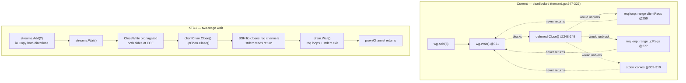
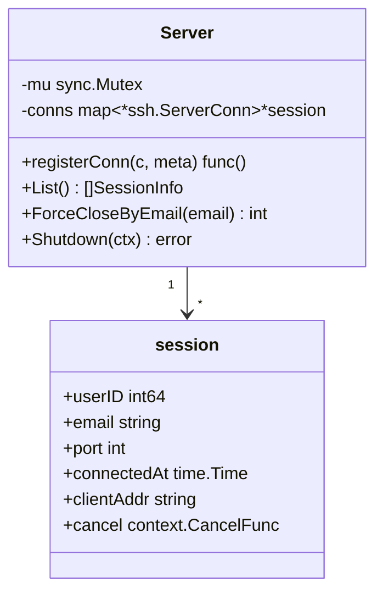

# feat: Complete the SSH proxy subsystem and ship it as one PR

## Goal Capsule

- **Objective:** Take the `feat/ssh-proxy` branch from "six units committed, one deadlocked, three not started" to a green, wired-up, reviewable PR that delivers a working SSH bastion.
- **Product authority:** The parent plan ([2026-05-23-001](2026-05-23-001-feat-add-authenticated-ssh-proxy-plan.md)) owns all product behavior and design rationale for U1–U10. This plan owns only the *completion path* — the defect fix, the remaining units, and the ship sequence. Where the two disagree on mechanism, this plan wins (it is written against the code as it actually exists); where they disagree on product behavior, the parent wins.
- **Authority order:** Parent plan requirements (R1–R14) win on behavior. This plan's Key Technical Decisions (KTD1–KTD5) win on mechanism. Implementation Units override neither.
- **Execution profile:** Eight units landing as a single PR on `feat/ssh-proxy`. U1 is a hard gate — the package cannot be tested at all until the deadlock is fixed. U8 (port-range config) is independent of U1–U6 and may be done at any point before U7; it is numbered last but sequenced before the ship unit.
- **Stop conditions:** Stop and surface if (a) fixing the deadlock reveals that channel lifecycle needs `x/crypto/ssh` behavior the library does not expose, (b) wiring `main.go` requires restructuring the existing HTTP startup or shutdown ordering rather than inserting into it, or (c) `ssh-force-logout` cannot be made honest without an IPC mechanism (see Open Questions).
- **Open blockers:** None. One decision is deferred to implementation time (OQ1).

---

## Summary

The `feat/ssh-proxy` branch has six of ten planned units committed and green. The seventh (`internal/sshproxy/forward.go`, the channel forwarder) is written but **uncommitted and deadlocked** — every test in the package hangs until the Go test timeout fires, so `go test ./...` fails at the repo root. The last three units (session registry, admin subcommands, `main.go` wiring) are not started, which means the SSH subsystem is never constructed at runtime: `cmd/` contains zero references to `sshproxy`, `sshenroll`, `sshca`, or `sshkey`.

This plan fixes the deadlock, closes the forwarder's test gaps, builds the remaining three units, adds port-range support to the upstream config grammar, and ships everything as one PR.

The port-range addition (U8) serves a project that runs several containers on one VM, each with its own `sshd` on a distinct port. The proxy needs to expose a contiguous range of ports and forward each to the same host on the same port number.

---

## Problem Frame

Three separate problems are tangled together, and they need to be untangled in order:

**1. The package does not test.** `proxyChannel` in `internal/sshproxy/forward.go:247` spawns six goroutines and calls `wg.Wait()` at line 321, with `clientChan.Close()` and `upChan.Close()` deferred until *after* that wait returns. Two of those six goroutines are request loops (`for r := range clientReqs` at line 259, `for r := range upReqs` at line 277) that only terminate when the SSH library closes those request channels — which happens on channel close. Two more are stderr copies (lines 309–319) that block on read until the channel closes. So `wg.Wait()` waits on four goroutines that are each waiting on the `Close()` that `wg.Wait()` is blocking. Nothing can make progress.

This reproduces deterministically. `go test -timeout 60s ./internal/sshproxy/...` panics at 60s on the very first test; at 120s it fails the same way; the unbounded run hung for the full default 10-minute budget and reported `FAIL github.com/forgeutah/forge-proxy/internal/sshproxy 602.335s`. The captured stack shows goroutine 27 parked in `sync.WaitGroup.Wait` at `forward.go:321` while goroutine 28 sits in `chan receive` at `forward.go:259`.

Note that the parent plan's own U7 pseudo-code specifies this exact shape (`wg.Wait(); clientChan.Close(); upChan.Close()`). This is a design error inherited from the plan, not a transcription slip — the fix belongs in the code *and* the reasoning belongs in this plan's KTDs so it doesn't get re-introduced.

**2. The feature is unreachable.** Without the parent's U10, nothing in `cmd/forge-proxy/` constructs an `sshproxy.Server`. Merging the branch as-is would land roughly 4,500 lines that no execution path can reach.

**3. There is no CI safety net.** `.github/workflows/` contains only `docker.yml` and `release.yml`; neither runs `go test` or `go vet`. A hanging test will not be caught on push. Local verification is the only gate, which raises the bar on this plan's verification contract.

---

## Requirements

Requirements are inherited from the parent plan; this plan adds completion-specific ones.

- R1. `go test ./...` completes and passes from the repo root, with no package hanging. *(new — currently failing)*
- R2. `go test -race ./internal/sshproxy/...` is clean. The forwarder is six-goroutine-per-channel concurrent code with no CI backstop; race detection is a shipping gate, not a nicety. *(new)*
- R3. The channel forwarder correctly proxies every channel type and request the parent plan's U7 scope names: `session`, `direct-tcpip`, `pty-req`, `window-change`, `exec`, `subsystem sftp`, `signal`/`exit-signal`, `exit-status`, and stderr. *(parent R10)*
- R4. Operator revocation exists and behaves as documented — no command silently claims success it cannot deliver. *(parent R12, R13)*
- R5. The SSH subsystem is constructed, started, and shut down by `cmd/forge-proxy/main.go`, and is a no-op when `SSH_UPSTREAMS` is empty. *(parent R1, R2)*
- R6. A README operator runbook covers upstream `sshd` setup, first-time enrollment, off-boarding, and CA rotation. *(parent R13, R14)*
- R7. The branch lands as a single PR containing only SSH-proxy work. *(new)*
- R8. `SSH_UPSTREAMS` accepts a contiguous **port range** mapped to a single upstream host, port-preserving: inbound port N forwards to `host:N`. One `allowed_roles` list governs the whole range. Existing single-port entries keep working unchanged, and both forms may appear in the same `SSH_UPSTREAMS` value. *(new)*

---

## Scope Boundaries

**In scope:** The deadlock fix; U7 test-gap closure; the parent plan's U8, U9, U10; port-range support in `SSH_UPSTREAMS`; full-suite verification; commit, push, and PR.

**Out of scope:**
- `docs/plans/2026-07-30-001-feat-upstream-required-roles-plan.md` — a separate HTTP required-roles feature, currently untracked. Do not commit it to this branch.
- `.claude/worktrees/` — local tooling state, untracked. Do not commit.
- Re-litigating parent-plan product decisions (dropped periodic Slack re-check, v1 reverse-forward refusal, agent-forwarding refusal). Those are settled.
- End-to-end VSCode Remote SSH validation as an automated test — it is a manual runbook step by parent-plan decision.

### Deferred to Follow-Up Work

- **A CI test workflow.** The repo has no job running `go test`/`go vet`. Adding one is clearly valuable and directly motivated by this work, but it is infrastructure change adjacent to the user's ask, not part of it. Recommend a follow-up PR adding a `test.yml` running `go vet ./...` and `go test -race ./...` on push and PR.
- **Cross-process force-logout IPC.** See OQ1 — if the documented-limitation approach proves unacceptable in operation, a signal- or socket-based mechanism is the follow-up.
- **Reverse port forwarding** (`tcpip-forward`) — declined in v1 per parent plan.

---

## Key Technical Decisions

- **KTD1. `proxyChannel` waits on the data copies only, then closes both channels, then drains the request loops.** The lifecycle inverts the current (deadlocked) one. Wait on the two `io.Copy` stream goroutines; when both return, both directions are EOF and the channel pair is done; *then* call `clientChan.Close()` and `upChan.Close()`, which is what causes the SSH library to close the request channels and unblock the stderr reads; then wait on the request and stderr goroutines to drain. Two-stage wait, not one. Implement as two `sync.WaitGroup`s (a `streams` group and a `drain` group) rather than one, which makes the ordering constraint explicit and hard to accidentally re-collapse. This supersedes the parent plan's U7 pseudo-code, which specifies the single-waitgroup shape that deadlocks.

- **KTD2. Extend the existing `Server.conns` registry into a typed session registry rather than adding a parallel `SessionMap`.** `internal/sshproxy/server.go:112-121` already carries `conns map[*ssh.ServerConn]struct{}` with `registerConn` (line 144) and a `Shutdown` (line 235) that closes every live connection. The parent plan's U8 proposed a separate `SessionMap` type with its own mutex and ID counter — building it now would mean two structures tracking the same connections with two locks and two lifetimes, and `Shutdown` would need to consult both. Instead, change the map's value type to a `*session` struct carrying `userID`, `email`, `port`, `connectedAt`, `clientAddr`, and `cancel`, and hang `List()`, `ForceCloseByEmail()`, and `ForceCloseByUser()` off `Server`. One lock, one lifetime, `Shutdown` unchanged in shape. *(Deviates from parent U8's file layout; same behavior.)*

- **KTD3. `ssh-remove-key` is the real revocation primitive; `ssh-force-logout` is honest about its process boundary.** `runAdmin` (`cmd/forge-proxy/admin.go:47`) builds its own `adminEnv` with its own DB handle — admin subcommands run in a *separate process* from the server. An in-memory session registry is therefore unreachable from the CLI, and any `ssh-force-logout` invoked the normal way would close zero sessions. Ship `ssh-remove-key` (durable, DB-backed, works cross-process, prevents all future auth) as the primary off-boarding tool, and have `ssh-force-logout` exit non-zero with an explicit message directing the operator to restart the proxy to drop live sessions. Do not print a "closed 0 sessions" success. See OQ1.

- **KTD4. One PR for the whole subsystem, on `feat/ssh-proxy`.** The six existing commits stay as-is; new work lands as additional focused commits on top. Rationale: without `main.go` wiring the feature is dead code, so a "foundation-only" PR asks reviewers to evaluate 4,500 lines with no reachable entry point.

- **KTD6. A port range expands at parse time into individual `SSHUpstream` entries; nothing downstream changes.** `parseSSHUpstreams` already returns `map[int]SSHUpstream` keyed by inbound port, and `Server.Run` (`internal/sshproxy/server.go:171`) binds one listener per map entry. Expanding `2300-2310=host|roles` into eleven entries inside the parser means the server, forwarder, session registry, and admin surface need **no changes at all** — the range is a config-authoring convenience that is fully erased before anything else sees it. Rejected alternative: a `PortRange` field on `SSHUpstream` carried through to the server, which would push range awareness into the listener loop, the session registry, and every log line for no operator-visible benefit. Consequence to accept: `List()`/log output shows individual ports, not the range that produced them — correct, since a session really is on one port.

- **KTD7. The range form takes a bare host and derives the upstream port; an explicit port with a range is a config error.** Port-preserving means the target port is *always* the inbound port, so `2300-2310=deuce.tailnet:22|ai-dev` is ambiguous — it reads as if every port funnels to `:22`, which is the opposite of the intent. Reject it with an error naming the conflict rather than silently picking one meaning. This makes the single-port and range forms syntactically distinguishable: single-port requires `host:port`, range requires bare `host`.

- **KTD5. `github.com/pkg/sftp` enters as a test-only dependency.** Not currently in `go.mod`. Required to drive the SFTP subsystem test from the client side; the bastion itself must not import it. Verify it lands in the main `require` block only because Go does not distinguish test-only deps — call this out in the PR description so a reviewer does not read it as a runtime dependency.

---

## Open Questions

### Resolved During Planning

- *Should this be one PR or two?* One. See KTD4.
- *Build a new `SessionMap` type per parent U8?* No — extend the existing registry. See KTD2.
- *Is the full test suite actually broken, or was the hang a fluke?* Broken, deterministically. Reproduced at three separate timeout budgets.

### Deferred to Implementation

- **OQ1. Does `ssh-force-logout` ship as a documented-limitation command, or get cut from v1?** KTD3's default is to ship it with an honest error. The alternative is to omit the subcommand entirely until IPC exists, on the grounds that a command that never works is worse than an absent one. Decide when writing U4 — the answer is clearer with the code in front of you. Either way, `ssh-list-keys` and `ssh-remove-key` ship.
- **OQ2. Does the exit-status ordering fix (golang/go#29733) survive the KTD1 restructure?** The existing `TestForward_NonZeroExitStatusPropagates` fences it. If it starts failing after the lifecycle change, the request-drain stage is closing too early relative to the stream copies.

---

## High-Level Technical Design

The deadlock and its fix, which is the crux of this plan:

The cycle on the left is the whole bug: `wg.Wait()` is upstream of `Close()`, and `Close()` is upstream of four of the six goroutines `wg.Wait()` is waiting for.

Session registry shape after KTD2:

---

## Implementation Units

### U1. Fix the `proxyChannel` deadlock

**Goal:** Make `internal/sshproxy` testable. This is a hard gate — U2 cannot be written and U3–U6 cannot be verified until the package stops hanging.

**Requirements:** R1, R3 · **Implements:** parent U7 (correction)

**Dependencies:** none

**Files:**
- Modify: `internal/sshproxy/forward.go`
- Modify: `internal/sshproxy/forward_test.go`

**Approach:**

1. Restructure `proxyChannel` (`forward.go:247`) per KTD1 into two wait stages: a `streams` group covering only the two `io.Copy` byte-stream goroutines, and a `drain` group covering the two request loops and the two stderr copies.
2. Remove the deferred `clientChan.Close()` / `upChan.Close()` at lines 248–249. Call both explicitly after `streams.Wait()` returns, before `drain.Wait()`.
3. Keep `CloseWrite()` propagation on each stream copy's return — that is what lets read-to-EOF commands (`cat`, `git push`) terminate, and it is currently correct.
4. Keep both request loops single-goroutine-per-direction. Ordering is load-bearing for exit-status vs. stdout (golang/go#29733); do not parallelize them while fixing the lifecycle.
5. Audit the sibling lifecycle in `Handle` while here: `handleChannel` (`forward.go:239`) spawns `go proxyChannel(...)` untracked, while `Handle` only waits on `chanDone`, which closes when `ac.Chans` drains. In-flight channel proxies can outlive `Handle`'s return. Add a `sync.WaitGroup` on the forwarder's per-connection scope so `Handle` waits for spawned channel proxies before returning.

**Execution note:** Reproduce first. Run `go test -timeout 30s -run TestForward_SessionExecRunsEndToEnd ./internal/sshproxy/` and confirm the hang and the `forward.go:321` stack before changing anything — a short timeout makes the loop fast. The fix is correct when that test passes in well under a second, not merely when it stops hanging.

**Test scenarios:**
- Regression (the deadlock itself): `TestForward_SessionExecRunsEndToEnd` completes in under one second. Assert this structurally by giving the test a `t.Deadline`-respecting context or an explicit short per-test timeout, so a re-introduced deadlock fails loudly instead of hanging the suite.
- Regression: `proxyChannel` returns after both stream copies complete even when the upstream sends no channel requests at all (no `exit-status`) — the drain stage must not block forever on an empty request channel.
- Existing coverage must stay green: exec end-to-end, non-zero exit status, stderr propagation, `pty-req` verbatim forwarding, upstream dial failure, agent-forwarding decline.
- Edge case: client closes the channel mid-stream while the upstream is still writing; `proxyChannel` returns without goroutine leak (assert with `runtime.NumGoroutine` delta or `goleak` if added).
- Edge case: `Handle` returns only after all spawned channel proxies have finished (fences the step-5 audit).

**Verification:** `go test -timeout 60s -race ./internal/sshproxy/...` passes with no hang. The whole package should run in seconds.

---

### U2. Close the U7 test-coverage gaps

**Goal:** Cover the channel types and request paths the parent plan's U7 enumerated but that the current `forward_test.go` does not exercise — the ones VSCode Remote SSH and SFTP actually depend on.

**Requirements:** R2, R3 · **Implements:** parent U7 (completion)

**Dependencies:** U1

**Files:**
- Modify: `internal/sshproxy/forward_test.go`
- Modify: `go.mod`, `go.sum` (test-only `github.com/pkg/sftp`, per KTD5)

**Approach:**

Extend the existing `testUpstream` harness (`forward_test.go:44`) rather than building a second one — it already does accept-loop, per-connection handling, and pluggable session handlers via `setSessionHandler` (line 127). Most gaps need only a new handler plus assertions. The `direct-tcpip` and `sftp` cases need harness additions: a channel-open handler for the former, a `pkg/sftp` server on the upstream for the latter.

Present coverage: exec, exit status, stderr, `pty-req`, dial failure, agent decline. Missing, in rough value order:

1. `subsystem sftp` — highest value; SFTP is how VSCode moves files.
2. Context cancellation — proves the teardown path U3 depends on.
3. `window-change` mid-session.
4. `direct-tcpip` channel with `ExtraData` preserved.
5. Upstream host-key mismatch → `ssh_upstream_host_key_mismatch`.
6. Global `tcpip-forward` declined → `ssh_reverse_forward_declined`.
7. `signal` forwarded up, `exit-signal` forwarded back.

**Test scenarios:**
- `subsystem sftp`: with a `pkg/sftp` server on the test upstream, a client `sftp.NewClient` through the bastion lists a directory and round-trips a file write/read. Bastion must not import `pkg/sftp` outside `_test.go`.
- Context cancellation: with a session in progress, cancel the forwarder's context; both client- and upstream-facing connections close within 100ms and the client's `Session.Wait()` returns a transport error.
- `window-change`: after a `pty-req`, the client sends `WindowChange(40, 100)`; the upstream observes a `window-change` request whose payload decodes to those dimensions.
- `direct-tcpip`: client opens a local forward; the upstream's channel-open handler observes channel type `direct-tcpip` with `ExtraData` byte-identical to what the client sent.
- Host-key mismatch: forwarder configured with a `known_hosts` callback that rejects the upstream's key; `Handle` returns an error, the inbound connection closes cleanly, and `ssh_upstream_host_key_mismatch` is logged (capture via a `slog` handler writing to a buffer).
- Global `tcpip-forward`: client sends the global request; forwarder replies `false`; `ssh_reverse_forward_declined` is logged; the session remains usable afterward.
- `signal`/`exit-signal`: client sends `SIGINT` on a running session; the upstream observes the `signal` request; the upstream's `exit-signal` reaches the client as a non-nil `Session.Wait()` error carrying signal info.

**Verification:** `go test -race ./internal/sshproxy/...` passes. `grep -rn "pkg/sftp" internal/ --include=*.go | grep -v _test.go` returns nothing.

---

### U3. Session registry on `Server` (parent U8)

**Goal:** Track live SSH sessions with the identity needed for operator revocation and for honest shutdown behavior.

**Requirements:** R4 · **Implements:** parent U8 (via KTD2, different layout)

**Dependencies:** U1

**Files:**
- Modify: `internal/sshproxy/server.go`
- Modify: `internal/sshproxy/server_test.go`
- Modify: `internal/sshproxy/forward.go` (register after authn + role check, deregister via defer)

**Approach:**

Per KTD2, evolve the existing structure instead of adding a parallel one:

1. Change `conns map[*ssh.ServerConn]struct{}` (`server.go:114`) to `map[*ssh.ServerConn]*session`, with `session` carrying `userID`, `email`, `port`, `connectedAt`, `clientAddr`, and a `cancel context.CancelFunc`.
2. Widen `registerConn` (`server.go:144`) to accept that metadata and the cancel func; keep the "returns a cleanup closure" shape, which the call site already uses correctly.
3. Add `List() []SessionInfo` returning a read-only snapshot, shaped for tab-separated admin output like the existing `list-users`.
4. Add `ForceCloseByEmail(email string) int` and `ForceCloseByUser(userID int64) int`, each invoking `cancel` on matches under the existing mutex and returning the count. Do not hold the lock while waiting for goroutines to finish.
5. `Shutdown` (`server.go:235`) keeps its current shape — it already iterates the map and closes every connection. Confirm it still compiles against the new value type and that its 5-second-deadline semantics are unchanged.

**Patterns to follow:** `internal/session/sweeper.go` for the mutex discipline. The existing `registerConn`/cleanup-closure idiom in `server.go` — do not replace it.

**Test scenarios:**
- Happy path: `registerConn` adds an entry; the returned cleanup removes it; `List()` reflects both states.
- Happy path: `ForceCloseByEmail` invokes `cancel` on each matching session and returns the count.
- Edge case: `ForceCloseByEmail("nobody@example.com")` returns 0 and does not error.
- Edge case: two live sessions for the same email — both are closed, count is 2.
- Edge case: concurrent `registerConn` and cleanup from multiple goroutines are `-race` clean.
- Integration: a real session held open against a test listener; `ForceCloseByEmail` causes the client's `Session.Wait()` to return within one second.
- Regression: `Shutdown` still closes all live connections and respects its context deadline after the value-type change.

**Verification:** `go test -race ./internal/sshproxy/...` passes.

---

### U4. Admin subcommands (parent U9)

**Goal:** Give operators `ssh-list-keys`, `ssh-remove-key`, and (per OQ1) `ssh-force-logout`, matching the existing admin command conventions exactly.

**Requirements:** R4 · **Implements:** parent U9

**Dependencies:** U3

**Files:**
- Modify: `cmd/forge-proxy/admin.go`
- Modify: `cmd/forge-proxy/admin_test.go`

**Approach:**

1. Add `keys *sshkey.Store` to `adminEnv` (`admin.go:35`) and construct it in `newAdminEnv` (line 87) alongside the existing stores.
2. Add dispatch cases in `dispatchAdmin` (line 66) beside `list-users`/`set-roles`/`force-logout`, and extend the usage string in `runAdmin` (line 47).
3. `ssh-list-keys <email>` — resolve the user via `env.users.GetByEmail`; on `user.ErrNotFound` return the same style of error `adminForceLogout` uses (`admin.go:182` is the template). Print a header line plus tab-separated `id`, `fingerprint`, `key_type`, `label`, `created_at`, `last_used_at`. A user with no keys prints the header and exits 0.
4. `ssh-remove-key <fingerprint>` — idempotent, mirroring `delete-session`: unknown fingerprint prints a "no key with that fingerprint" note and exits 0.
5. `ssh-force-logout <email>` — per KTD3 and OQ1. Default: resolve the user (so a typo'd email still errors usefully), then print the explicit cross-process explanation and exit non-zero. Do not report a zero count as success.
6. Route every DB error through `classifyBusy` (`admin.go:268`), as all existing subcommands do.

**Execution note:** Settle OQ1 before writing the `ssh-force-logout` test — the expected exit code and message depend on it. If the command is cut instead, drop its scenarios and note the omission in the README off-boarding section.

**Test scenarios:**
- Happy path: `ssh-list-keys alice@example.com` after seeding two keys prints two rows carrying both fingerprints.
- Edge case: `ssh-list-keys nobody@example.com` errors with a user-not-found message and exits non-zero.
- Edge case: `ssh-list-keys` for a user with zero keys prints only the header and exits 0.
- Happy path: `ssh-remove-key <fp>` removes the row; a following `ssh-list-keys` for the owner omits it.
- Edge case: `ssh-remove-key SHA256:nonexistent` prints the idempotent note and exits 0.
- Edge case (OQ1-dependent): `ssh-force-logout alice@example.com` prints the cross-process explanation and exits non-zero.
- Edge case: a SQLITE_BUSY error during `ssh-remove-key` surfaces the friendly retry message via `classifyBusy`.
- Regression: existing admin subcommands still dispatch correctly after the `adminEnv` widening.

**Verification:** `go test ./cmd/forge-proxy/...` passes; `forge-proxy admin` with no args lists the new subcommands.

---

### U5. Wire the SSH subsystem into `main.go` (parent U10, code)

**Goal:** Make the feature reachable. This is what turns the branch from dead code into a working bastion.

**Requirements:** R5 · **Implements:** parent U10 (code half)

**Dependencies:** U1, U3

**Files:**
- Modify: `cmd/forge-proxy/main.go`
- Modify: `cmd/forge-proxy/main_test.go`

**Approach:**

Insert into `run()` (`main.go:262`), following the existing goroutine + waitgroup + signal-handler idiom already used for the sweeper (lines 302–307) and HTTP server (line 381):

1. Guard the entire block on `len(cfg.SSHUpstreams) > 0`. Empty config means no key loading, no listeners, no behavior change — the HTTP-only deployment path must be byte-for-byte unaffected.
2. Load host key and CA key via `sshca.LoadOrGenerate` for `cfg.SSHHostKeyPath` and `cfg.SSHCAKeyPath`. Log the CA public key at startup so operators can copy it into upstream `TrustedUserCAKeys`.
3. Build the `known_hosts` callback from `cfg.SSHKnownHostsPath` by calling `golang.org/x/crypto/ssh/knownhosts.New` **directly in `main.go`**. Note: `internal/sshproxy/config.go` documents `KnownHostsCallback` as "loaded from internal/sshca's knownhosts helper" — that helper does not exist (`grep -rn "knownhosts" internal/sshca/` is empty). Either add it to `sshca` for symmetry with `LoadOrGenerate`, or call `knownhosts.New` inline and correct the stale comment. Do not go looking for the helper. A missing or unreadable file is a **fatal** startup error when SSH is enabled — silently accepting unknown upstream host keys would defeat the outbound-verification design.
4. Construct `sshenroll` store and handlers; mount the enrollment routes on the existing `authMux` beside the current handlers (line 322 area).
5. Construct `sshproxy.NewForwarder(caKey, knownHosts, logger)`, then populate `sshproxy.Config` — `ListenAddr`, `Upstreams`, `HostKey`, `CAKey`, `KnownHostsCallback`, `AuthHost` — and pass it to `sshproxy.New(cfg, keys, users, tokens, forwarder, logger)`. Start `sshSrv.Run(serverCtx)` in a goroutine tracked by a waitgroup. Two wiring traps here: `AuthHost` is required (it builds the enrollment URL in the keyboard-interactive challenge) and is easy to leave zero-valued, which yields a broken enrollment link rather than a startup error; and `Config.KnownHostsCallback` appears to have no reader — the forwarder receives the callback through `NewForwarder` instead. Confirm whether the field is live; if it is genuinely dead, delete it rather than populating both paths.
6. Shutdown ordering, inserting into the existing block at lines 398–406: HTTP `srv.Shutdown` → `sshSrv.Shutdown` (own 5-second deadline) → `sweeperStop()` + `sweeperWG.Wait()` → deferred `db.Close()`. SSH must close before the sweeper and DB because live sessions hold user lookups.

**Execution note:** Verify the SSH-disabled path first — start the binary with `SSH_UPSTREAMS` empty and confirm identical startup and shutdown behavior to `main` before testing the enabled path. This is the regression that would hurt most in production.

**Test scenarios:**
- Integration: with `SSH_UPSTREAMS` set in a test env, the binary binds the configured SSH ports *and* the HTTP listener; both accept connections.
- Integration: SIGTERM produces shutdown in the documented order — assert on `slog` output ordering (HTTP closed, then SSH, then sweeper, then DB).
- Edge case: `SSH_UPSTREAMS` empty — no SSH listeners bound, startup and shutdown logs match the pre-change baseline.
- Error path: SSH enabled but `SSH_KNOWN_HOSTS_PATH` missing or unreadable — startup fails with a clear error rather than starting insecurely.
- Error path: a configured SSH port is already bound — startup fails with the port named.
- Edge case: host key and CA key files absent — `LoadOrGenerate` creates them with correct permissions and the CA public key is logged.

**Verification:** `go test ./cmd/forge-proxy/...` passes; `go build ./...` clean; manual smoke of both enabled and disabled configurations.

---

### U6. README operator runbook (parent U10, docs)

**Goal:** Document what an operator must do to stand this up and run it. Nothing in U1–U5 is usable without it.

**Requirements:** R6 · **Implements:** parent U10 (docs half)

**Dependencies:** U4, U5

**Files:**
- Modify: `README.md`

**Approach:**

`.env.example` already documents the SSH variables (lines 66–86) — do not duplicate that content, reference it. README currently has no SSH section at all. Add one following the structure of the existing `## Adding a new upstream app` (line 386) and `## Off-boarding a user` (line 456) sections, matching their tone and depth.

Sections to add:
- **`## SSH proxy`** — what it is, port allocation and firewall, `SSH_UPSTREAMS` grammar, where the CA public key is logged, populating `known_hosts` from each upstream, and the upstream `sshd` configuration (`TrustedUserCAKeys` plus an `AuthorizedPrincipalsCommand` that maps principal → local user).
- **Port ranges (per-container access)** — document the U8 range form: `2300-2310=deuce.tailnet|ai-dev` exposes eleven proxy ports forwarding to the same host on the same port numbers, for a VM running one container `sshd` per port. State the three operator-facing constraints explicitly: the target is a bare host (no `:port`), one roles list covers the entire range, and the range is capped at 256 ports. Include the firewall implication — the whole range must be open, not just one port. Note that `known_hosts` needs an entry per host:port the proxy dials, so a range means keyscanning every port in it; give the `ssh-keyscan -p` loop for this.
- **First-time enrollment** — user runs stock `ssh host -p <port>` once, follows the printed URL, signs in with Slack, then uses VSCode Remote SSH. Explain *why* the stock-`ssh`-first step exists (VSCode's keyboard-interactive handling).
- **VSCode Remote SSH verification runbook** — the numbered manual checklist for first deploy: open a devcontainer, list a directory, run an SFTP put, confirm the expected `slog` events. This is the parent plan's designated substitute for an automated end-to-end test.
- **Off-boarding a user (SSH)** — extend the existing section: `ssh-list-keys` to enumerate, `ssh-remove-key` per fingerprint. State the KTD3 live-session caveat plainly, and reflect whatever OQ1 resolved to.
- **SSH CA key rotation** — generate the new CA, add its public key as a second `TrustedUserCAKeys` entry on every upstream, swap `SSH_CA_KEY_PATH`, restart, then remove the old entry. Mirror the tone of `## Rotating the proxy secret` (line 487).

**Test expectation:** none — documentation only. Correctness is checked by following the runbook during U7's manual verification.

**Verification:** A reader can go from a fresh proxy VM to a working VSCode Remote SSH session using only the README. Every command named exists with those exact flags.

---

### U8. Port-range support in `SSH_UPSTREAMS`

*(Numbered U8 per the U-ID stability rule — added after U7 existed — but sequenced here, before the ship unit. Independent of U1–U6; can be done at any point before U7.)*

**Goal:** Let one config entry expose a contiguous range of proxy ports that all forward to the same upstream host, port-preserving, so several containers on one VM are each reachable on their own port.

**Requirements:** R8 · **New** — not in the parent plan

**Dependencies:** none (touches only `internal/config`)

**Files:**
- Modify: `internal/config/config.go`
- Modify: `internal/config/config_test.go`
- Modify: `.env.example`

**Approach:**

All work is inside `parseSSHUpstreams` (`internal/config/config.go`). Per KTD6 the range is expanded before the function returns, so `Config.SSHUpstreams` keeps its exact current type and every consumer is untouched.

1. After `strings.Cut(entry, "=")` yields `portRaw`, detect a range by the presence of `-`. Keep the existing `strconv.Atoi` path for a bare port so single-port entries are behaviorally identical.
2. For a range, split on `-` into `lo` and `hi`. Validate: both parse as integers; both within 1–65535; `lo <= hi`. Reject `hi < lo` with an error naming the entry rather than silently swapping — a reversed range is a typo, not an intent.
3. Cap the range width at **256 ports**. Each port becomes a bound TCP listener plus an accept-loop goroutine, so an unbounded range (`1-65535`) would exhaust file descriptors at startup. Error names the requested width and the cap.
4. Per KTD7, the range form's target must be a **bare host** with no port. The current code requires `u.Port() != ""` — that check inverts for ranges: a port present on a range target is an error explaining that the range form derives the upstream port from the inbound port. For the bare-host case, parse via `url.Parse("ssh://" + host)` as today (keeping port validation in one place) and confirm `u.Host` is non-empty.
5. Expand: for each port `p` in `[lo, hi]`, build a `*url.URL` targeting `host:p` and insert `SSHUpstream{Port: p, Target: <that URL>, AllowedRoles: roles}`. Parse the role list once for the whole range, not per port. Give each entry its **own** `*url.URL` value — do not share one pointer across map entries, or a later mutation would affect every port in the range.
6. The existing duplicate-port check catches range/range and range/single overlaps for free. Improve its message to name the entry that collided, since "duplicate port 2305" is unhelpful when the entry that produced it was written as `2300-2310`.

**Execution note:** Write the parser tests before the parser. This is pure input-validation logic with a wide error surface and no I/O — table-driven tests are cheap here, and the error messages are the operator's only feedback for a misconfigured range.

**Patterns to follow:** The existing `parseSSHUpstreams` error style — every message quotes the offending entry and states the expected form. `internal/config/config_test.go`'s existing table-driven cases for the single-port grammar.

**Test scenarios:**
- Happy path: `2300-2302=deuce.tailnet|ai-dev` yields exactly three entries, ports 2300/2301/2302, each targeting `deuce.tailnet` on its own port number, each carrying `["ai-dev"]`.
- Happy path: a single-port entry and a range entry in one value (`2222=box:22|ops;2300-2302=deuce.tailnet|ai-dev`) both parse; four entries total.
- Happy path: a one-port range (`2300-2300=host|role`) yields exactly one entry, equivalent to the single-port form.
- Regression: every existing single-port test case still passes unchanged — this is the compatibility guarantee in R8.
- Edge case: multiple ranges to different hosts in one value parse independently.
- Error path: reversed range (`2310-2300=host|role`) errors naming the entry.
- Error path: range width over the cap (`2000-3000=host|role`) errors naming the width and the 256 cap.
- Error path: range with an explicit target port (`2300-2310=deuce.tailnet:22|ai-dev`) errors explaining the range form derives the port (KTD7).
- Error path: single-port entry with a bare host (`2222=deuce.tailnet|ops`) still errors as today — the existing "target missing port" behavior must not regress.
- Error path: overlapping ranges (`2300-2310=a|r;2305-2315=b|r`) error identifying the collision.
- Error path: a range overlapping a single-port entry errors the same way.
- Edge case: port bounds — `0-10` and `65530-65540` both error on the out-of-range endpoint.
- Error path: non-numeric endpoints (`23a0-2310=host|role`) error naming the bad value.
- Edge case: whitespace tolerance (`2300 - 2302 = host | role`) matches whatever the existing parser does for single ports; be consistent rather than inventing new trimming rules.

**Verification:** `go test ./internal/config/...` passes. Confirm no file outside `internal/config` and `.env.example` needed a change — if one did, KTD6's premise is wrong and the design should be revisited before proceeding.

---

### U7. Full verification, commit, push, PR

**Goal:** Land it.

**Requirements:** R1, R2, R7

**Dependencies:** U1–U6, U8

**Files:** none (git operations and PR authoring)

**Approach:**

1. **Verify.** `go build ./...`, `go vet ./...`, `go test ./...`, and `go test -race ./...` from the repo root. All must pass with no package hanging. Per R2 and the absence of CI, the race run is a gate, not optional.
2. **Confirm working-tree hygiene.** `git status` must show only SSH-proxy files staged. `.claude/worktrees/` and `docs/plans/2026-07-30-001-feat-upstream-required-roles-plan.md` stay untracked — check explicitly before committing, since a `git add -A` would sweep both in.
3. **Commit** in focused units on top of the existing six, matching the established `feat(scope): summary` convention visible in `git log`: the forwarder (U1+U2), the session registry (U3), the admin subcommands (U4), the `main.go` wiring (U5), the port-range config grammar (U8), and the README (U6). Include this plan and the parent plan in the docs commit.
4. **Push** `feat/ssh-proxy` to `origin`.
5. **Open the PR** against `main` with `gh pr create`. The body should carry: what the subsystem does; the U1–U10 map and what each unit delivered; the deadlock and its fix (reviewers will want the reasoning, and it corrects the parent plan); KTD2's deviation from parent U8; KTD3 and the OQ1 outcome for `ssh-force-logout`; KTD5's test-only `pkg/sftp` dependency, flagged so nobody reads it as a runtime dep; the manual VSCode verification status; and a note that no CI job runs these tests, with the follow-up CI PR recommended.

**Execution note:** Do not push until the race-enabled full-suite run is green locally. There is no CI backstop — whatever is pushed is what reviewers and `main` inherit.

**Test scenarios:** No new tests. The gate is the full existing suite, race-enabled.

**Verification:**
- `go test -race ./...` green from repo root, no hangs.
- `go vet ./...` clean.
- `git status` shows no unintended files committed.
- PR is open, its body covers the items above, and the branch is pushed.

---

## Verification Contract

Gates that must pass before the PR opens:

| Gate | Command | Blocking |
|---|---|---|
| Build | `go build ./...` | Yes |
| Vet | `go vet ./...` | Yes |
| Full suite | `go test ./...` | Yes |
| Race | `go test -race ./...` | Yes — no CI backstop (R2) |
| No hang | `go test -timeout 120s ./...` completes well inside the budget | Yes |
| Tree hygiene | `git status` shows no unrelated files staged | Yes |
| Manual | VSCode Remote SSH + SFTP against a real upstream, per U6 runbook | Best-effort; note status in the PR |

---

## Definition of Done

- `go test -race ./...` passes from the repo root with no package hanging.
- `internal/sshproxy` covers every channel type and request path in R3.
- `cmd/forge-proxy/main.go` constructs, starts, and shuts down the SSH subsystem, and is a verified no-op when `SSH_UPSTREAMS` is empty.
- `ssh-list-keys` and `ssh-remove-key` work; `ssh-force-logout` reflects the OQ1 decision without overclaiming.
- `SSH_UPSTREAMS` accepts port ranges (port-preserving, one host per range, 256-port cap), existing single-port entries still parse identically, and no file outside `internal/config` needed changing to support it.
- README carries the operator runbook, enrollment flow, off-boarding, and CA rotation.
- `feat/ssh-proxy` is pushed and a PR is open against `main` with a body covering the deadlock fix, the KTD deviations, and the CI gap.
- No unrelated files are committed.

---

## Risks & Dependencies

- **The deadlock may not be the only lifecycle bug.** It is the first one that manifests — it blocks the very first test, so nothing behind it has ever run. Expect U2 to surface further issues once the package can execute; budget for it rather than treating U2 as pure test-writing.
- **`Handle`'s untracked channel goroutines** (U1 step 5) are a latent leak independent of the deadlock. Fixing them may change teardown timing that other tests implicitly depend on.
- **No CI means local verification is the only gate**, and a race-enabled full run is meaningfully slower. Do not skip it under time pressure — the concurrency here is exactly where a missed race becomes a production hang.
- **`ssh-force-logout` is weak in v1** (KTD3). If operators need live-session revocation on day one, OQ1 resolves toward cutting the command and prioritizing the IPC follow-up.
- **The manual VSCode step cannot be automated**, so the highest-value user path is the least-tested one. U2's SFTP and `direct-tcpip` coverage is the closest available proxy for it.
- **`go.mod` churn** from `pkg/sftp` will show in the diff as a runtime-looking dependency (KTD5) — flag it in the PR body to avoid a review round-trip.
- **A port range multiplies startup resource use.** Each port is a listener and an accept-loop goroutine, and a partial bind failure part-way through a range leaves the server half-started. Confirm `Run`'s existing error path (`server.go:171-198`) closes already-bound listeners when a later bind in the same config fails — with single ports this was a 1-in-N risk, and a range makes it routine. If it does not, that is a real bug U8 surfaces and U5 should fix.
- **`known_hosts` scales with the range.** The proxy verifies each upstream `host:port` it dials, so an 11-port range needs 11 keyscanned entries. An operator who scans only the first port gets failures on every other port that look like the forwarder is broken. U6's runbook must make this explicit.

---

## Sources & References

- Parent plan: [2026-05-23-001-feat-add-authenticated-ssh-proxy-plan.md](2026-05-23-001-feat-add-authenticated-ssh-proxy-plan.md) — full design rationale, KTDs, and U1–U10 specifications.
- Origin requirements: [docs/brainstorms/2026-05-22-forge-ssh-proxy-requirements.md](../brainstorms/2026-05-22-forge-ssh-proxy-requirements.md)
- golang/go#29733 — SSH exit-status vs. stdout ordering; the reason both request loops stay single-goroutine.
- Observed failure: `go test ./...` → `FAIL github.com/forgeutah/forge-proxy/internal/sshproxy 602.335s`; stack shows `sync.WaitGroup.Wait` at `forward.go:321` blocked against `chan receive` at `forward.go:259`.
